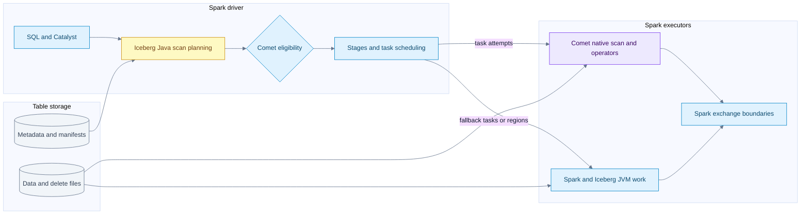
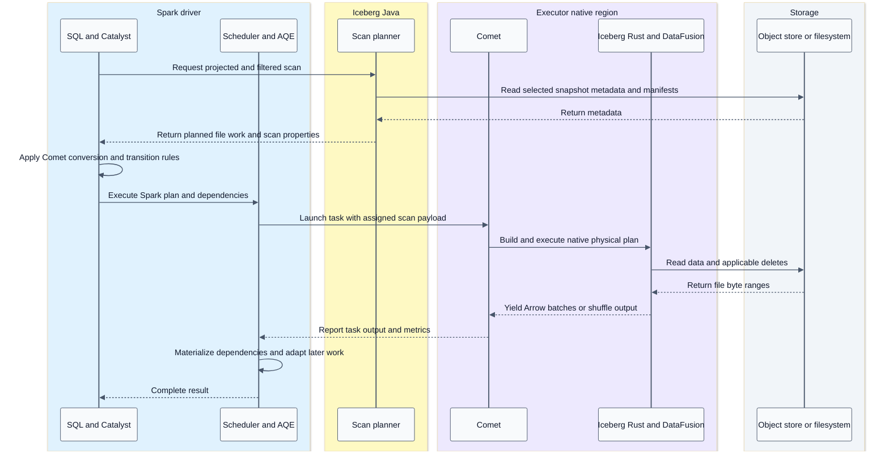

# System architecture and ownership

[Index](README.md) | [Next: Iceberg scan](02-iceberg-scan.md)

## Mental model

A query has several cooperating state machines. Spark controls the distributed computation. Iceberg controls the table snapshot and commit protocol. Comet has a native execution context inside a Spark task attempt. Parquet controls the physical file layout. Arrow describes in-memory arrays; it does not schedule work or publish table state.

| Component | Owns | Does not automatically own |
| --- | --- | --- |
| Spark Catalyst | SQL analysis, optimization, physical plan selection | Iceberg file contents or native decoding |
| Spark DataSource V2 | Scan/write interfaces, input partitions, writer messages | The table format's commit protocol |
| Spark AQE | Replanning around materialized query stages and observed statistics | A second Iceberg snapshot chosen inside a running native task |
| Spark scheduler | Jobs, stage dependencies, task attempts, placement, retries | Native operator algorithms |
| Iceberg Java | Catalog/table loading, snapshot/schema/spec selection, manifests, task planning, commit validation | Every executor byte must remain JVM-owned |
| Comet JVM | Eligibility, Spark physical-plan conversion, protobuf, task/native lifecycle | A separate cluster scheduler |
| Comet native and DataFusion | Local execution plans, Arrow streams, supported expressions and operators | Unrestricted replacement of Spark SQL semantics |
| Iceberg Rust | Iceberg-aware reading/deletes/adaptation and eligible file writers | Replanning Comet's scan from the catalog |
| arrow-rs | Arrays, buffers, Parquet codecs and readers/writers, FFI | Transaction visibility or retry policy |

Evidence: [Spark integration and native runtime](09-source-ledger.md#comet-runtime), [Iceberg planning](09-source-ledger.md#iceberg-planning), [DataFusion and Arrow](09-source-ledger.md#datafusion-and-arrow).

## High level component flow



The two executor boxes are not mutually exclusive for a whole query. A plan can contain several native regions separated by JVM operators, exchanges, or representation transitions. An unsupported scan need not imply that every downstream operator is JVM-only, and a native scan does not prove a native end-to-end query.

## End to end query sequence



This is a phase summary. Planning hooks can revisit a scan; AQE and runtime filters defer some work. Do not infer a single eager planning pass or a single task from the diagram.

## Distinct units of work

| Unit | Stable meaning | Common mistake |
| --- | --- | --- |
| Snapshot | A committed table state, with history and references | Treating an S3 prefix as the table state |
| Iceberg partition | A tuple produced by a partition spec | Assuming one Spark task per partition |
| Data file | A stored data artifact with manifest metadata | Assuming it contains only one row group |
| FileScanTask | A file/range plus schema, spec, residual and deletes | Treating it as only a filename |
| Spark input partition | Work assigned to a task attempt | Equating its count with Arrow batch count |
| Stage | Spark computation separated by distributed dependencies | Calling every native operator a Spark stage |
| Task attempt | One attempt to execute a scheduling partition | Assuming side effects happen once physically |
| Native execution context | A task-owned native plan and streams | Treating it as a cluster-wide DataFusion session |
| RecordBatch | Schema and equal-length arrays plus row count | Treating a batch as a Parquet page |

## Example distributed aggregate

Illustrative query: `SELECT region, SUM(amount) FROM orders WHERE event_date >= DATE '2026-01-01' GROUP BY region`.

```text
Map side: assigned Iceberg files -> native scan -> filter -> partial SUM by region -> hash shuffle write
Reduce side: fetch region partitions -> native shuffle decode -> final SUM -> result
```

The native region reduces per-row overhead; the exchange makes all contributions for one key meet. More scan tasks can improve read parallelism without changing the number of reduce partitions. Skew can leave one reduce task much slower than the others. These are different problems from Parquet decoding speed.

## Repository relationships

Comet calls Iceberg Rust directly and builds its own `IcebergScanExec`. The separate `datafusion-iceberg` project implements a DataFusion `TableProvider`, scan plan and append path. It is a useful design comparison, not a box on Comet's execution path.

The sibling DataFusion checkout explains `ExecutionPlan::execute(partition, TaskContext)` and `SendableRecordBatchStream`. Comet selects/adapts operators and Spark-specific semantics through its native planner. A feature implemented in upstream DataFusion is not automatically supported by Comet's serializer, eligibility rules, Spark semantics, or tests.

## Invariants worth defending in a talk

- SQL correctness spans both JVM and native components; it does not stop at the planner.
- Table format, file format, memory format and execution engine are separate layers.
- Spark cluster parallelism and native asynchronous I/O concurrency are separate controls.
- Native acceleration changes eligible implementation work, not the table's visibility contract.
- Inspect the executed plan and fallback reasons before labelling an operation native.
