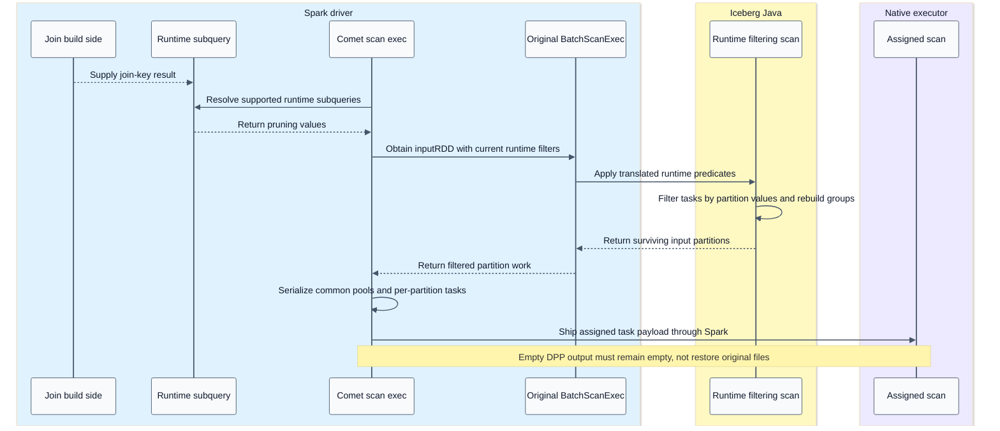

# Iceberg scan planning and native reading

[Index](README.md) | [Parquet detail](03-parquet.md)

## Summary

Iceberg Java produces the authoritative task set. Comet serializes the surviving Spark partitions after runtime pruning. Iceberg Rust reads those tasks, applies supported deletes and schema semantics, and emits Arrow batches. The native reader does not independently reload the catalog to pick another snapshot.

Evidence: [Iceberg planning](09-source-ledger.md#iceberg-planning), [Comet scan](09-source-ledger.md#comet-scan), [pinned Rust reader](09-source-ledger.md#iceberg-rust-reader).

## Metadata planning flow

```mermaid
%%{init: {"theme":"base","flowchart":{"curve":"basis","nodeSpacing":32,"rankSpacing":46},"themeVariables":{"fontFamily":"Ubuntu, Arial, sans-serif","fontSize":"15px","primaryTextColor":"#0f172a","lineColor":"#64748b"}}}%%
flowchart LR
  subgraph ICE["Iceberg Java"]
    T["Table metadata and selected snapshot"]
    ML["Manifest list summaries"]
    MF["Surviving data and delete manifests"]
    DI["DeleteFileIndex"]
    FT["FileScanTasks with residuals"]
    GR["Split and group tasks"]
    T --> ML --> MF --> FT --> GR
    MF --> DI --> FT
  end
  subgraph SPARK["Spark and Comet driver"]
    P["SparkInputPartitions"]
    DPP["Resolve runtime filters"]
    SER["Pool shared metadata and<br/>serialize each partition slice"]
    GR --> P --> DPP --> SER
  end
  subgraph NATIVE["Executor"]
    RUN["Read only the assigned task slice"]
    SER --> RUN
  end
  classDef ice fill:#fef9c3,stroke:#ca8a04,color:#713f12
  classDef spark fill:#e0f2fe,stroke:#0284c7,color:#0c4a6e
  classDef native fill:#ede9fe,stroke:#7c3aed,color:#3b0764
  class T,ML,MF,DI,FT,GR ice
  class P,DPP,SER spark
  class RUN native
```



`DataTableScan.doPlanFiles` obtains the selected snapshot's data/delete manifests and builds `ManifestGroup`. The group evaluates manifest/file predicates and creates tasks with the applicable delete list. Task splitting and bin packing account for file bytes, delete bytes and open-file cost. These weights are scheduling estimates, not exact future network bytes.

The Iceberg Spark connector can also use distributed planning paths. The diagram expresses logical ownership, not a guarantee that every metadata read runs in one driver thread.

## Planning objects and contracts

| Object | Important contents or role |
| --- | --- |
| Table metadata | Schemas, specs, snapshots, properties and references |
| Snapshot | Visible file-state lineage and manifest-list location |
| Manifest list | Manifest descriptors and partition summaries |
| Manifest entries | File descriptors, entry status, sequence information and statistics |
| DeleteFileIndex | Match deletes to data using sequence, partition/spec, path and relevant statistics |
| FileScanTask | Data-file path/range, schema/spec, residual, applicable deletes |
| Task group | Several scan tasks grouped for an engine scheduling unit |
| SparkInputPartition | Task group plus expected schema, table/FileIO access and locality metadata |

Data and delete manifests have different content roles. Do not say every individual manifest contains both data and delete files. Equality field IDs are delete-file metadata, not an ordinary data-file property.

## Runtime pruning sequence



The exact empty-RDD class differs across Spark versions. Comet's supported shims and tests are the contract; do not mechanically port a class-name assumption from the newer sibling Spark checkout.

## Native reader flow

```mermaid
%%{init: {"theme":"base","flowchart":{"curve":"basis","nodeSpacing":32,"rankSpacing":46},"themeVariables":{"fontFamily":"Ubuntu, Arial, sans-serif","fontSize":"15px","primaryTextColor":"#0f172a","lineColor":"#64748b"}}}%%
flowchart LR
  subgraph COMET["Comet native"]
    P["Decode task pools"]
    IO["Create or reuse FileIO"]
    STAT["Stat unique Parquet delete files"]
    P --> IO --> STAT
  end
  subgraph READER["Iceberg Rust"]
    OPEN["Read footer and resolve field IDs"]
    RG["Select row groups by range and statistics"]
    SEL["Intersect page and position-delete selections"]
    DEC["Decode and evaluate row predicates"]
    ADAPT["Schema promotion, constants,<br/>column order and metadata"]
    DEL["Load deletes"]
    STAT --> OPEN --> RG --> SEL --> DEC --> ADAPT
    STAT --> DEL
    DEL -- "equality predicate" --> DEC
    DEL -- "position or DV bitmap" --> SEL
  end
  subgraph OUT["Comet and DataFusion"]
    A["Adapt output to Spark schema"]
    F["Remaining exact filter and operators"]
    ADAPT --> A --> F
  end
  classDef native fill:#ede9fe,stroke:#7c3aed,color:#3b0764
  classDef reader fill:#ffedd5,stroke:#f97316,color:#7c2d12
  class P,IO,STAT,A,F native
  class OPEN,RG,SEL,DEC,ADAPT,DEL reader
```



The diagram omits an optimization edge: the combined scan/equality-delete predicate can also participate in row-group/page filtering. The cited reader pipeline gives the precise composition order. Delete loading and data-file work may overlap.

## Deletes and schema evolution

Position deletes identify a data-file path and original row position. Puffin deletion vectors supply a compact positional representation with blob offsets/lengths. Several vectors in one Puffin object must not be collapsed merely because their object path matches.

Equality deletes identify keys by Iceberg field ID. Applying them can require columns outside the output projection. Comet resolves keys against current and historical schemas, then includes required fields in task metadata. If a key cannot be resolved safely, the scan is rejected for native conversion.

```text
Requested output fields + delete-required fields + spec-required fields -> internal read/task schema -> delete and predicate evaluation -> requested output
```

The same raw recorded path must survive serialization for position-delete matching. URL adaptation at the I/O boundary must not silently change the identity string used by delete matching.

## Predicates at different levels

| Level | What it may prove | What remains |
| --- | --- | --- |
| Partition projection | A partition cannot match, or sometimes fully matches | Non-partition residuals |
| Manifest/file statistics | A file cannot match | Rows in surviving files still need evaluation |
| Parquet row-group/page indexes | A range cannot match | Rows in surviving ranges |
| Reader row filter | A pushed predicate is true for retained rows | Any omitted or weakened predicate |
| Post-scan filter | Full remaining engine predicate | Exact SQL answer |

For safe partial pushdown, the original predicate must imply the pushed predicate. `a AND b` implies `a`; `a OR b` does not. NOT reverses polarity. The local uncommitted serde change tracks polarity, allowing a missing AND side in positive position or a missing OR side in negative position. Committed HEAD is more conservative. This is correctness-sensitive work, not a claimed released feature.

## Concurrency and metrics

Comet sets a native data-file concurrency limit, default 1, independently of Spark's running task count. Increasing it can overlap file I/O but increases in-flight readers and memory. The reader also coalesces/fetches byte ranges; file concurrency is not the total number of storage requests.

The native scan exposes `output_rows`, `bytes_scanned`, `elapsed_compute`, and `num_splits`; JVM planning metrics are bridged separately. `num_splits` is not a unique-data-file count. Actual delete-file reads contribute to scan I/O. A projected output row count may already reflect reader predicates/deletes, before later engine filters.

## Test anchors and validation gaps

`CometIcebergNativeSuite` covers native-plan assertions, position/equality deletes, dropped equality keys, shared Puffin vectors, page skipping within one row group, metadata columns, historical schemas, DPP, split boundaries and scan metrics. `CometIcebergResidualPushdownSuite` exercises conversion semantics. These tests were inspected, not run here.

The entire schema/spec/predicate/storage combination must pass the planner gate. See [capabilities](08-capabilities-and-debugging.md) before generalizing support from one passing example.
