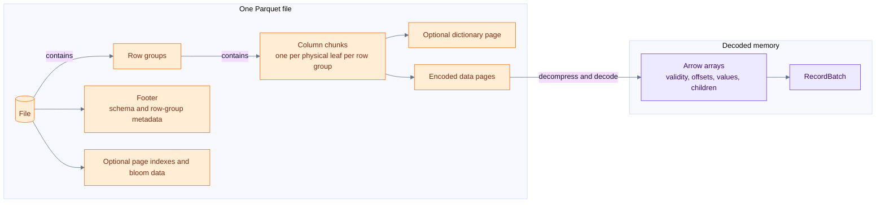
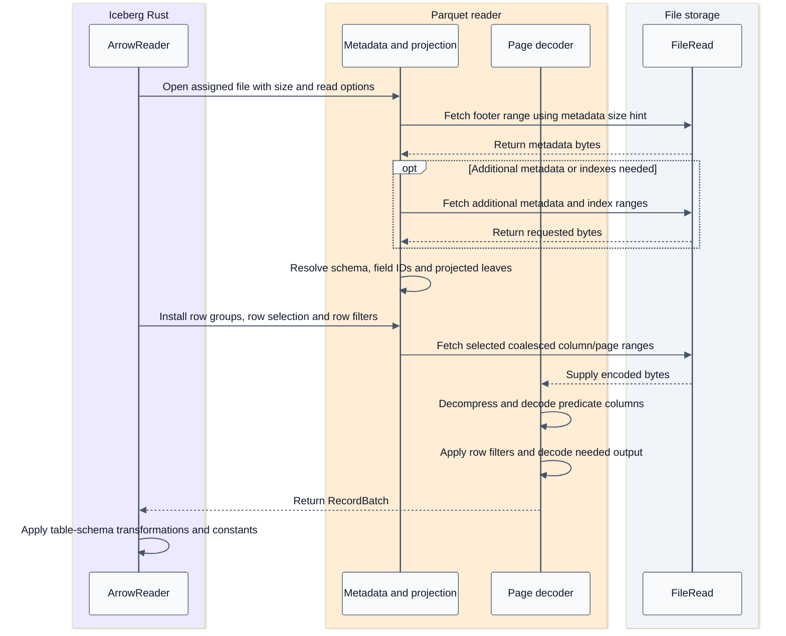
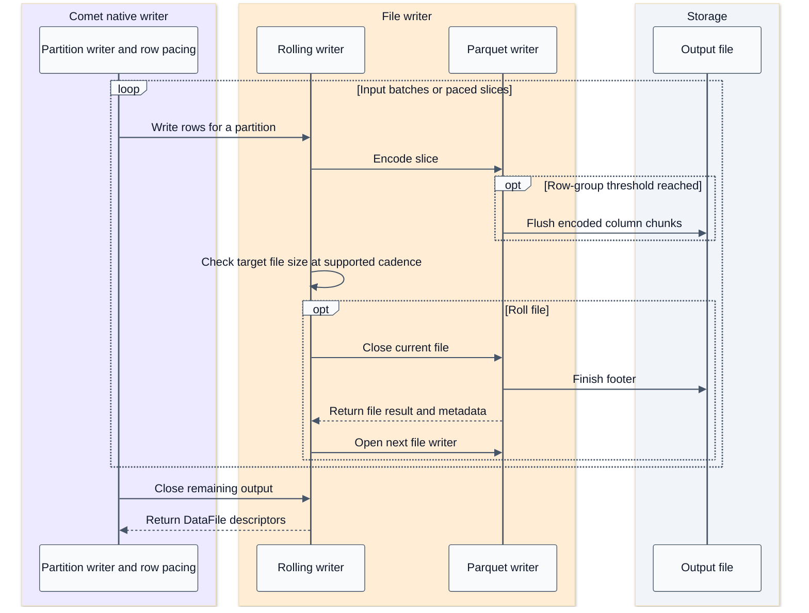

# Parquet layout and batch processing

[Index](README.md) | [Native runtime](04-native-runtime-and-serde.md)

## Summary

Parquet determines how a file stores columns. Iceberg determines which files belong to a table state. A reader chooses byte ranges, decodes the necessary pages, reconstructs nested values, and produces batches. An Arrow batch is an output-memory unit, not an on-disk Parquet unit.

Evidence: [Parquet sources](09-source-ledger.md#parquet), [pinned native reader](09-source-ledger.md#iceberg-rust-reader), [Arrow arrays](09-source-ledger.md#datafusion-and-arrow).

## Physical layout



This is a containment diagram, not a literal byte-offset drawing. Footer metadata describes row groups and column chunks and can point to optional indexes. Index and bloom contents are not all embedded directly in every row-group statistics object.

| Concept | Purpose | Consequence for a reader |
| --- | --- | --- |
| Row group | Column chunks covering a common logical row range | A unit for statistics-based skipping and reader work |
| Column chunk | Encoded physical leaf column for one row group | Projection can avoid unrelated chunks |
| Data page | Encoded values and, as required, repetition/definition levels | Decompression/decoding work; not automatically a result batch |
| Dictionary page | Values referred to by dictionary indices | Dictionary encoding is not the same as an Arrow dictionary array |
| Definition levels | Represent optional/nested presence | Distinguish missing parents, null values and empty containers |
| Repetition levels | Represent repeated/nested structure | Reconstruct lists and nested row boundaries |
| Column index | Page-level statistics | Can establish non-matching pages |
| Offset index | Page offsets and row-position information | Helps turn selected rows/pages into byte-range reads |
| Bloom filter | Probabilistic membership summary | Can prove absence; a possible match is not proof of presence |
| Footer statistics | Row-group/column metadata and bounds | Pruning must handle missing/truncated/ambiguous statistics conservatively |

Encoding and compression are separate. Dictionary, RLE/bit-packing and delta encodings exploit value structure; codecs such as Snappy or Zstd compress encoded page payloads. Exact available encodings depend on physical type and writer configuration.

## Read request sequence



This is logical dependency order. The implementation buffers, overlaps and sometimes widens range requests. It is not a claim of one HTTP request per page. `ArrowFileReader.get_byte_ranges` merges nearby ranges and fetches merged ranges with bounded concurrency. Comet supplies a 512 KiB metadata prefetch hint; that is not a guaranteed footer size or fixed amount read for every file.

## Pruning ladder

```text
Table metadata: partition and manifest summaries -> file statistics -> candidate FileScanTasks
File metadata: split ownership and row-group statistics -> page selection -> projected decoding
Rows: reader predicates and deletes -> remaining exact engine predicates -> relational operators
```

The explicit native composition is useful:

- Intersect task byte-range ownership with predicate-selected row groups.
- Build row selections from page indexes where the predicate/type supports them.
- Intersect with positions retained after position deletes or deletion vectors.
- Install the combined scan/equality-delete row filter.
- Decode only what the selected reader plan needs, then adapt the batch.

Predicate pushdown can still have residual work. Missing statistics or indexes reduce pruning opportunities; they must not cause false-negative row elimination.

The pinned reader's `RowSelection` is relative to selected row groups, while `_pos` and position deletes refer to original file positions. Mixing these coordinate systems is a correctness bug. File splitting must assign row groups consistently so adjacent byte ranges do not both return a row group. The Comet suite explicitly checks that boundary.

## Java and Rust paths are not identical

| Path | Source-backed observation |
| --- | --- |
| Iceberg Java `ReadConf` | Explicit row-group statistics, dictionary and bloom tests |
| Comet Iceberg Rust reader | Row-group filtering plus enabled page-index row selection |
| Pinned Iceberg Rust bloom support | Exists, but defaults off; Comet does not enable it in this scan builder |
| DataFusion generic Parquet datasource | Separate integration; its options do not automatically configure Comet's custom Iceberg scan |

The fact that one path can skip pages says nothing about whether a particular query/file/type combination did so. The integration test for single-row-group page skipping is stronger evidence than a filtered result alone because it checks read behavior.

## Nested values and field identity

An Arrow list uses offsets into a child array plus validity; a struct has children and parent validity; a variable-length string/binary array uses offsets plus value bytes. Parquet uses physical leaves and repetition/definition levels. The reader reconstructs the logical shape.

Consequently, a null struct is not equivalent to a present struct whose children are null. A null list is not an empty list. Schema projection must preserve these distinctions. Native support for a struct column does not prove nested-field predicate pushdown, nor does it prove that an entire container can be used as an equality-delete key.

Field IDs connect the Parquet schema to Iceberg columns. When IDs are absent, the reader may use a name mapping or compatibility fallback IDs. A rename must not be implemented as blindly selecting the new column name from an old file.

## Write layout flow

```mermaid
%%{init: {"theme":"base","flowchart":{"curve":"basis","nodeSpacing":32,"rankSpacing":46},"themeVariables":{"fontFamily":"Ubuntu, Arial, sans-serif","fontSize":"15px","primaryTextColor":"#0f172a","lineColor":"#64748b"}}}%%
flowchart LR
  subgraph INPUT["Native input"]
    B["Arrow batches"]
    PART["Route to Iceberg partition writer"]
    B --> PART
  end
  subgraph PARQUET["Parquet encoding"]
    COL["Encode physical leaves and levels"]
    PAGE["Build and compress pages"]
    RG["Flush row groups"]
    FOOT["Close file and write footer"]
    PART --> COL --> PAGE --> RG --> FOOT
  end
  subgraph ICE["Iceberg file metadata"]
    DF["DataFile descriptors<br/>counts, bounds, offsets, partition"]
    COMMIT["Later driver commit"]
    FOOT --> DF --> COMMIT
  end
  classDef native fill:#ede9fe,stroke:#7c3aed,color:#3b0764
  classDef parquet fill:#ffedd5,stroke:#f97316,color:#7c2d12
  classDef ice fill:#fef9c3,stroke:#ca8a04,color:#713f12
  class B,PART native
  class COL,PAGE,RG,FOOT parquet
  class DF,COMMIT ice
```



## Write and rollover sequence



The row-group threshold, page target, target data-file size, task split size and Arrow batch size are independent controls. Target file size is approximate: buffering, compression, row size and check cadence cause overshoot. Comet's writer paces rows to match the Java rolling writer's 1000-row check cadence; this does not make output files byte-identical.

## Performance reasoning

Illustrative tradeoffs, not measured results:

- Many tiny files increase footer, open, planning and task overhead.
- Larger row groups can improve compression and throughput but make row-group pruning coarser.
- Page indexes offer a finer skipping opportunity but also cost metadata and requests.
- Range coalescing trades fewer requests for reading gaps between useful ranges.
- Larger batches amortize per-batch work but increase working memory and may delay first output.
- Stronger compression trades CPU for storage/network bytes.
- Sorted layouts can tighten bounds; unsorted values can make min/max broad and unhelpful.
- `COUNT(*)` may be answered by Java metadata aggregate pushdown. If an empty projection reaches the pinned native reader, its current fallback can read all columns to preserve row counts. Do not assume every count is metadata-only or every count is a full data scan.
