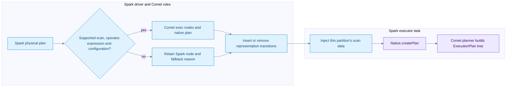
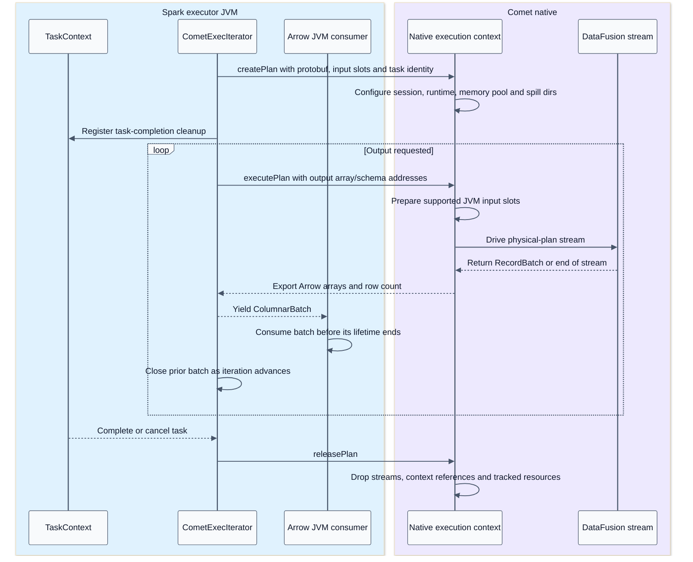
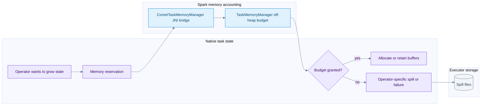

# Native execution serialization and memory

[Index](README.md) | [Distributed execution](05-distributed-execution.md)

## Summary

Comet translates eligible Spark physical regions into a protobuf plan, instantiates a native execution context inside a Spark task, and streams Arrow batches through local operators. Task serialization, native-plan serialization, Arrow FFI, shuffle encoding and Iceberg commit-message encoding are different protocols.

Evidence: [Comet runtime](09-source-ledger.md#comet-runtime), [memory](09-source-ledger.md#memory), [shuffle encoding](09-source-ledger.md#shuffle), [write handoff](09-source-ledger.md#writes).

## Physical conversion flow

`CometSparkSessionExtensions` inserts rules at columnar and AQE preparation/optimization points. `CometScanRule` checks scan contracts; `CometExecRule` converts eligible physical operators. Native operators and expressions are explicitly translated, including Spark-compatible behavior. Supported DataFusion APIs alone do not establish Spark parity.

Adjacent native operators can form one execution block. Its leaves may be native file scans, input Arrow streams, or raw shuffle streams. A JVM-only operator can split the region. An exchange changes distributed ownership even when both sides are native.

## Serialization contracts

| Boundary | Representation | Ownership and cost |
| --- | --- | --- |
| Driver to Spark executor | Spark task description, task binary/broadcast and partition object | Distributed task launch; not a stream of query result rows |
| JVM to native planner | Protobuf operators, expressions, configuration and scan pools | Copy/parse control metadata, then build native objects |
| Iceberg task distribution | Common deduplicated pools plus per-partition task references | Avoid repeating shared schemas/deletes for every file/task |
| JVM to native batch input | Arrow C Stream or compatible batch bridge | In-process addresses and release callbacks, not network serialization |
| Native output to JVM | Arrow C Data arrays/schema plus explicit row count | Buffer lifetime must outlive consumers; some adaptations allocate |
| Executor shuffle transport | Comet-framed compressed Arrow IPC blocks | Encode, transfer and decode; not C pointers sent over the network |
| Native write result to JVM | Binary Avro manifest payload plus written-location payload | Recover DataFiles and cleanup ownership; not a published snapshot |
| Executor write result to driver | Serialized Iceberg WriterCommitMessage | Driver coordinates a single logical table commit |

The scan pools contain shared schemas, specs, projection IDs, partition values, delete files/sets and residuals. The per-partition slice is placed on the Spark partition object; the entire O(number of partitions) map is not supposed to ride in every task's shared binary. Reflection is used on the JVM to interface with supported Iceberg class shapes. Failed compatibility extraction is a fallback reason during planning, not license to omit correctness metadata.

## Native batch lifecycle sequence

This is a logical lifecycle. Native asynchronous work can run on Comet's Tokio runtime. JNI callbacks have thread-context constraints; the shuffle scanner explicitly pulls JVM input outside its stream `poll_next` path. Some supported UDF bridges install task/classloader context on attached native worker threads. Do not infer that every callback can happen on any thread.

`createPlan` establishes the native context; physical-plan construction/execution is driven as execution starts. `CometExecIterator` registers completion cleanup and converts native errors back to Spark-facing exceptions. `close()` attempts independent cleanup steps and is idempotent. The lifecycle suite tests setup failure and teardown failure paths.

## Arrow lifetime and copying

Arrow arrays refer to buffers and children; a `RecordBatch` groups arrays with a schema and row count. The C Data interface exports a schema, array description and release contract. The C Stream interface exposes a producer of such arrays. Neither is an RPC system.

Zero-copy is boundary-specific. Comet's output code explicitly materializes non-zero-offset arrays through `take` on a compatibility path. Type casts, schema adaptation, filtering, decompression and shuffle interleaving can allocate. Returning a pointer does not make the full query allocation-free.

The shuffle block bridge returns a reusable DirectByteBuffer. Its bytes are valid only until the next pull. Native decoding must finish consuming those compressed bytes first; the decoded batch uses separately owned decompressed buffers.

## Memory reservation flow

The shared off-heap pool is an accounting budget, not a single shared allocator. Rust still allocates native memory. Multiple native plans in one Spark task share a task budget. Pool policy controls fairness and admission, but only explicitly reserved allocations are tracked.

Per-batch kernel buffers, decompression, readers, request buffers, runtime overhead, JVM Arrow buffers and allocator fragmentation can sit outside reservations. The container can run out of memory while the reservation pool appears healthy.

Spark's `NativeMemoryConsumer.spill` callback does not directly spill native state. Native operators with spill support respond to reservation pressure through their own logic. Do not interpret shared accounting as universal cross-language spill control, or assume every join/aggregate/expression can spill.

## Practical boundaries to inspect

- Plan conversion: which node remained JVM and why?
- Plan payload: are schemas/deletes pooled, and is each task receiving only its slice?
- Input ownership: who closes the stream, batch, buffer and native plan on setup failure?
- Memory: compare reserved bytes, native allocation/RSS, JVM memory and spill metrics.
- Throughput: distinguish I/O wait, decode, operator state growth, JNI boundary work and shuffle encoding.
- Cancellation: task completion should release resources even when the consumer stops at LIMIT.
