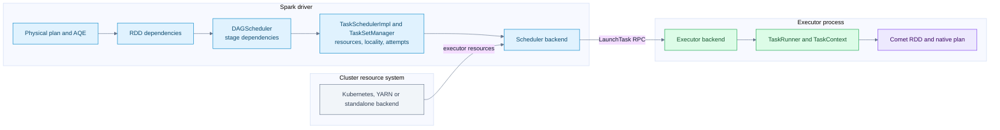
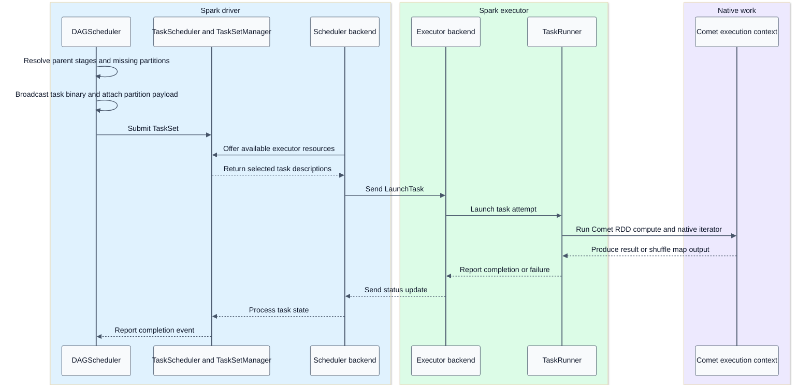
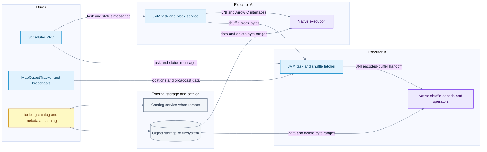
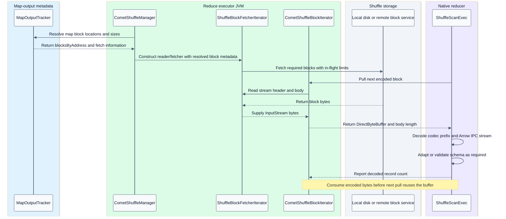

# Distributed scheduling networking and shuffle

[Index](README.md) | [Writes](06-iceberg-write.md) | [Failure handling](07-fault-tolerance.md)

## Summary

Spark distributes work using jobs, stage dependencies and task attempts. Comet stays inside that contract. DataFusion supplies executor-local streams and operators; it does not schedule tasks across this Spark cluster.

This chapter traces the conventional materialized shuffle path. The local Spark branch contains additional pipelined-shuffle code, which is not evidence that Comet's normal exchange uses it. Celeborn is a separate optional Comet integration, described explicitly below.

Evidence: [Spark scheduling](09-source-ledger.md#spark-scheduling), [Spark networking](09-source-ledger.md#spark-networking), [Comet shuffle](09-source-ledger.md#shuffle).

## Scheduling component flow



The cluster manager supplies executor resources; Spark's task scheduler assigns tasks to those executors. The diagram groups that relationship rather than claiming all deployment backends have the same resource-request protocol.

## From stages to task attempts

`DAGScheduler` follows RDD dependencies. Narrow dependencies permit pipelined computation within a task; a shuffle dependency normally introduces a materialization boundary and shuffle-map stage. Result stages produce the requested result or write-task messages. SQL query stages used by AQE are related to exchanges but should not be conflated with every scheduler stage or every native operator.

When a stage becomes runnable, Spark computes missing partitions and locality preferences, serializes a shared task binary, broadcasts it, and builds per-partition `ShuffleMapTask` or `ResultTask` instances. The scheduler uses task sets, resource offers and locality constraints. The coarse-grained backend serializes task descriptions and sends `LaunchTask` to executors.

Comet's native RDDs preserve Spark dependencies. `CometExecRDD` and the native-shuffle scheduling anchor carry per-partition scan payloads. A native file-scan leaf can read storage directly and therefore need no JVM input RDD supplying rows. That is different from having no Spark scheduling anchor.

## Task launch sequence



Task identity matters: stage ID, stage-attempt number, partition ID, task-attempt ID and attempt number are not interchangeable. Task-attempt identity protects output naming/lifecycle; partition ID identifies logical work. A retried task creates a new native context and may run on a different executor.

## Parallelism and backpressure

There are several independent concurrency levels:

| Level | Controlled by | Tradeoff |
| --- | --- | --- |
| Scan scheduling partitions | Iceberg split/group planning and Spark scan | More tasks versus per-task overhead |
| Running task slots | Executor resources and Spark resource profiles | More simultaneous work versus contention |
| Native file concurrency per task | Comet Iceberg reader setting | I/O overlap versus reader/buffer memory |
| Range-fetch concurrency | Reader/FileIO implementation | Storage throughput versus requests and buffers |
| Shuffle reduce partitions | Exchange partitioning and AQE | Parallelism versus tiny partitions and skew |
| Native runtime workers | Comet runtime configuration | Local execution resources, not extra cluster slots |

Illustrative upper-envelope reasoning: active readers can grow roughly with `running scan tasks * configured file concurrency`, but actual concurrency is limited by available tasks/files, storage and downstream demand. This is not a measured memory-sizing formula.

DataFusion produces streams that are polled by consumers. Stateful operators can buffer, and file readers can prefetch. Pull-based batches do not mean every stage has only one batch resident or that remote storage has no in-flight requests. Shuffle fetching adds separate in-flight byte/request/block limits.

## Network and process boundaries



- Scheduler RPC carries control, task descriptions and status. It is not the bulk path for every scanned row.
- Executors read data/delete bytes from storage. The driver generally does not proxy those bytes through its heap.
- Local shuffle may read directly from local disk; remote shuffle fetches blocks from an executor block service or configured external service.
- MapOutputTracker supplies map-output locations and sizes, not the full shuffle payload.
- Broadcast exchange is a separate data-distribution mechanism used for eligible join/subquery results; it is not an all-to-all shuffle.
- JNI is in-process. Arrow C pointers are not valid remote addresses. The checked local-shuffle transport is not Arrow Flight.
- Catalog protocol, credentials, TLS and object-store access depend on deployment. Do not publish credentials in plan captures or notes.

## Local native shuffle flow

```mermaid
%%{init: {"theme":"base","flowchart":{"curve":"basis","nodeSpacing":34,"rankSpacing":48},"themeVariables":{"fontFamily":"Ubuntu, Arial, sans-serif","fontSize":"15px","primaryTextColor":"#0f172a","lineColor":"#64748b"}}}%%
flowchart LR
  subgraph MAP["Map task"]
    N["Native child plan"]
    P["Hash, range, round-robin<br/>or single partitioning"]
    BF["Buffer Arrow batches<br/>and partition row indices"]
    EN["Gather/coalesce rows and encode<br/>optionally compressed IPC to scratch"]
    SP["Flush encoded scratch<br/>to spill or final output"]
    N --> P --> BF --> EN --> SP
  end
  subgraph LOCAL["Spark shuffle storage"]
    F[("Map data and index files")]
    MS["MapStatus locations and lengths"]
    SP --> F
    F -. "publish successful map output" .-> MS
  end
  subgraph REDUCE["Reduce task"]
    GET["Spark block fetcher"]
    JNI["CometShuffleBlockIterator"]
    DE["ShuffleScanExec decodes IPC"]
    OP["Downstream native operators"]
    MS --> GET
    F --> GET --> JNI --> DE --> OP
  end
  classDef native fill:#ede9fe,stroke:#7c3aed,color:#3b0764
  classDef spark fill:#e0f2fe,stroke:#0284c7,color:#0c4a6e
  classDef ext fill:#f1f5f9,stroke:#64748b,color:#334155
  class N,P,BF,EN,SP,DE,OP native
  class MS,GET,JNI spark
  class F ext
```



The row buffers and encoded-byte scratch serve different purposes. The multi-partition writer can retain Arrow batches and per-partition row indices, then gather/interleave selected rows when draining them. `BufBatchWriter` coalesces small batches, serializes completed batches into reusable byte scratch, and flushes those bytes to its underlying spill or output writer. Other partitioners have their own buffering paths; no single buffer layout is required for all of them. [Partition buffers](/Users/srajak/Documents/repos/oss/apache/datafusion-comet/native/shuffle/src/partitioners/multi_partition.rs:323), [encoding and flush](/Users/srajak/Documents/repos/oss/apache/datafusion-comet/native/shuffle/src/writers/buf_batch_writer.rs:112).

A supported native child can be fused under `ShuffleWriter(childNativeOp)` in one native plan. Spark still invokes the shuffle writer through its shuffle-map task contract. Compression is optional: `spark.shuffle.compress=false` selects uncompressed IPC bodies. [Compression configuration](/Users/srajak/Documents/repos/oss/apache/datafusion-comet/spark/src/main/scala/org/apache/comet/CometConf.scala:631).

The local writer creates temporary data output, captures native partition offsets, computes partition lengths, and calls `IndexShuffleBlockResolver.writeMetadataFileAndCommit`. It returns `MapStatus`. A shuffle partition comprises contributions from many map tasks, not one globally shared writer file.

Range partitioning requires bounds; hash partitioning requires Spark-compatible hash semantics and null/type handling. Round-robin has determinism and ordering concerns during retries. Comet's native-shuffle input RDD explicitly reports determinism for positional placement. Do not substitute an arbitrary Rust hash function and expect joins to remain correct.

## Shuffle fetch and decode sequence



The shuffle manager obtains `blocksByAddress` from the executor's MapOutputTracker before constructing the block-store reader. That tracker can use cached map-output information or obtain it from the driver; the fetcher receives resolved metadata and starts fetching blocks. Fetch/prefetch and native consumption can overlap. [Location lookup](/Users/srajak/Documents/repos/oss/apache/datafusion-comet/spark/src/main/scala/org/apache/spark/sql/comet/execution/shuffle/CometShuffleManager.scala:168), [fetcher construction](/Users/srajak/Documents/repos/oss/apache/datafusion-comet/spark/src/main/scala/org/apache/spark/sql/comet/execution/shuffle/CometBlockStoreShuffleReader.scala:58).

Each native shuffle block has Comet framing: an 8-byte encoded-body-length field, an 8-byte field-count field, then a body beginning with a 4-byte codec tag and encoded IPC. The length includes the field-count bytes but not its own length field. The decoder accepts compressed codecs or `NONE` for uncompressed output. Bounds/truncation checks are part of the reader. Each encoded block is a self-contained Arrow IPC stream, including schema, needed dictionaries, a record batch and end marker.

One read path returns decoded `ColumnarBatch` objects through the JVM wrapper. The direct native `ShuffleScan` path instead receives encoded blocks and decodes in Rust. They should not be drawn as one mandatory JVM decode followed by another native decode.

Spark's block fetcher limits bytes, requests and blocks in flight and uses configured transport retries. Comet passes these controls through. A network retry and a scheduler stage retry happen at different layers; see [fault tolerance](07-fault-tolerance.md).

## Optional Celeborn path

The checked branch also supports native output routed to a JVM `ShufflePartitionPusher` callback backed by Celeborn. This is not the same as writing local index/data files and is not proof that all remote-shuffle configurations are native.

```text
Native partition writer -> bounded encoded output -> JNI pusher callback -> Celeborn transport -> remote shuffle storage
Remote reader -> encoded stream -> native IPC decode -> reducer operators
```

Driver-owned `CometCelebornShuffleMaterialization` chooses a destination before downstream consumers depend on its output. A specifically handled size-limit failure can cancel the remote map job and materialize a fresh local dependency. Separate RDD/shuffle/stage identities fence late remote completion. This narrow fallback mechanism is not general mid-query fallback for any native error. Destination completion includes commit authorization and remote lifecycle checks.

## AQE and joins

AQE uses materialized stage statistics to change later execution: coalescing shuffle partitions, handling skew and selecting eligible join alternatives are distinct from native expression evaluation. Comet participates at Spark's query-stage extension points and preserves supported DPP/broadcast-reuse behavior.

Do not claim that Iceberg task grouping automatically preserves storage-partitioned joins. `CometIcebergNativeScanExec` currently reports `UnknownPartitioning` and no ordering. Correct rows and correct optimizer distribution metadata are separate contracts.

## Questions for a slow distributed query

1. Is time spent planning files, waiting for task slots, reading storage, decoding, shuffling or committing?
2. Are there many tiny tasks, or a small number of huge/skewed tasks?
3. Is scan concurrency causing memory/request contention rather than useful overlap?
4. Are shuffle bytes reduced by partial aggregation before exchange?
5. Are remote fetch wait, decode time and spill time separated in metrics?
6. Did AQE reduce the partition count so far that it reduced useful parallelism?
7. Is a fallback transition repeatedly materializing rows between native blocks?
8. Are retries recomputing expensive upstream native work?
