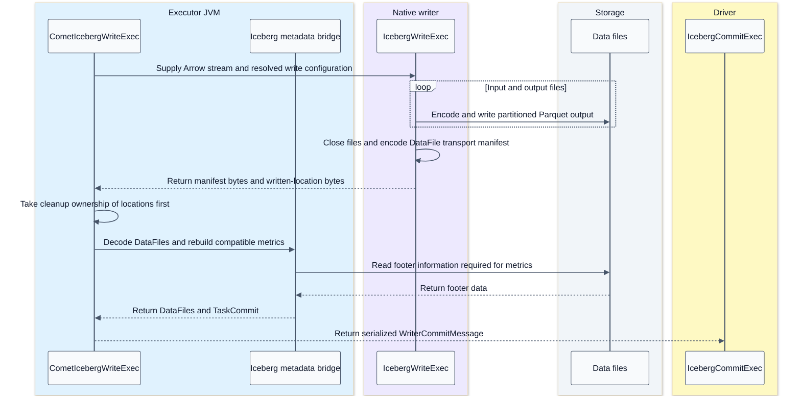
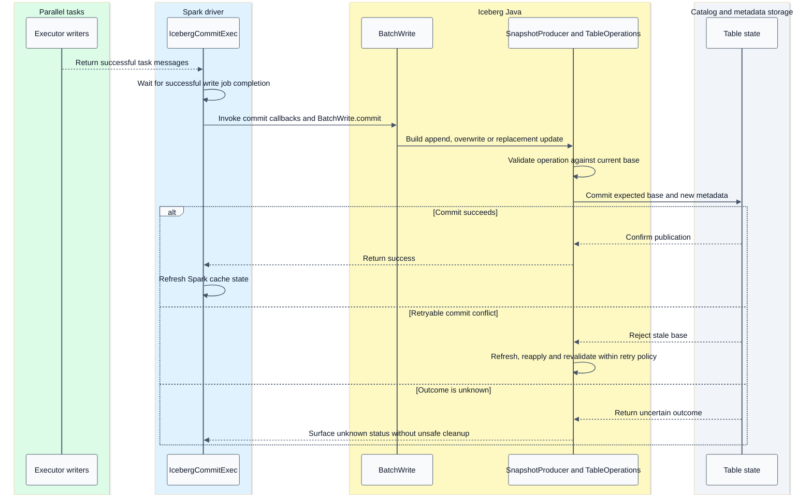

# Iceberg file writing and snapshot publication

[Index](README.md) | [Fault tolerance](07-fault-tolerance.md)

## Summary

Native file production is an executor operation. Table publication is a driver-coordinated Iceberg Java operation. This split permits parallel native data-file writing without replacing Iceberg's commit authority.

Both write flags are off by default in the checked Comet source. The native writer is eligibility-gated and experimental. Read support for v3 deletion vectors does not imply native v3 writing.

Evidence: [write strategy and bridge](09-source-ledger.md#writes), [commit semantics](09-source-ledger.md#iceberg-commits), [capabilities](08-capabilities-and-debugging.md).

## Write component flow

```mermaid
%%{init: {"theme":"base","flowchart":{"curve":"basis","nodeSpacing":33,"rankSpacing":48},"themeVariables":{"fontFamily":"Ubuntu, Arial, sans-serif","fontSize":"15px","primaryTextColor":"#0f172a","lineColor":"#64748b"}}}%%
flowchart LR
  subgraph DRIVER["Spark planning"]
    L["Append, overwrite or eligible ReplaceData"]
    S["IcebergWriteStrategy<br/>split writer and committer"]
    G{"Native write gates<br/>and native child?"}
    L --> S --> G
  end
  subgraph EXEC["Executor tasks"]
    N["Comet native file writer"]
    J["Iceberg Java file writer"]
    A["JVM DataFile reconciliation<br/>and TaskCommit"]
    G -- "yes" --> N --> A
    G -- "no" --> J --> A
  end
  subgraph COMMIT["Driver Iceberg Java"]
    C["IcebergCommitExec collects messages"]
    BW["BatchWrite.commit<br/>validate and publish"]
    A --> C --> BW
  end
  subgraph STORE["Storage"]
    D[("New data files")]
    M[("Committed table metadata")]
    N --> D
    J --> D
    BW -. "table publication" .-> M
  end
  classDef spark fill:#e0f2fe,stroke:#0284c7,color:#0c4a6e
  classDef native fill:#ede9fe,stroke:#7c3aed,color:#3b0764
  classDef ice fill:#fef9c3,stroke:#ca8a04,color:#713f12
  classDef store fill:#f1f5f9,stroke:#64748b,color:#334155
  class L,S,G,C spark
  class N native
  class J,A,BW ice
  class D,M store
```



The JVM writer already produces normal TaskCommit data; only native output needs the manifest-decoding/metrics-rebuild portion of the reconciliation box.

The eligibility decision runs in driver physical-plan conversion before tasks execute the selected writer. A native runtime failure follows Spark task recovery; it does not switch that task to a JVM writer. [Conversion rule](/Users/srajak/Documents/repos/oss/apache/datafusion-comet/spark/src/main/scala/org/apache/comet/rules/CometExecRule.scala:464), [support checks](/Users/srajak/Documents/repos/oss/apache/datafusion-comet/spark/src/main/scala/org/apache/comet/serde/operator/CometIcebergNativeWrite.scala:120).

The split strategy keeps the committer outside the AQE-replanned writer subtree and shares one `BatchWrite` object across planning/execution. Recreating unrelated BatchWrite instances would lose the validation context. The strategy declines writers requiring Spark's commit coordinator; the checked Iceberg `SparkWrite` reports that it does not require that coordinator.

## Native file writer stack

```text
Arrow input -> schema and field-ID alignment -> unpartitioned, fanout or clustered writer -> DataFile writer -> rolling file writer -> Parquet writer
```

- **Unpartitioned** routes all rows to the table's unpartitioned file stream.
- **Clustered** relies on required partition clustering; revisiting a closed partition can be an error. Spark distribution/sort requirements matter.
- **Fanout** permits unsorted partitioned input by keeping partition writers active; many distinct partitions can increase resource use.
- **Rolling** separates the target file size from Parquet row-group/page targets.
- **Schema alignment** stamps Iceberg field IDs and enforces compatible Arrow/Parquet types.
- **Naming** includes partition/task-attempt/operation identity so retried attempts do not overwrite the same output blindly.

The native writer records every generated location. Its abort guard can clean known files if input, encoding, close or payload assembly fails. Cleanup remains best effort; process death cannot be assumed to run a destructor.

## Executor handoff sequence



The native result is one row containing two binary payloads. The Avro manifest is an in-memory transport envelope, not the manifest list of an independently committed snapshot. The separate locations payload allows cleanup even if manifest decoding fails.

The executor JVM rebuilds Iceberg metrics using Java footer/metrics logic, reconciles native floating-point bounds/NaN information where needed, and restores sort-order metadata. This work is part of compatibility and performance cost. Do not describe the writer as a wholly JVM-free path.

## Driver commit sequence



The retry branch summarizes Iceberg's internal retry policy; a validation failure need not be retryable, and the diagram does not promise eventual success. `TableOperations.commit(base, updated)` is the publication boundary; catalogs implement the atomic update using their own mechanisms. New object creation alone does not publish table rows.

For an ordinary commit, readers resolving the updated table reference see the new snapshot; already planned scans remain bound to their selected state. Branch targets and write-audit-publish can deliberately publish to a branch or stage a snapshot without moving the default current snapshot.

## DML coverage is plan dependent

| Operation | Important qualification |
| --- | --- |
| Append | Eligible native file writing, Java append commit |
| Static or dynamic overwrite | Native files where eligible, Java overwrite validation/publication |
| Copy-on-write DELETE/UPDATE | Rewritten data files can use the native writer |
| Copy-on-write MERGE | JVM MergeRows logic remains; native file writing can still engage after a suitable exchange |
| Merge-on-read WriteDelta | Not intercepted by this split native-write strategy |
| CTAS/RTAS | Tests cover native inner append/write paths; table creation/replacement control remains Java/Spark |

The unpartitioned MERGE test expects the JVM two-operator writer path; the partitioned no-AQE test can get a native writer because a Comet exchange provides an eligible native child above JVM `MergeRowsExec`. Neither proves a native implementation of MergeRows itself.

## Maintenance distinctions

`rewrite_data_files` reads and rewrites data. Its staged scan tasks can enter Comet's recognized `SparkStagedScan` path, followed by eligible native operators and writer. Iceberg chooses rewrite groups and publishes replacements. A maintenance action can have several group jobs or commits depending on its options; do not generalize one query commit into one commit for every maintenance invocation.

`rewrite_manifests` primarily reorganizes metadata. `expire_snapshots` changes retained table history and can delete no-longer-needed files. `remove_orphan_files` is lifecycle housekeeping, not a normal transaction commit step. `rewrite_position_delete_files` rewrites delete artifacts and is not merely metadata-only work; native data-file writer support does not cover it automatically.

## Failure boundary reminders

- Task success is not snapshot success.
- A task retry can write different physical files for the same logical work.
- Driver commit retries do not necessarily require rerunning every writer task.
- Unknown publication outcome must be distinguished from known rejection.
- Cleanup is best effort, and later orphan maintenance may be needed.
- None of this establishes application-level exactly-once ingestion from an external source; that needs an additional end-to-end protocol.
