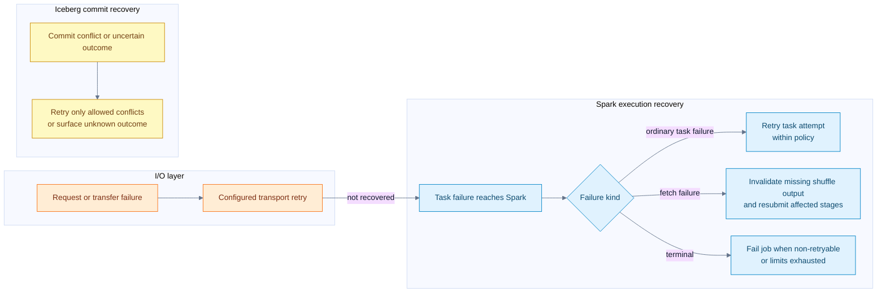
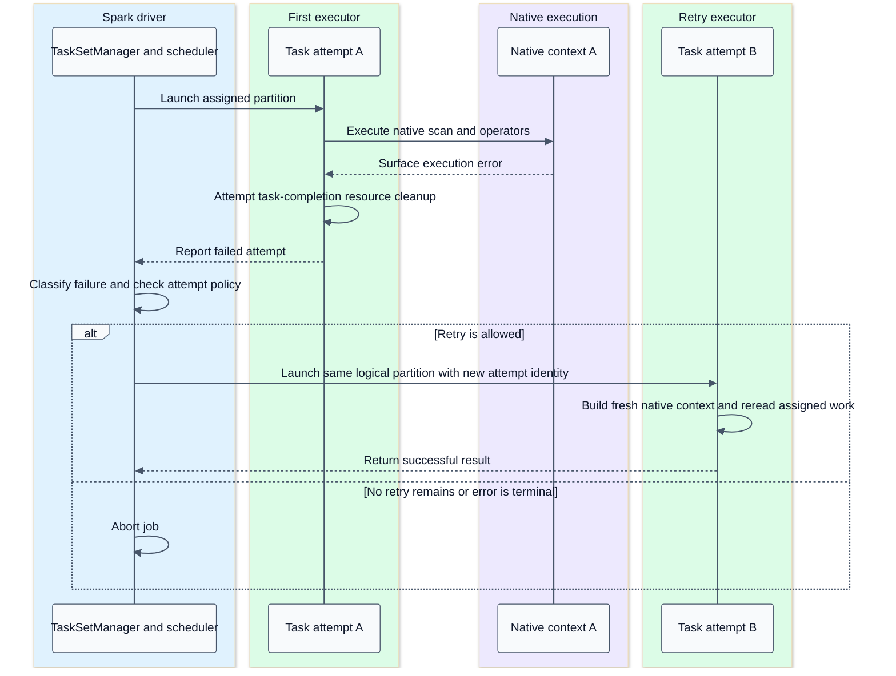
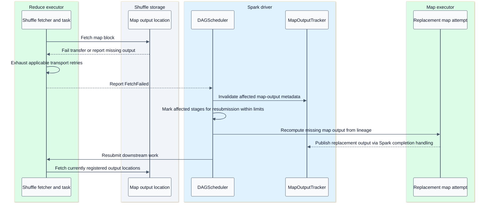
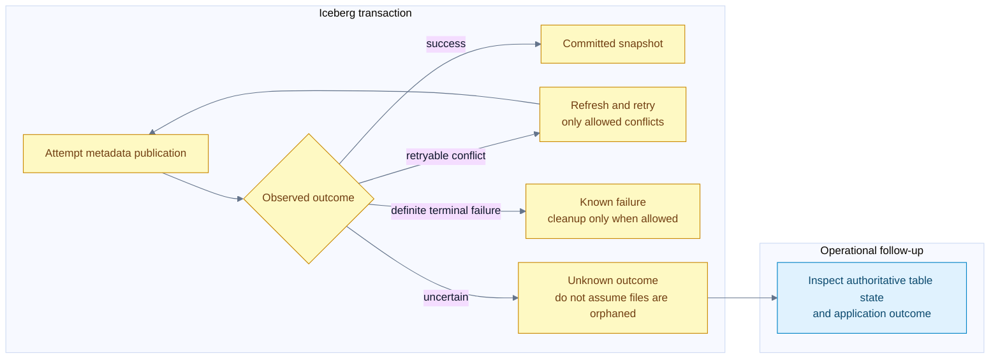

# Failure recovery and cleanup boundaries

[Index](README.md) | [Investigation guide](08-capabilities-and-debugging.md)

## Summary

Recovery happens at several layers. A storage or shuffle transport may retry an operation. Spark may retry a task or recompute a shuffle stage. Iceberg may retry a metadata commit. These are different units of replay, with different side effects and limits.

Native execution does not remove Spark's retry protocol. It also does not make every failure recoverable. Process crashes, out-of-memory termination, non-retryable errors, exhausted attempts and unknown commit outcomes require distinct treatment.

Evidence: [Spark scheduling and recovery](09-source-ledger.md#spark-scheduling), [shuffle](09-source-ledger.md#shuffle), [native lifecycle](09-source-ledger.md#comet-runtime), [Iceberg commits](09-source-ledger.md#iceberg-commits).

## Recovery ownership flow

Storage retry behavior depends on the selected FileIO/backend and configuration; this diagram does not guarantee a retry for every object-store error. A failed delete-file read is not permission to return undeleted rows.

## Read task retry sequence

A normal task retry does not resume from an arbitrary Arrow batch boundary. It re-executes task work according to Spark lineage and its input dependencies. Scanned snapshot/task identity should remain consistent with the planned query. If files for an in-flight snapshot are externally removed, retry cannot manufacture the missing data; retention policy matters.

Native error conversion returns failures to Spark. A process-level crash may instead be reported as executor loss. Either way, no arbitrary transparent replacement of a partially executed native task with a JVM plan is promised.

## Shuffle loss sequence

The final storage participant represents the currently registered location, which may be a different executor after recomputation. The diagram omits Spark's internal completion-event hop when recording new MapStatus metadata.

`TaskSetManager` treats fetch failures differently from ordinary counted task exceptions; `DAGScheduler` handles upstream output invalidation and stage recovery. Stage retry limits, determinism, executor loss, shuffle preservation services and deployment configuration affect what can be reused. Do not promise that every failed reducer causes exactly one map task to rerun.

## Speculation and determinism

Speculation can run another attempt of slow logical work when enabled and eligible. Spark selects successful task output according to its task/output protocols. This is not evidence that external side effects happened once. Writers need attempt-unique locations and a commit protocol; losing or interrupted attempts can leave cleanup work.

The Comet Iceberg split writer shares Iceberg's commit contract and declines a BatchWrite requiring an unsupported commit-coordinator path. Do not claim Spark's output commit coordinator protects every Iceberg file write. The optional Celeborn native shuffle path has its own explicit authorization checks.

Repartitioning also interacts with determinism. Replaying unordered input into position-based partition assignment can change output placement; the RDD determinism contract matters for safe shuffle replay. Comet's native shuffle anchor carries this property rather than hiding it inside Rust.

## Write failure matrix

| Failure point | Known state | Expected handling and limit |
| --- | --- | --- |
| Native input, encode or close fails | Attempt did not hand off a successful result | Native guard attempts cleanup of recorded attempt files |
| Manifest packaging fails | Files may exist; task result is not usable | Native location tracking permits cleanup |
| JVM manifest decode or metric rebuild fails | JVM first took written-location ownership | Executor JVM attempts cleanup even without decoded DataFiles |
| Some tasks finish, then write job fails | Driver has some completed task messages; no commit attempted | Comet aborts and attempts cleanup of known completed outputs |
| Cleanable commit rejection | Iceberg knows cleanup is allowed | Java abort logic can remove uncommitted output |
| Commit result unknown | Publication may already have succeeded | Preserve potentially committed files; surface uncertainty |
| Executor or driver process dies | In-process cleanup may not execute | Some files may remain orphaned; recovery depends on surrounding system |

The driver explicitly gathers completed messages as tasks finish so a later job failure does not discard all knowledge of their files. This is still bounded knowledge, not a guarantee that every abandoned file is discoverable synchronously.

## Publication outcome flow

Atomic publication means a partial set of task files is not made visible by gradually appending directory entries to a live table. It does not mean the client always knows whether a commit succeeded. It does not mean the whole Spark application can be replayed without duplicating an append.

## Cancellation and memory failure

Task completion listeners close Comet iterators and native contexts even when a consumer stops early. Idempotent close and independent cleanup steps are important because a metrics/stream close can itself throw. An uncatchable process kill bypasses these guarantees.

Reservation failure may cause a spill-capable operator to spill; another operator may fail. Container OOM is not the same as a refused reservation: untracked buffers and allocator overhead can exhaust physical memory. Retrying with identical resource pressure may repeat the failure.

## What this architecture does not promise

- No universal batch-level checkpoint inside a native task.
- No automatic application-driver recovery from Spark task retry alone.
- No general transaction across an external message source and an Iceberg snapshot.
- No synchronous cleanup of every orphan after every crash.
- No unconditional native-to-JVM fallback after a task starts.
- No guarantee a catalog commit conflict is harmless or retryable for every operation.

Test evidence includes Comet iterator lifecycle failures, Iceberg write-job abort and commit-conflict cases, shuffle lifecycle/cache cleanup, and native scan delete-stat failure. The notebook does not claim a newly executed failure-injection campaign.
