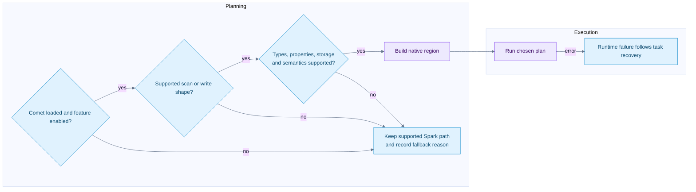

# Native capabilities gaps and investigation guide

[Index](README.md) | [Source ledger](09-source-ledger.md)

## Status vocabulary

**Native** means an implementation exists in this checkout, subject to its other gates. **Delegated** means Spark or Iceberg Java owns the operation intentionally. **Partial** means only some plan shapes or feature combinations are native. **Not admitted** means the native planner declines the path; the overall Spark query may still work.

Source scope is Comet `184accac5` plus the explicitly recorded local residual-pushdown edits. This table is not a current-upstream feature tracker. Source references and test anchors are in [the ledger](09-source-ledger.md).

## Eligibility flow



An unsupported predicate can remain as an exact post-scan filter without rejecting the whole scan. Conversely, a feature that the reader cannot safely represent can reject the scan itself. Treat these as separate outcomes.

## Read coverage

| Feature | Status | Qualification |
| --- | --- | --- |
| Catalog and snapshot selection | Delegated | Java plans the selected state; native receives tasks |
| Time travel and branch reads | Delegated planning plus native data reading | Historical schema IDs and projection matter |
| Manifest pruning and delete association | Delegated | Java plans applicable tasks/deletes |
| Parquet data scan | Native | Iceberg ORC/Avro data files are not native here |
| v1/v2/v3 reads | Native with feature gates | v3 is not blanket coverage of new types/defaults/lineage |
| Parquet position and equality deletes | Native with gates | Struct/Variant equality keys and unresolvable keys are rejected |
| Puffin deletion vectors | Native | Blob offsets/lengths and per-data-file identity preserved |
| Schema evolution and name mapping | Native with gates | Field IDs and historical delete fields are handled |
| Arrays/maps/structs | Native reading | Not blanket nested/container predicate pushdown |
| Partition transforms/evolution | Supported through planning/task metadata | Certain transform-bearing residuals and partition value types are rejected |
| Row-group and page pruning | Native | Predicate/type/index availability controls actual pruning |
| Residual comparisons/null/IN/logical operators | Partial | Top-level/type restrictions; NOT IN remains post-scan |
| Partial residual weakening | Local uncommitted implementation | Do not present as committed HEAD support |
| DPP and AQE | Implemented with gates and shims | Unsupported subqueries/multi-index DPP rejected; Spark 3.4 AQE DPP uses fallback |
| `_file`, `_pos`, `_spec_id`, `_partition` | Native | Explicit metadata allowlist |
| `_deleted` and row-lineage metadata projection | Not admitted | Underlying reader lineage support is not exposed by Comet's allowlist |
| Projected initial-default values | Not admitted | Required v3 missing-column synthesis unsupported |
| Variant | Partial | Entirely unprojected roots can be tolerated; projected Variant rejected |
| Geometry/geography/unknown types | Not admitted by current type gates | No blanket v3 type support |
| Encrypted reads | Qualified support | AES-GCM 128/256-bit keys admitted; 192-bit rejected; runtime/version setup still matters |
| Local, S3/S3A, GCS, OSS reads | Qualified support | Compatible FileIO, URI and credential setup required |
| S3-compliant alias schemes | Opt-in | Do not infer support solely from URI parsing |
| Multiple S3 data/delete buckets | Not admitted | One native object-store configuration per scan |
| HDFS/Azure Iceberg locations | Not admitted by this scan scheme allowlist | Support in another Comet reader/dependency does not transfer |
| Metadata tables and catalog administration | Delegated or distinct scan paths | This native scan recognizes specific batch/staged data scan classes |

OSS read backend presence is not a claim of complete property forwarding or deployment coverage. REST catalog compatibility also does not automatically mean vended credentials are usable in Rust; the configured credential bridge and actual native access must be verified.

## Write coverage

| Feature | Status | Qualification |
| --- | --- | --- |
| Split file writer and committer | Implemented, off by default | Strategy preserves one BatchWrite and commit boundary |
| Native file production | Implemented, off by default | Requires split flag and eligible native child |
| Append and static/dynamic overwrite | Native where eligible | Publication remains Java |
| Copy-on-write DELETE/UPDATE | Native writing for covered shapes | Scan and intermediate operators have separate eligibility |
| Copy-on-write MERGE | Partial | MergeRowsExec stays JVM; native writer depends on downstream plan shape |
| Merge-on-read WriteDelta/delete-file production | Not handled by native write strategy | Read support for deletes is not write support |
| CTAS/RTAS | Native inner write paths covered | Table command/control remains Spark/Iceberg |
| Partitioned and unpartitioned writers | Native | Clustered/fanout mode and required distribution matter |
| Format v3 native writes | Not admitted | Current writer gate requires v1/v2 |
| UUID columns and encrypted writes | Not admitted | Reader and writer type/encryption support differ |
| Custom FileIO/location provider/object-storage layout | Restricted/not admitted | Default compatible layout contract required |
| Parquet writer options | Allowlisted | Enabled bloom filters, non-default page version and unvetted settings rejected |
| Local/S3/GCS writing | Qualified support | GCS additionally requires the recognized GCS FileIO route |
| OSS/HDFS/Azure writing | Not admitted by native writer | Separate write allowlist |
| Branch/WAP/commit validation | Delegated | Java SparkWrite and SnapshotProducer retain semantics |
| Data-file rewrite maintenance | Partial native acceleration | Staged scans, operators and writer each need eligibility |

## Configuration anchors

```text
spark.comet.scan.icebergNative.enabled                  = true
spark.comet.scan.icebergNative.dataFileConcurrencyLimit = 1
spark.comet.write.iceberg.splitOperator.enabled         = false
spark.comet.iceberg.write.enabled                      = false
```

These are defaults, not a complete launch recipe. Native library loading, global Comet execution, memory mode, shuffle-manager settings, supported Spark/Iceberg versions and the actual plan still matter. Treat native writes as experimental until validated for the intended workload.

## Integration gaps worth investigating

These are source-derived opportunities, not measured bottlenecks or committed roadmap items.

| Gap | Evidence | What an implementation would need |
| --- | --- | --- |
| Bloom-filter reads not enabled | Pinned reader exposes option; builder default is false; Comet omits it | Configuration, query correctness, selective-I/O tests and cost assessment |
| Row-lineage projection not wired | Reader has support; Comet metadata allowlist excludes fields | Task metadata propagation, schema/physical-column cases and version tests |
| Scan distribution/order metadata lost | Native scan advertises UnknownPartitioning and no ordering | Correct Spark distribution semantics and storage-partitioned-join tests |
| Narrow residual pushdown | Explicit top-level/type limits and local partial-predicate work | Boolean/null/NaN/type semantics, nested field identity and I/O assertions |
| Empty native projection reads broadly | Reader preserves counts through read-all fallback | Zero-column row-count path that also respects deletes and filters |
| Native MERGE and delta writes incomplete | JVM MergeRows and no WriteDelta strategy match | Operation-code semantics, delete production and commit parity |
| v3 writing unavailable | Explicit version gate | Defaults, lineage, types, metadata and writer protocol support |
| Storage and custom FileIO parity | Explicit scheme/provider/property gates | End-to-end credentials, multi-bucket configuration and failure tests |

## Investigation workflow

Use a read-only baseline first. Record the exact physical plan, source snapshots, table schema/spec history, format version, properties, delete types and storage scheme. Change one variable at a time when testing.

```text
Correct result -> executed native plan proof -> pruning evidence -> operator and I/O metrics -> resource profile -> repeatable comparison
```

| Symptom | First questions | Source area |
| --- | --- | --- |
| Native scan absent | Is Comet loaded? Which schema/FileIO/residual/version gate failed? | CometScanRule |
| Correct rows but high I/O | Did residual serialize? Are indexes present? Are bounds selective? | Scan serde and Rust reader |
| Deleted rows appear | Correct snapshot? Applicable delete list? Raw path and field IDs preserved? | DeleteFileIndex, serde, reader |
| Many tiny tasks | Split/open-cost settings? File layout? DPP results? | Iceberg task grouping |
| Driver memory pressure | Huge metadata/task pools or task binary? Planning parallelism? | Planning and plan-data distribution |
| Executor OOM | Reserved versus untracked native memory? Too many files/partitions in flight? | Memory pool, readers, shuffle writer |
| Shuffle bottleneck | Partition skew, bytes, fetch wait, codec time, spill, network? | Exchange, writer and reader |
| Writer remains JVM | Both flags? Native child? v3/properties/layout gate? | Write strategy and native serde |
| Files exist but no new snapshot | Task files are not publication; was commit attempted or uncertain? | Commit exec and SnapshotProducer |
| Slow commit | Catalog latency/conflicts/metadata work rather than file encoding? | Java commit path |

Use runtime metric names in context. Native `bytes_scanned` concerns actual scan I/O, including applicable delete reads; file size from a manifest is different. Shuffle write/read bytes, spill bytes and encoded/decoded row counts measure different stages. `elapsed_compute` is not necessarily end-to-end wall time.

## Proof checklist for a public claim

- Record source versions and local changes, not just a release nickname.
- Show the actual plan and relevant fallback reasons.
- Check results against the compatible Spark path.
- For pruning, show bytes or skipped units, not just filtered output rows.
- For native writing, show writer engagement, file layout and the Java commit boundary.
- For retries, name the failed unit and distinguish task, stage and commit retry.
- For zero-copy, identify the exact boundary and any adaptation path.
- Keep issue/PR status and performance promises out of the notes unless freshly verified.
