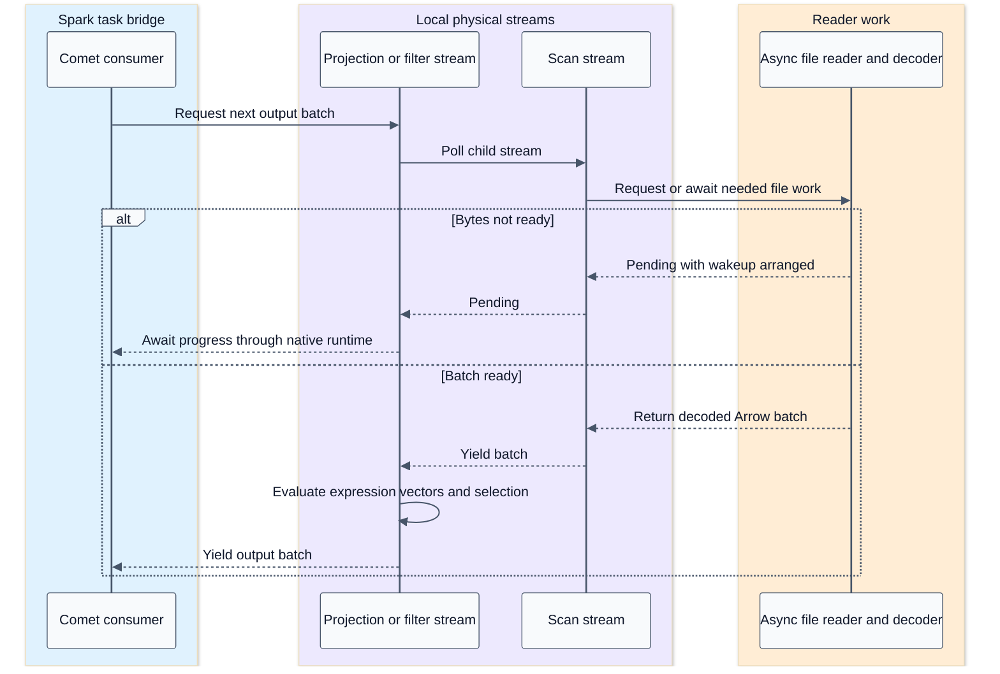
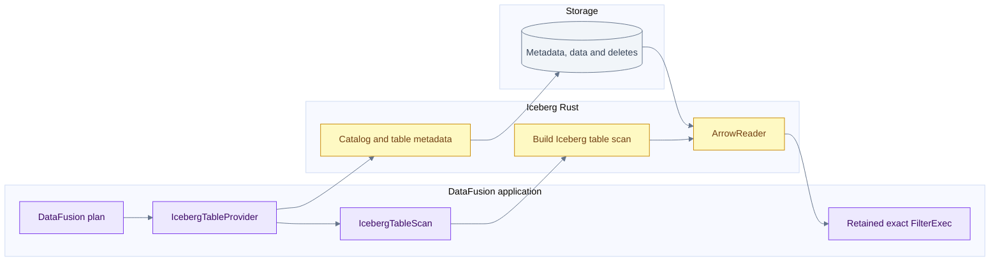
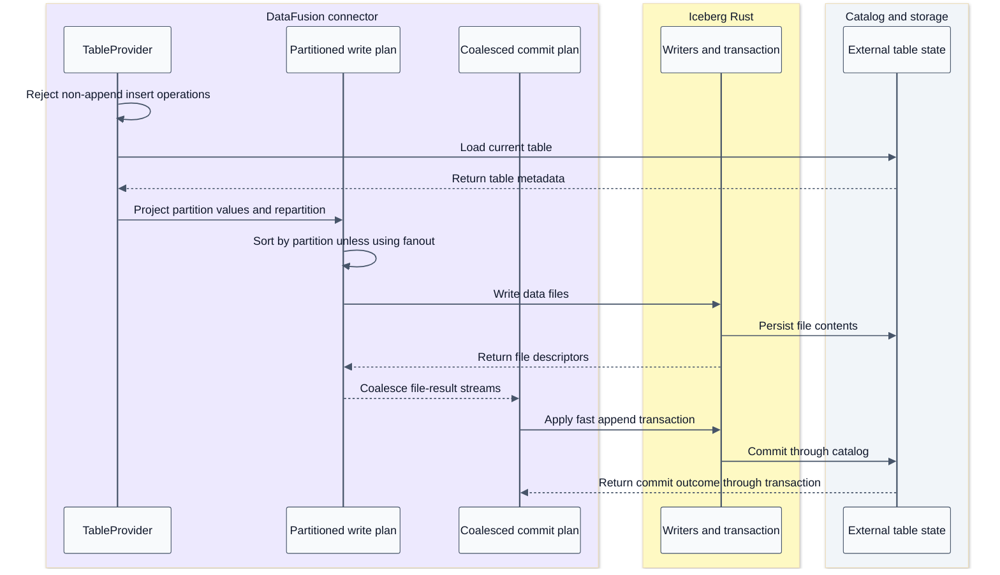

# DataFusion operators and standalone Iceberg integration

[Index](README.md) | [Native runtime](04-native-runtime-and-serde.md)

## Summary

Within Comet, a DataFusion physical plan is an executor-local computation over Arrow streams. Spark supplies distributed placement and exchange coordination. The standalone datafusion-iceberg connector starts at a different boundary: a DataFusion TableProvider owns table loading, scan construction and its own supported append commit path.

Evidence: [DataFusion and Arrow sources](09-source-ledger.md#datafusion-and-arrow). These sibling sources illustrate contracts; Comet's pinned dependency and native planner must be checked before transferring a particular operator capability.

## Native operator data flow

```mermaid
%%{init: {"theme":"base","flowchart":{"curve":"basis","nodeSpacing":34,"rankSpacing":48},"themeVariables":{"fontFamily":"Ubuntu, Arial, sans-serif","fontSize":"15px","primaryTextColor":"#0f172a","lineColor":"#64748b"}}}%%
flowchart LR
  subgraph MAP["One map task native region"]
    SC["IcebergScanExec"]
    FI["Filter and projection"]
    AG["Partial aggregate state"]
    SW["Native shuffle writer"]
    SC --> FI --> AG --> SW
  end
  subgraph SPARK["Spark distributed exchange"]
    SH[("Materialized shuffle blocks")]
    SW --> SH
  end
  subgraph REDUCE["One reduce task native region"]
    SR["ShuffleScanExec"]
    FA["Final aggregate merges state"]
    OUT["Arrow output"]
    SH --> SR --> FA --> OUT
  end
  classDef native fill:#ede9fe,stroke:#7c3aed,color:#3b0764
  classDef spark fill:#e0f2fe,stroke:#0284c7,color:#0c4a6e
  class SC,FI,AG,SW,SR,FA,OUT native
  class SH spark
```

This is an illustrative eligible grouped aggregate, not a universal plan. Comet serializes aggregate modes and expressions from Spark's chosen plan. The intermediate rows may contain aggregate state, not final SQL values. For example, a distributed AVG requires enough state to merge sums and counts; averaging per-task averages is generally wrong.

## Stream execution sequence

This is a conceptual poll/wakeup trace, not a separate OS thread per operator. `ExecutionPlan.execute` returns a stream for a partition. Operators wrap child streams or create stateful streams; asynchronous readiness and operator state determine when they can produce output. Comet's bridge drives the root and manages any required JVM inputs.

## Operator behavior and state

| Operator family | Typical local work | State and boundary |
| --- | --- | --- |
| Projection | Evaluate expressions and select/reorder columns | Some arrays can be referenced; computed expressions allocate |
| Filter | Evaluate boolean mask and retain selected rows | Null semantics matter; output batches may be coalesced |
| Hash aggregate | Map group keys to accumulator state | Cardinality drives memory; partial/final modes must agree |
| Hash join | Build lookup state, probe matching rows, apply join semantics | Build side, null handling, duplicate keys and outer/semi/anti behavior matter |
| Sort | Buffer/sort runs and merge output | Spill-capable paths write/read local temporary data |
| Limit | Stop after required output | Upstream resource cleanup still needed when not exhausted |
| Shuffle writer | Route rows and encode partitioned blocks | It creates the cross-task boundary coordinated by Spark |

A hash join's build side can delay output until sufficient build state exists. A sort often consumes substantial input before ordered output. Incremental streams therefore do not imply all operators are stateless or nonblocking. Spill behavior is operator- and version-specific, not a blanket feature of every ExecutionPlan.

Plan properties communicate partitioning, ordering and other guarantees. A wrong property can make an optimizer remove a necessary repartition or sort. Correct batches alone are not sufficient; an integration must communicate truthful properties as well.

## Standalone connector flow

The connector reports filter pushdown as `Inexact`, so an exact engine filter remains where required. The catalog-backed provider reloads the table on scan and uses the current snapshot; the static provider supports a cached read-only table/snapshot view. The scan advertises `UnknownPartitioning(1)` in this checkout. That is one DataFusion output partition, not necessarily one data file or no internal read concurrency.

## Standalone connector append sequence

This connector path does not use Comet's JVM TaskCommit compatibility bridge or Spark's scheduler. DataFusion partitioned execution alone does not install a distributed cluster runtime. Comet and the standalone connector can share lower-level libraries while having different planning, scheduling and transaction integration.

## Questions for integration work

- Is the feature in the library, the connector, Comet's serializer, or the Spark-facing contract?
- Does the native expression match Spark's type coercion, null, overflow and error semantics?
- Does the operator expose truthful ordering and distribution properties?
- Is state reserved and spill behavior defined for this particular operator?
- Are Arrow buffers still valid when the downstream consumer uses them?
- Is a claimed speedup measured across the whole distributed boundary or just a local kernel?
