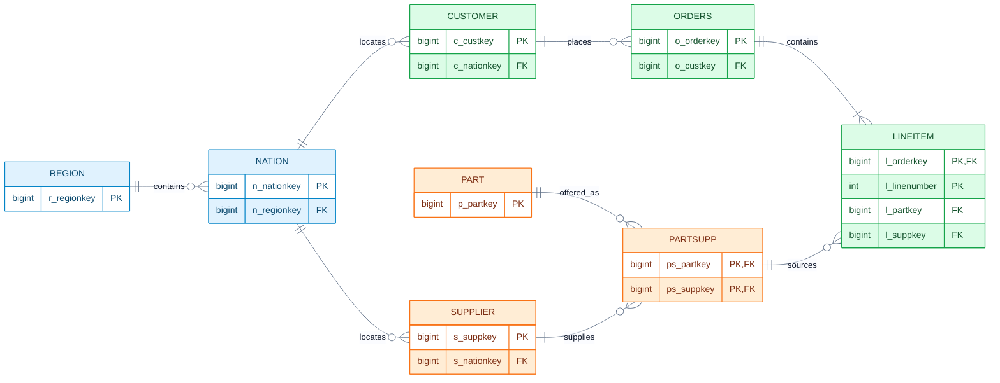
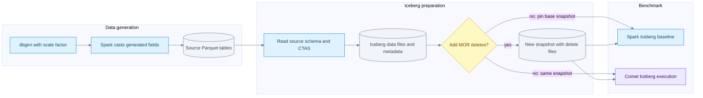

# TPC-H dataset schema and query workload

[Index](README.md) | [Spark versus Comet results](12-tpch-spark-versus-comet.md)

TPC-H supplies a synthetic business dataset and a family of analytical queries. In this notebook, the useful model is a wholesaler selling parts to customers, purchasing those parts from suppliers, and tracking orders and shipments. The large transactional tables drive scan volume; the smaller reference tables and relationships create joins, grouping, subqueries and sorting.

The local Comet workload is named **CometBench-H, derived from TPC-H** in its SQL headers. Our timings are development measurements over Iceberg, not an audited TPC-H result or a QphH score. The official benchmark includes query streams, refresh operations and reporting requirements beyond timing these 22 SQL files. [TPC-H overview](https://www.tpc.org/tpch/).

## Dataset summary

| Question | Answer |
| --- | --- |
| How many tables and columns? | Eight tables; 61 columns in Comet's current `TPCHTables` definition |
| Largest table? | `lineitem`, containing individual items within orders |
| Other large tables? | `orders`, then the part/supplier association `partsupp`; sizes depend on scale factor |
| Workload? | 22 analytical query files, with joins, filters, aggregation, sorting and subqueries |
| Dataset versus file format? | TPC-H defines logical data. Parquet stores physical files. Iceberg manages table metadata and snapshots over files. |
| What does SF1 mean? | Approximately 1 GB of reference raw data, not a promise of 1 GB of Parquet, Iceberg storage or runtime memory |
| Was the complete historical warehouse inspected? | No. Its raw files and metadata were not recovered for this update. Distinguish expected dataset properties from measured table properties. |

Column names and Spark types below come from the local [TPCH table definitions](/Users/srajak/Documents/repos/oss/apache/datafusion-comet/spark/src/test/scala/org/apache/spark/sql/TPCH.scala:80), not from an inferred schema of the historical warehouse. The official schema and population rules are in [TPC-H specification 3.0.1, clauses 1 and 4](https://www.tpc.org/tpc_documents_current_versions/pdf/tpc-h_v3.0.1.pdf).

## Tables and scale factors

These are reference cardinalities before any local deletes or refreshes. `lineitem` has an approximately linear population, not exactly six million rows times the scale factor. The specification lists **6,001,215** rows at SF1 and **59,986,052** at SF10. `nation` and `region` remain fixed. [Specification, schema figure and LINEITEM cardinality table](https://www.tpc.org/tpc_documents_current_versions/pdf/tpc-h_v3.0.1.pdf).

| Table | Grain of one row | Reference row count | SF1 reference rows | Main logical key |
| --- | --- | --- | ---: | --- |
| `region` | One geographic region | 5 | 5 | `r_regionkey` |
| `nation` | One nation assigned to a region | 25 | 25 | `n_nationkey` |
| `supplier` | One supplier | 10,000 x SF | 10,000 | `s_suppkey` |
| `customer` | One customer | 150,000 x SF | 150,000 | `c_custkey` |
| `part` | One product/part | 200,000 x SF | 200,000 | `p_partkey` |
| `partsupp` | One part offered by one supplier | 800,000 x SF | 800,000 | `(ps_partkey, ps_suppkey)` |
| `orders` | One customer order | 1,500,000 x SF | 1,500,000 | `o_orderkey` |
| `lineitem` | One numbered line within an order | Approximately 6,000,000 x SF | 6,001,215 | `(l_orderkey, l_linenumber)` |

At SF1 these counts sum to 8,661,245 rows. This is reference arithmetic, not a count performed against our old Iceberg snapshot. After the merge-on-read modification, logical row counts are lower even though the original data-file records may still exist physically.

Scale changes several costs at once: bytes to read, join-build size, aggregation cardinality, shuffle volume and memory pressure. A query that fits comfortably in memory at SF1 may spill or choose a different join strategy at SF100. Multiplying an SF1 runtime by 100 is not a capacity model.

## Entity relationships

This is a logical key diagram, not a claim that Iceberg enforces primary or foreign keys. Zero-or-more notation on the child side expresses the relationship, not the exact generated population per parent. Blue is geography, green is customer/order activity, and orange is the part/supplier catalog.

The `partsupp -> lineitem` relationship uses **both** part and supplier keys. Joining on `partkey` alone can multiply rows across suppliers and corrupt revenue or cost totals. Q9 explicitly joins both columns when subtracting supply cost. Similarly, `l_orderkey` alone is not a line-item identifier; all lines in an order share it.

## Complete column reference

Types are the default Spark mapping in the checked Comet generator: `long` becomes SQL `BIGINT`, decimal fields are `DECIMAL(12,2)`, dates are `DATE`, and character fields are `STRING`. Do not treat these as the only legal TPC-H SQL types. The generator's optional type-conversion machinery can replace decimal with double or date with string; doing that changes the execution and correctness workload. [Type conversion code](/Users/srajak/Documents/repos/oss/apache/datafusion-comet/spark/src/test/scala/org/apache/spark/sql/Tables.scala:114).

The keys described here are logical identities. The converter creates tables with `CREATE TABLE ... AS SELECT`; it does not declare these primary/foreign-key constraints. Generated and read schemas can contain nullable fields, so the `isnotnull` predicates visible in saved Spark plans are not surprising.

### REGION

| Column | Spark type | Meaning |
| --- | --- | --- |
| `r_regionkey` | BIGINT | Region identity |
| `r_name` | STRING | Region label used by filters |
| `r_comment` | STRING | Descriptive text |

### NATION

| Column | Spark type | Meaning |
| --- | --- | --- |
| `n_nationkey` | BIGINT | Nation identity |
| `n_name` | STRING | Nation label used by filters and grouping |
| `n_regionkey` | BIGINT | Reference to `region` |
| `n_comment` | STRING | Descriptive text |

### SUPPLIER

| Column | Spark type | Meaning |
| --- | --- | --- |
| `s_suppkey` | BIGINT | Supplier identity |
| `s_name` | STRING | Supplier name |
| `s_address` | STRING | Supplier address |
| `s_nationkey` | BIGINT | Supplier's nation |
| `s_phone` | STRING | Phone text; not an integer |
| `s_acctbal` | DECIMAL(12,2) | Account balance |
| `s_comment` | STRING | Text inspected by predicates such as Q16's complaint test |

### CUSTOMER

| Column | Spark type | Meaning |
| --- | --- | --- |
| `c_custkey` | BIGINT | Customer identity |
| `c_name` | STRING | Customer name |
| `c_address` | STRING | Customer address |
| `c_nationkey` | BIGINT | Customer's nation |
| `c_phone` | STRING | Phone text; Q22 extracts a prefix |
| `c_acctbal` | DECIMAL(12,2) | Account balance |
| `c_mktsegment` | STRING | Market segment, for example Q3's `BUILDING` filter |
| `c_comment` | STRING | Descriptive text |

### PART

| Column | Spark type | Meaning |
| --- | --- | --- |
| `p_partkey` | BIGINT | Part identity |
| `p_name` | STRING | Part name, including text searched by Q9 and Q20 |
| `p_mfgr` | STRING | Manufacturer label |
| `p_brand` | STRING | Brand label |
| `p_type` | STRING | Product classification |
| `p_size` | INT | Size category |
| `p_container` | STRING | Container classification |
| `p_retailprice` | DECIMAL(12,2) | Retail price |
| `p_comment` | STRING | Descriptive text |

### PARTSUPP

| Column | Spark type | Meaning |
| --- | --- | --- |
| `ps_partkey` | BIGINT | Part side of the composite key |
| `ps_suppkey` | BIGINT | Supplier side of the composite key |
| `ps_availqty` | INT | Available quantity for this supplier/part pair |
| `ps_supplycost` | DECIMAL(12,2) | Unit supply cost |
| `ps_comment` | STRING | Descriptive text |

### ORDERS

| Column | Spark type | Meaning |
| --- | --- | --- |
| `o_orderkey` | BIGINT | Order identity; not a row number or file position |
| `o_custkey` | BIGINT | Customer placing the order |
| `o_orderstatus` | STRING | Order status code |
| `o_totalprice` | DECIMAL(12,2) | Order total |
| `o_orderdate` | DATE | Order creation date |
| `o_orderpriority` | STRING | Business priority classification |
| `o_clerk` | STRING | Clerk identifier stored as text |
| `o_shippriority` | INT | Shipping priority code |
| `o_comment` | STRING | Text inspected by Q13 |

### LINEITEM

| Column | Spark type | Meaning |
| --- | --- | --- |
| `l_orderkey` | BIGINT | Order reference and first part of the line-item key |
| `l_partkey` | BIGINT | Purchased part |
| `l_suppkey` | BIGINT | Supplying vendor; paired with `l_partkey` for `partsupp` |
| `l_linenumber` | INT | Line identifier within the order |
| `l_quantity` | DECIMAL(12,2) | Quantity; decimal in this generator, not INT |
| `l_extendedprice` | DECIMAL(12,2) | Extended line price before the query's discount/tax arithmetic |
| `l_discount` | DECIMAL(12,2) | Fractional discount; `0.04` means four percent |
| `l_tax` | DECIMAL(12,2) | Fractional tax |
| `l_returnflag` | STRING | Return-status code |
| `l_linestatus` | STRING | Line-status code |
| `l_shipdate` | DATE | Shipment date, often used for scan filtering |
| `l_commitdate` | DATE | Committed delivery date |
| `l_receiptdate` | DATE | Receipt date; comparison with commit date identifies lateness |
| `l_shipinstruct` | STRING | Shipping instructions |
| `l_shipmode` | STRING | Shipping mode |
| `l_comment` | STRING | Descriptive text |

The date columns are not interchangeable. Q6 filters shipment date, Q3 combines order and shipment dates, and Q12 compares shipment, commitment and receipt dates. A partition spec based on one date does not automatically prune a predicate on another.

## Measures and join examples

| Measure | Expression or relationship | Why the distinction matters |
| --- | --- | --- |
| Discounted revenue | `l_extendedprice * (1 - l_discount)` | Used by multiple revenue queries |
| Discount amount | `l_extendedprice * l_discount` | Q6 measures this amount, not full discounted sales revenue |
| Tax-inclusive charge | `l_extendedprice * (1 - l_discount) * (1 + l_tax)` | Extra decimal arithmetic in Q1 |
| Profit-like amount | Discounted revenue minus `ps_supplycost * l_quantity` | Q9 needs the correct part/supplier pair |
| Inventory value | `ps_supplycost * ps_availqty` | Q11 works on inventory rather than orders |
| Customer order count | Customer left join orders, then count order key | Q13 must retain customers without qualifying orders |

These formulas explain the checked SQL, not an accounting recommendation. Decimal expression output precision and aggregation state can be wider than the source's `DECIMAL(12,2)`; native execution must preserve Spark's expression semantics.

## From generated data to Iceberg

Pinning the same snapshot is a comparison requirement in this diagram. The current harness registers the current table; it does not itself enforce snapshot immutability across the two engine runs. Ensure no concurrent writes, or explicitly use equivalent pinned snapshots.

The [generator entry point](/Users/srajak/Documents/repos/oss/apache/datafusion-comet/spark/src/test/scala/org/apache/spark/sql/GenTPCHData.scala:41) invokes `dbgen`, casts generated fields and writes Spark output. Its defaults include SF1, Parquet, 100 generation partitions and no table partitioning. Those are current defaults, not recovered arguments for the historical run. Generation partitions, output files and benchmark scan tasks are different quantities.

The [Iceberg converter](/Users/srajak/Documents/repos/oss/apache/datafusion-comet/benchmarks/tpc/create-iceberg-tables.py:132) reads `table.parquet` or `table/`, then writes new Iceberg tables. It is not a metadata-only registration of the source Parquet files. CTAS may change file counts, compression, row-group layout and clustering.

| Preparation choice | Checked converter behavior | Interpretation |
| --- | --- | --- |
| Default | Unpartitioned Iceberg tables | Do not assume generator folder partitions become an Iceberg partition spec |
| `--partitioned` | `months(l_shipdate)` for lineitem and `months(o_orderdate)` for orders | Other six tables remain unpartitioned in this mapping |
| `--mor-delete-pct N` | Format v2 and MOR table properties; deletes orders/lineitem where order key modulo 100 is below N | Deterministic key predicate, not independent random deletion of exactly N percent of every file |
| Re-running converter | Drops the named tables before recreating them | Use a dedicated benchmark warehouse; do not run against valuable tables |

The SF1 MOR chart is labelled 5% deletes, but the preserved chart alone does not reveal the actual logical row count, delete-file count, partition spec or snapshot ID. The converter reports actual deleted rows when executed; retain that log in a new run. This modification is not the standard TPC-H refresh workload.

## Query map

This map is derived from the current [22 CometBench-H SQL files](/Users/srajak/Documents/repos/oss/apache/datafusion-comet/benchmarks/tpc/queries/tpch/q1.sql:1). Names below describe the business question; they do not imply a particular physical join algorithm. SQL aliases and subqueries can scan a base table more than once.

| Query | Business question | Main tables | Work the SQL asks the engine to do |
| --- | --- | --- | --- |
| Q1 | Summarize shipped quantities and prices by status | lineitem | Date filter, eight aggregate expressions, two grouping keys, sort |
| Q2 | Find low-cost suppliers for selected parts in a region | part, partsupp, supplier, nation, region | Joins, correlated minimum, ordering and top 100 |
| Q3 | Rank revenue from selected customers' orders | customer, orders, lineitem | Segment/date filters, joins, aggregate and top 10 |
| Q4 | Count orders having a late-received line | orders, lineitem | Date range, EXISTS, grouping and sort |
| Q5 | Revenue associated with suppliers and customers in a region | customer, orders, lineitem, supplier, nation, region | Six-table join, date filter and revenue aggregation |
| Q6 | Sum discount amounts under date/quantity/discount conditions | lineitem | Four-column scan, filter and global sum; no join |
| Q7 | Revenue between two nations over time | supplier, lineitem, orders, customer, nation | Two nation aliases, joins, year extraction and aggregate |
| Q8 | A nation's share of a market | part, supplier, lineitem, orders, customer, nation, region | Eight relation references including two nation aliases, CASE and ratio |
| Q9 | Profit by nation and year for selected parts | part, supplier, lineitem, partsupp, orders, nation | Text filter, composite-key join, decimal profit arithmetic |
| Q10 | Rank customers by returned-item revenue | customer, orders, lineitem, nation | Date/return filters, wide grouped output and top 20 |
| Q11 | Identify large inventory-value positions | partsupp, supplier, nation | Aggregation and HAVING against a scalar aggregate subquery |
| Q12 | Compare shipping modes and order priorities | orders, lineitem | Date comparisons, join and conditional counts |
| Q13 | Distribution of customer order counts | customer, orders | Filtered left outer join and two levels of grouping |
| Q14 | Promotional share of revenue | lineitem, part | Join, CASE, two sums and ratio |
| Q15 | Find suppliers with maximum period revenue | lineitem, supplier | Temporary view, grouped sum, maximum subquery and supplier join |
| Q16 | Count qualifying suppliers per part category | part, partsupp, supplier | String predicates, NOT IN, distinct count and sort |
| Q17 | Revenue from unusually small line quantities | lineitem, part | Brand/container filter, correlated average and final sum |
| Q18 | Rank large-quantity orders | customer, orders, lineitem | Grouped subquery, membership test, joins, aggregate and top 100 |
| Q19 | Revenue for several part/shipping categories | lineitem, part | Join with three OR branches and a global sum |
| Q20 | Find suppliers with sufficient inventory | supplier, nation, partsupp, part, lineitem | Nested membership tests and correlated quantity aggregation |
| Q21 | Count supplier delays under multi-supplier conditions | supplier, lineitem, orders, nation | Repeated lineitem aliases, EXISTS and NOT EXISTS, aggregate, top 100 |
| Q22 | Find positive-balance customers without orders | customer, orders | Phone-prefix filter, average subquery, anti-existence and grouping |

`EXISTS` and correlated SQL do not require a literal per-row subquery loop. Catalyst can rewrite them to joins and aggregate plans. Inspect the captured physical plan before assigning a join type, scan count or repeated-scan cost.

## Why this dataset is useful for Comet

The workload spans different bottlenecks. Q6 makes scan and columnar-to-row boundaries easy to inspect. Q1 adds many decimal aggregates. Q5/Q9/Q18 stress joins and intermediate data movement. Q13/Q16/Q21/Q22 add outer, distinct, anti or existence semantics that are important for eligibility and correctness.

Parquet projection, Iceberg file pruning and native execution are separate effects. Reading four columns instead of sixteen is useful, but both saved Q6 plans already request the same four columns. That shared optimization cannot, by itself, explain the difference between those two engines.

Use the [benchmark chapter](12-tpch-spark-versus-comet.md) to see the measured historic timings, the preserved Q6 operator changes, and the limits of what the surviving artifacts prove.
