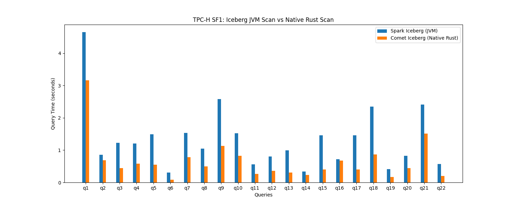
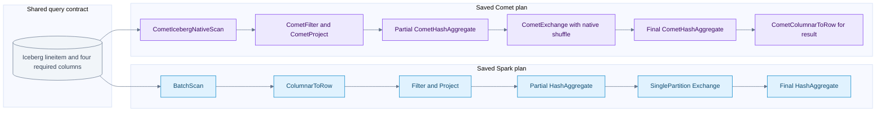
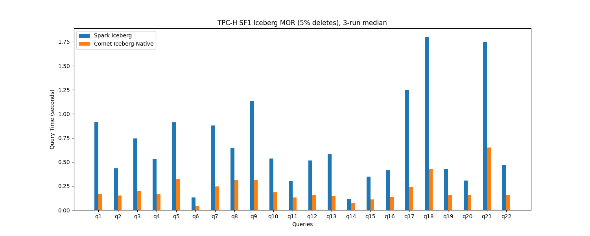

# TPC-H Spark versus Comet benchmark findings

[Index](README.md) | [Dataset and schema](11-tpch-dataset-and-schema.md)

The historic local SF1 comparison reports roughly **half the total query time** with Comet, with gains varying substantially by query. The preserved Q6 plans show a concrete architectural change: Spark's scan batches become rows before the residual filter and aggregation; Comet keeps the scan, filter, projection, aggregation and shuffle native, converting only the final result back to rows.

That explains a credible mechanism, not a measured breakdown of the saved seconds. We recovered the presentation timing table, two charts and a Q6 plan pair. We did **not** recover the original full-suite result JSONs, full plan directory, historical event logs or exact historical build configuration. No benchmark was rerun while writing these notes.

## Findings and confidence

| Finding | Evidence | Confidence boundary |
| --- | --- | --- |
| Historic base run improved by about 2x overall | Preserved 22-query timing table and chart | One measured iteration; not a repeated performance estimate |
| Largest absolute savings were Q18, Q1 and Q9 | Arithmetic from the rounded timing table | About 4.42 seconds combined; not attribution to particular operators |
| Q6 forms a long native pipeline | Saved formatted Spark and Comet plans | Direct plan evidence, but not tied by a run manifest to the historic timed invocation |
| Q6 does not need a join | Checked query and saved plans | Its improvement is not a native join improvement |
| MOR chart shows lower Comet bars across the displayed queries | Saved SF1, 5%-delete, three-run-median chart | Raw samples and correctness hashes not recovered; no exact new ratios derived from pixels |
| Full-query time is more than scan time | Current harness timer placement | Does not establish which exact harness revision produced the historic chart |
| Hash equality is reported in the deck | Speaker notes say all 22 queries matched | Not independently revalidated here without original outputs |

This is a **TPC-H-derived development comparison**, not a published TPC-H QphH result. A 2x time ratio is neither a QphH score nor a guarantee for other scales, machines, schemas or storage. [TPC-H benchmark overview](https://www.tpc.org/tpch/).

## Evidence recovered

| Artifact | What it establishes | What it does not establish |
| --- | --- | --- |
| [Historic timing transcription](assets/tpch/historic-sf1-transcription.json) | The 22 rounded values displayed in the preserved presentation | Original duration samples, correctness results or an audited benchmark |
| [Base SF1 chart](assets/tpch/tpch-sf1-jvm-vs-native.png) | Visual comparison from the earlier local run | Per-operator timings or uncertainty intervals |
| [MOR chart](assets/tpch/tpch-sf1-mor-jvm-vs-native.png) | A separately labelled three-run-median comparison with 5% deletes | Exact snapshot IDs, delete counts, raw medians or variance |
| [Spark Q6 plan](assets/tpch/tpch-q6-spark-iceberg.plan.txt) | JVM baseline operators and scan/filter contract | Actual CPU time, bytes read, spill, cache state or benchmark provenance |
| [Comet Q6 plan](assets/tpch/tpch-q6-comet-iceberg.plan.txt) | Native scan, filter, projection, aggregate and native shuffle | The percentage of gain contributed by each operator |

The JSON is deliberately named **transcription**: it was created from the talk's rounded table, not recovered from a benchmark process. The plans and chart images are copied unchanged from the existing talk assets so the notebook remains self-contained.

## Historical conditions versus current defaults

The [preserved presentation](/Users/srajak/Documents/repos/talks/datafusion-comet-talk/presentation/index.html:998) reports macOS Apple Silicon, Spark 3.5.8, local mode, SF1, 22 queries and one measured base-table iteration. It also reports matching result hashes and native scan plans for all queries. Exact machine model, cores used, cache policy, raw hashes, Comet SHA/JAR checksum and full Spark configuration were not recovered.

Do not fill those gaps with the current demo defaults. The current demo README recommends Spark 3.5.3, Scala 2.12, Java 17 and Iceberg runtime 1.8.1; that is a different recorded setup, not proof of the historical stack.

| Setting | Checked current source | Why it matters |
| --- | --- | --- |
| Workload source | `tpcbench.py --catalog ... --database ...` registers Iceberg tables as temporary views | Both engines must refer to the same logical data and snapshots |
| Baseline engine | `spark-iceberg.toml`, without Comet plugin settings | The baseline is Spark with Iceberg, not a generic raw-Parquet scan |
| Native engine | Plugin, `spark.comet.enabled`, `spark.comet.exec.enabled`, `spark.comet.scan.icebergNative.enabled` | This changes compute as well as the scan; the result is not a scan-only ablation |
| Shuffle | `CometShuffleManager` in the Comet engine file | An eligible exchange can move into native shuffle |
| Reader concurrency | Local Comet engine file requests 4 | A current uncommitted setting; not confirmed for the historic run |
| Cast compatibility | Current Comet engine sets `spark.comet.expression.Cast.allowIncompatible=true` | This permission broadens eligibility; preserve correctness checks and report it |
| Common memory | Current `run.py`: driver 8G, executor 16g, off-heap enabled with 16g | Defaults are not historical measurements; local mode does not create two remote executors merely because a profile names two |
| AQE | Not explicitly pinned in current engine TOMLs or common configuration | Record the effective configuration and final adaptive plan; do not infer it from an old runbook |
| Iterations and order | Current harness runs query numbers in ascending order per iteration | No automatic discarded warm-up phase or randomized engine order |
| Spark restart | `run.py` restarts standalone master/worker unless `--no-restart` is supplied | Use `--no-restart` for the local-mode workflow; this is not a documented OS cache flush |

Source check for this chapter: Comet `184accac5b9cee6b761a6673c73c263adedef45e`, with local converter and Comet engine changes; talk `5503f3c9be4f0617c26fe88df8680a2057487d68`. These identify inspected source, not the historical timed binaries. Sources: [run.py](/Users/srajak/Documents/repos/oss/apache/datafusion-comet/benchmarks/tpc/run.py:107), [Spark engine](/Users/srajak/Documents/repos/oss/apache/datafusion-comet/benchmarks/tpc/engines/spark-iceberg.toml:20), [Comet engine](/Users/srajak/Documents/repos/oss/apache/datafusion-comet/benchmarks/tpc/engines/comet-iceberg.toml:34).

## All 22 historic timings

Seconds below are transcribed from the existing deck. Ratios and savings are recalculated from those displayed two-decimal values, so they can differ from the deck's one-decimal ratios. Lower time is better. A ratio above 1 means Comet was faster in that sample.

| Query | Spark seconds | Comet seconds | Spark / Comet | Seconds saved |
| --- | ---: | ---: | ---: | ---: |
| Q1 | 4.65 | 3.17 | 1.47x | 1.48 |
| Q2 | 0.85 | 0.69 | 1.23x | 0.16 |
| Q3 | 1.23 | 0.45 | 2.73x | 0.78 |
| Q4 | 1.20 | 0.58 | 2.07x | 0.62 |
| Q5 | 1.50 | 0.55 | 2.73x | 0.95 |
| Q6 | 0.31 | 0.09 | 3.44x | 0.22 |
| Q7 | 1.53 | 0.78 | 1.96x | 0.75 |
| Q8 | 1.05 | 0.49 | 2.14x | 0.56 |
| Q9 | 2.58 | 1.13 | 2.28x | 1.45 |
| Q10 | 1.52 | 0.82 | 1.85x | 0.70 |
| Q11 | 0.56 | 0.27 | 2.07x | 0.29 |
| Q12 | 0.81 | 0.36 | 2.25x | 0.45 |
| Q13 | 0.99 | 0.30 | 3.30x | 0.69 |
| Q14 | 0.34 | 0.23 | 1.48x | 0.11 |
| Q15 | 1.46 | 0.40 | 3.65x | 1.06 |
| Q16 | 0.72 | 0.68 | 1.06x | 0.04 |
| Q17 | 1.46 | 0.41 | 3.56x | 1.05 |
| Q18 | 2.35 | 0.86 | 2.73x | 1.49 |
| Q19 | 0.41 | 0.17 | 2.41x | 0.24 |
| Q20 | 0.83 | 0.45 | 1.84x | 0.38 |
| Q21 | 2.41 | 1.51 | 1.60x | 0.90 |
| Q22 | 0.57 | 0.20 | 2.85x | 0.37 |



The original deck reports totals of **29.33 s Spark and 14.56 s Comet**, with a **2.19x geometric mean**. Adding its displayed query rows gives **29.33 s and 14.59 s**. From those rounded rows, the ratio of sums is **2.0103x**, total savings are **14.74 s**, and the geometric mean is **2.1857x**. The 0.03 s total difference may be rounding or transcription; without raw samples we cannot settle it. Preserve the distinction instead of manufacturing extra precision.

```text
query ratio = Spark query time / Comet query time
query time reduction = 1 - Comet query time / Spark query time
suite ratio = sum of Spark query times / sum of Comet query times
geometric mean = exp(mean(log(each query ratio)))
```

The rounded-row suite reduction is about **50.26%**. A 2x ratio means about half the elapsed time, not a 200% reduction. The geometric mean weights each query's multiplicative ratio equally; the ratio of sums gives more influence to expensive queries. Neither should be substituted for the other.

## Where the saved time is concentrated

| Query or group | Savings from rounded rows | What this tells us |
| --- | ---: | --- |
| Q18 | 1.49 s | Largest displayed absolute saving; aggregate/subquery/join workload |
| Q1 | 1.48 s | Only about 1.47x faster, yet almost as much time saved as Q18 because it was expensive |
| Q9 | 1.45 s | Multi-table profit query with composite-key joins and arithmetic |
| Q15 and Q17 | 2.11 s combined | Large relative gains and material absolute contributions |
| Top five above | 6.53 s | About 44.3% of the 14.74 s rounded-row savings |
| Q6 | 0.22 s | An excellent plan explanation, but only about 1.5% of suite savings |
| Q16 | 0.04 s | Smallest displayed gain; one sample cannot establish a robust improvement |

This separates the most teachable native plan from the biggest contributors to total time saved. Q6 is easy to explain, but it did not account for most of the historic suite improvement.

## Q6 question and plan proof

The checked Q6 filters `lineitem` to shipment dates in 1994, discounts from 0.03 through 0.05 inclusive, and quantity below 24. It sums `l_extendedprice * l_discount`. There is no join, no GROUP BY key and one final aggregate row. [Current Q6 SQL](/Users/srajak/Documents/repos/oss/apache/datafusion-comet/benchmarks/tpc/queries/tpch/q6.sql:1).

Both preserved plans project the same four scan columns: extended price, discount, shipment date and quantity. Both show the same pushed filter conditions. The native plan also retains `CometFilter`; pushing a condition into a scan does not universally remove the need for exact residual evaluation.

### Paired Q6 execution flow

Arrows follow the movement of data upward through the saved physical plans. Spark remains the scheduler in both lanes. The shared starting box means equivalent query/table work, not a claim that these saved files prove identical historical snapshot IDs.



| Stage | Spark plan | Comet plan | What changed |
| --- | --- | --- | --- |
| File reading | Iceberg `BatchScan` | `CometIcebergNativeScan` | Eligible file decode and Arrow batch production move into the native reader |
| First row boundary | `ColumnarToRow` immediately above scan | No row conversion here | Comet's residual filter and projection receive batches |
| Residual evaluation | JVM code-generated Filter/Project | `CometFilter` / `CometProject` | Supported expressions execute over native columnar input |
| Local reduction | Partial JVM `HashAggregate` | Partial `CometHashAggregate` | The aggregate loop and state processing move native |
| Exchange | Spark `Exchange`, SinglePartition | `CometExchange`, SinglePartition, `CometNativeShuffle` | Native exchange implementation, still coordinated by Spark |
| Final reduction | JVM `HashAggregate` | `CometHashAggregate` | Final combination remains native |
| Return to Spark/Python | Final Spark result rows | `CometColumnarToRow` after final aggregate | Row conversion is retained where required, after major reduction |

The Spark `*` markers identify whole-stage code-generated operators. This is not a comparison against naive interpreted Java or an object allocated for every scalar value. The defensible distinction is the location of the row boundary and the implementation of eligible scan/compute/shuffle work.

Q6's partial aggregation reduces each input partition to small aggregate state before the SinglePartition exchange. It is therefore misleading to claim that shuffling millions of input rows explains this query's gain. The native shuffle is visible, but scan/filter/arithmetic/aggregation are more plausible major work sites. **That is an inference; operator timing and byte counters are missing.**

The current Rust [Iceberg scan implementation](/Users/srajak/Documents/repos/oss/apache/datafusion-comet/native/core/src/execution/operators/iceberg_scan.rs:217) builds an Iceberg Rust Arrow reader with batch size, file concurrency and row selection, then adapts its output to the expected schema. This explains today's integration. It does not prove the historical build used every current optimization.

## What likely helped other query families

The SQL shapes below are verified against the checked query files. Their performance explanations are **inferences**, because only Q6's paired physical plans were recovered. Do not assign a specific native join or fallback node to Q5, Q9, Q16 or Q18 from SQL alone.

| Family | Examples and displayed gains | Plausible useful native work | Evidence still needed |
| --- | --- | --- | --- |
| Scan plus arithmetic/aggregation | Q1 1.47x; Q6 3.44x | Decode, filter, decimal expressions, aggregate state updates; fewer row transitions | Scan/decode CPU, rows before/after filters, byte counters and aggregate time |
| Multi-table joins and grouping | Q3/Q5/Q18 about 2.73x; Q9 2.28x | Native joins, aggregate reduction, sort and shuffle where eligible | Actual join strategy/build side, each native island, shuffle bytes and spills |
| Aggregate subqueries | Q15 3.65x; Q17 3.56x | Native scan/aggregate work in rewritten subplans | Scan duplication, subquery reuse, decorrelation and final physical plans |
| Outer or anti/existence semantics | Q13 3.30x; Q21 1.60x; Q22 2.85x | Supported joins, string predicates and grouping | Null semantics, native coverage and conversion boundaries |
| Small displayed improvement | Q16 1.06x | Could be dominated by distinct/anti processing, fixed overhead or a less beneficial native region | Repetitions and the actual plan; the timing alone does not prove fallback |

A query can improve even if its ratio is modest because it starts expensive. Conversely, a small subsecond query can show a large ratio while saving little total time. SF1 on local storage also exposes startup, metadata, scheduling and JIT/cache effects that can change at larger scale.

## Merge-on-read evidence



This is a separate experiment, not another iteration of the base-table run. Its title specifies SF1, 5% deletes and three-run medians. The displayed Comet bars are below Spark's for all 22 queries. We have not digitized the image or promoted estimated bar heights to raw timing values.

The reader now has additional correctness work: load applicable delete artifacts and suppress deleted records while scanning. Fewer live rows can also change downstream work. Thus a base-versus-MOR chart difference mixes changed data and execution costs; it is not a controlled measurement of delete-application overhead.

The current converter targets orders and lineitem using an order-key modulo predicate. To establish real delete overhead, preserve the before/after snapshots, counts, delete-file types and sizes, and compare both engines on the same modified snapshot. To separate retained-delete cost from reduced row count, add an equivalent compacted table with the same live rows but no remaining delete artifacts.

## What the harness actually times

The following describes the **current checked source**, not a recovered execution trace of the historic run. [Timer and collection path](/Users/srajak/Documents/repos/oss/apache/datafusion-comet/benchmarks/tpc/tpcbench.py:190).

```mermaid
%%{init: {"theme":"base","flowchart":{"curve":"basis","nodeSpacing":34,"rankSpacing":46},"themeVariables":{"fontFamily":"Ubuntu, Arial, sans-serif","fontSize":"15px","primaryTextColor":"#0f172a","lineColor":"#64748b"}}}%%
flowchart LR
  subgraph SETUP["Before per-query timer"]
    S["Create Spark session and table views"]
    Q["Read SQL and classify statements"]
    S --> Q
  end
  subgraph TIMED["Reported collect-path duration"]
    B(["Start timer"])
    P["spark.sql and formatted explain"]
    W{"Plan capture enabled?"}
    F["Format and write plan file"]
    C["collect executes query and returns rows"]
    E(["Compute elapsed time"])
    B --> P --> W
    W -- "yes" --> F --> C
    W -- "no" --> C
    C --> E
  end
  subgraph AFTER["After per-query timer"]
    H["Count rows and hash sorted row strings"]
    J["Append duration and later write JSON"]
    H --> J
  end
  Q --> B
  E --> H
  classDef spark fill:#e0f2fe,stroke:#0284c7,color:#0c4a6e
  classDef io fill:#ffedd5,stroke:#f97316,color:#7c2d12
  classDef metadata fill:#fef9c3,stroke:#ca8a04,color:#713f12
  class S,Q,B,P,C,E spark
  class F,J io
  class W,H metadata
```



Important details:

- `df.explain("formatted")` is inside the timer even when `--plan-dir` is absent. Optional plan formatting and file output add more timed work. Omitting plan capture does not make the result an execution-only measurement.
- `collect()` includes bringing output rows to the driver/Python side. Result hashing starts after elapsed time is computed.
- Session startup and table registration happen before the per-query loop. DDL surrounding Q15 is executed but not added as a query duration; the SELECT referencing its view still performs the query's data work.
- The `--write` path is a different experiment: the code sorts all output columns, coalesces to one partition and writes Parquet. Do not mix those timings with `collect()` runs. Its JSON does not include the same row-count/hash fields.
- Plans are captured before the action. With AQE enabled, preserve the final adaptive plan after execution separately; a pre-action explain is not sufficient evidence of the final executed strategy.
- Durations are rounded to milliseconds in the current JSON. Queries always run in numeric order and there is no automatic warm-up exclusion.

### Correctness checks and limitations

[Hash code](/Users/srajak/Documents/repos/oss/apache/datafusion-comet/benchmarks/tpc/tpcbench.py:50) sorts collected rows by their string representation and hashes the concatenated strings with MD5. This is useful for exact cross-engine comparison under the same schema and representation, but it is not a tolerance-aware numerical validator, an ordering check, or a substitute for reference answers.

The harness computes hashes in each iteration but stores only the first iteration's `row_count` and `result_hash` in the per-query JSON entry. Later iterations' printed results must also be checked. In addition, the [comparison script](/Users/srajak/Documents/repos/oss/apache/datafusion-comet/benchmarks/tpc/generate-comparison.py:70) only **warns** about hash/row-count mismatches and then still generates charts. A rendered chart is not proof that a correctness gate passed.

The JSON top-level `engine` field is hardcoded to `datafusion-comet`, even for the Spark baseline. Identify the run from the filename/name, plugin settings, complete `spark_conf` and captured plan, not that field alone.

The summary chart sums per-query medians. That is different from taking the median of whole-suite elapsed times, and it excludes setup or other untimed work. Preserve both metrics when the comparison is intended to describe an entire job.

## What we can and cannot attribute

We can say that the preserved native Q6 plan relocates eligible work and moves row conversion to after aggregation. We can say the historic reported query times are lower for Comet. We cannot say how many milliseconds came from a faster decoder, fewer conversions, SIMD, fewer allocations, shuffle serialization or a particular join algorithm without controlled evidence.

| Potential explanation | How to test it rather than assume it |
| --- | --- |
| Native file reader is faster | Same files, projection, filters and output; controlled reader comparison with equal downstream work |
| Longer native compute pipeline helps | Compare JVM scan/compute, a supported mixed path and full native plan; record actual boundaries |
| Less data is read | Compare selected files/row groups and physical bytes; identical SQL alone does not prove identical I/O |
| Native shuffle helps | Hold upstream results and partitioning comparable; measure encode/decode CPU, bytes, compression and fetch time |
| Delete application is faster | Same logical modified snapshot and delete artifacts; compare compacted equivalent as an additional arm |
| Spill behavior explains a query | Record peak memory, reservations, spill bytes and time, not just heap size |
| SIMD or allocation reduction explains the gain | Native/JVM CPU and allocation profiles; no saved profile currently establishes this |

A useful decomposition is planning + storage wait + decode/delete work + local compute + exchange + result return. These phases overlap across tasks, so their observed times are not always additive. Any claim that a component accounts for a fixed percentage needs profiling and a controlled comparison.

## Reproduction and evidence checklist

Use the existing entry points, with a dedicated warehouse and explicitly pinned versions. These are command templates, not commands executed for this notebook:

```bash
cd /path/to/datafusion-comet/benchmarks/tpc
python3 run.py --engine spark-iceberg --benchmark tpch --no-restart \
  --iterations 5 --output /path/to/results \
  --plan-dir /path/to/plans/spark
python3 run.py --engine comet-iceberg --benchmark tpch --no-restart \
  --iterations 5 --output /path/to/results \
  --plan-dir /path/to/plans/comet
```

Set `SPARK_HOME`, `SPARK_MASTER`, `COMET_JAR`, `ICEBERG_JAR`, `ICEBERG_WAREHOUSE`, `ICEBERG_CATALOG` and `ICEBERG_DATABASE` first. Create output directories and verify the effective command with `--dry-run`. The displayed commands retain the harness's planning/explain overhead; they reproduce that measurement shape, not an isolated native-kernel benchmark.

For a defensible new comparison:

1. Record hardware, OS, Java/Python, Spark/Scala, Iceberg, Comet SHA, local diff and JAR checksum. Do not substitute the current checkout for the binary that actually ran.
2. Record every table's schema, row count, snapshot ID, partition spec, sort order, data/delete file count, bytes, compression and row-group layout.
3. Fix the resource envelope, AQE/join settings, shuffle settings, cache policy and storage location across arms. Explicitly report deliberate differences.
4. Separate warm-up and measured repetitions. Alternate engine ordering where practical; report all samples, medians and spread. Do not silently discard slow queries.
5. Compare outputs for every query and repetition, including schemas, nulls, decimals and ordering where required. Treat mismatches as failures before reporting speedups.
6. Capture final plans, fallback explanations, Spark event logs, scan rows/bytes, shuffle bytes/fetch time, spills, GC, native CPU profiles and executor RSS.
7. Publish per-query ratios and absolute savings, suite aggregation rules and regressions. Distinguish current native support from what the actual executed plan used.

Plan capture is opt-in and writes one named file per query per engine, overwriting that filename across iterations. A full 22-query pair should have 44 plan files if all writes succeed. This notebook contains only the two preserved Q6 files; it does not claim the missing 42 were inspected. A capture failure is logged as a warning, so count and inspect the files before calling the evidence complete.

## Summary to use in a talk

The dataset gives us both large scans and complex relational shapes. Our historic SF1 comparison showed about a 2x total-time improvement, but the gain was not uniform. Q6's saved plans show how Comet can keep the hot path native; Q18, Q1 and Q9 contributed the largest absolute time savings in the table. Exact causal attribution and repeatability still need the original raw artifacts or a newly controlled run.
