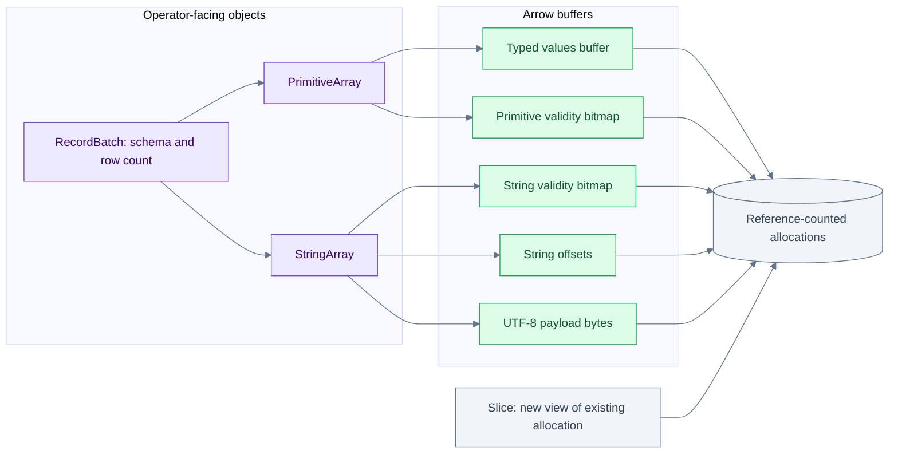
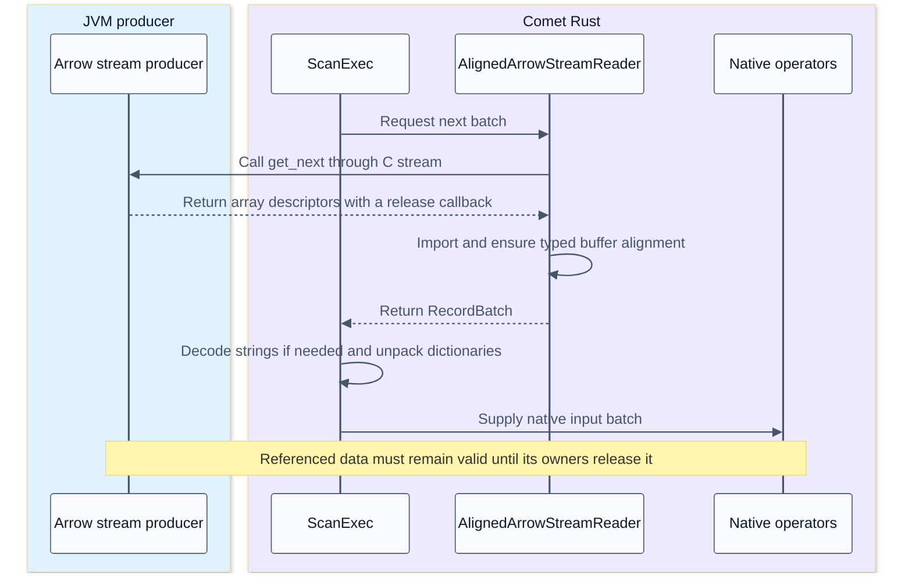

# Apache Arrow memory layout and execution kernels

[Index](README.md) | [Vectorization and hardware](14-vectorization-and-hardware.md) | [Scan and rewrite integration](15-arrow-in-iceberg-scan-and-rewrite.md)

Arrow supplies the in-memory contract that lets a Parquet reader, expression kernel and downstream operator exchange columns without inventing another row representation at each boundary. It is not a query scheduler, an Iceberg catalog or a promise that every operation is zero-copy. This chapter traces the Rust implementation from buffers to batches, then explains where allocation, copying and ownership still matter.

## Findings to keep straight

| Question | Source-backed answer | Consequence for this pipeline |
| --- | --- | --- |
| Is a batch one contiguous allocation? | A `RecordBatch` holds a schema and references to separate arrays | Locality exists within buffers; the entire batch is not one packed object |
| Does Arrow mean SIMD? | The layout enables regular loops; kernels and the compiler determine instructions | Batch execution and machine SIMD require separate evidence |
| Is slicing zero-copy? | `Buffer` and `ScalarBuffer` slices share ownership of their allocation | A small slice can keep a large allocation alive |
| Is filtering zero-copy? | General primitive filtering copies selected values; string-view filtering can share string payloads | Masks, offsets, views and payloads have different costs |
| Does Parquet equal Arrow on disk? | Parquet encodes/compresses columns; its reader reconstructs Arrow arrays | Reading normally performs real decoding and allocation |
| Does the C interface remove all conversion? | It shares an agreed memory representation and release contract | Alignment repair, dictionary expansion and semantic conversion may still copy |
| Does Rust memory appear in JVM heap metrics? | Native buffers have native ownership | JVM heap alone is not executor memory consumption |

## Versions and scope

The inspected Arrow checkout is `149b3ab23dc360e9452b2f854b01d2f5fed06f43`, with workspace version **60.0.0**. The Comet checkout is `184accac5b9cee6b761a6673c73c263adedef45e`; its manifest requests compatible Arrow/Parquet `59.2.0` releases, while its lockfile resolves **59.3.0**. A Cargo requirement is not necessarily the exact resolved version.

Source: [Arrow workspace](/Users/srajak/Documents/repos/oss/apache/arrow-rs/Cargo.toml:68), [Comet dependencies](/Users/srajak/Documents/repos/oss/apache/datafusion-comet/native/Cargo.toml:40), [resolved Arrow](/Users/srajak/Documents/repos/oss/apache/datafusion-comet/native/Cargo.lock:228), [resolved Parquet](/Users/srajak/Documents/repos/oss/apache/datafusion-comet/native/Cargo.lock:4877).

Unless explicitly marked otherwise, Arrow internals below describe that local 60.0.0 source. They do not prove what was linked into the historical TPC-H executable. No Arrow unit suite, assembly inspection or hardware profile was run for these notes. Named tests were inspected as coverage evidence.

## Crate map

| Crate or area | Main responsibility | Read it when asking |
| --- | --- | --- |
| `arrow-schema` | Data types, fields, schema, metadata and errors | What does this column mean? |
| `arrow-buffer` | Shared byte buffers, typed buffers, offsets, validity and bit utilities | Who owns these bytes, and how are nulls represented? |
| `arrow-data` | Generic array layout, validation and low-level transformations | Are these buffers a valid instance of this type? |
| `arrow-array` | Typed arrays, builders, `ArrayRef`, `RecordBatch`, C interfaces | How does an operator access or exchange a column? |
| `arrow-arith`, `arrow-ord`, `arrow-string` | Arithmetic, Boolean logic, aggregation, comparisons, sorting and strings | Which loop implements an expression? |
| `arrow-select` | Filter, take, concatenate, interleave and coalesce | Which rows survive, and are values copied? |
| `arrow-cast` | Type conversion and parsing | Is this conversion metadata-only, allocating, or fallible? |
| `arrow-row` | Row-oriented comparison representation for multiple columns | Why might a columnar engine temporarily encode rows for sorting/grouping? |
| `arrow-ipc` | Arrow stream/file serialization | How do arrays become transferable bytes? |
| `arrow-flight` | Arrow-oriented RPC services | Is this application using Flight? Its presence does not mean Spark shuffle uses it. |
| `parquet` | File metadata, encodings, codecs, page readers and Arrow integration | How do compressed files become arrays, or arrays become files? |
| `arrow` | Convenient public facade and re-exports | Where does a caller import the functionality? |

The workspace includes additional format and utility crates. This map selects the ones that explain the batch pipeline; it is not a dependency graph claiming that every crate participates in every query. [Workspace members](/Users/srajak/Documents/repos/oss/apache/arrow-rs/Cargo.toml:20).

## Batch and buffer ownership



Each nullable array can have its own validity bitmap; all-valid primitive/string arrays can omit it. The allocation node groups ownership, not all bytes into one allocation.

`RecordBatch` stores `Vec<Arc<dyn Array>>`, a `SchemaRef` and a row count. Its checked constructor verifies compatibility of columns and schema. Keeping the row count separately also permits batches with no physical columns through the appropriate constructor/options. `PrimitiveArray<T>` stores the logical data type, `ScalarBuffer<T::Native>` and optional `NullBuffer`. [RecordBatch](/Users/srajak/Documents/repos/oss/apache/arrow-rs/arrow-array/src/record_batch.rs:224), [PrimitiveArray](/Users/srajak/Documents/repos/oss/apache/arrow-rs/arrow-array/src/array/primitive_array.rs:607).

`Buffer` contains a reference-counted owner, a pointer to the visible start and a byte length. Cloning or slicing the buffer does not duplicate its payload. Mutability requires appropriate ownership; sharing an array is not permission to modify bytes behind another consumer. [Buffer](/Users/srajak/Documents/repos/oss/apache/arrow-rs/arrow-buffer/src/buffer/immutable.rs:70), [ScalarBuffer](/Users/srajak/Documents/repos/oss/apache/arrow-rs/arrow-buffer/src/buffer/scalar.rs:26).

## Fixed-width values and nulls

Illustrative `Int32` array:

```text
logical values = [10, null, 30, 40]
values slots   = [10, arbitrary, 30, 40]
validity bits in row order = [1, 0, 1, 1]
validity byte, bit 0 is row 0 = 0b00001101
```

A null is not a sentinel integer such as zero. The physical value in its slot does not define the logical value. Absence of a validity buffer normally means all slots are valid for these primitive arrays. Boolean values are themselves bit-packed, so a nullable Boolean array has both a value bitmap and a validity bitmap.

This separation lets a cheap infallible operation run over regular value buffers and combine validity independently. The checked `arity::binary` does exactly that: it processes every value slot, creates output values, and combines input null information. Its callback must be safe for *all* physical input values, including null slots. Division, checked overflow and other fallible operations need their own semantics; blindly evaluating them over garbage null slots is not valid. [Binary kernel](/Users/srajak/Documents/repos/oss/apache/arrow-rs/arrow-arith/src/arity.rs:78).

`NullBuffer::union` means union of the **sets of null positions**, which is an AND of the **validity** bits. Do not mistake the function name for a bitwise OR of valid bits. SQL Boolean logic is more subtle: `false AND null` is false, while `true AND null` is null. Arrow provides Kleene Boolean kernels for this distinction. [Null union](/Users/srajak/Documents/repos/oss/apache/arrow-rs/arrow-buffer/src/buffer/null.rs:79), [Kleene AND](/Users/srajak/Documents/repos/oss/apache/arrow-rs/arrow-arith/src/boolean.rs:60).

## Strings and string views

An ordinary `StringArray` uses validity, 32-bit offsets and a UTF-8 byte buffer. `LargeStringArray` uses 64-bit offsets. For an illustrative array `['ab', null, 'xyz', '']`, offsets `[0, 2, 2, 5, 5]` and payload `abxyz` work with validity `[1, 0, 1, 1]`. Equal offsets alone cannot distinguish a null from a valid empty string. Reading element `i` uses the byte range between consecutive offsets. [GenericByteArray](/Users/srajak/Documents/repos/oss/apache/arrow-rs/arrow-array/src/array/byte_array.rs:87).

`StringViewArray` changes the tradeoff:

| String length | Sixteen-byte view | Additional payload |
| --- | --- | --- |
| At most 12 bytes | Length plus inline string bytes | None for that value |
| More than 12 bytes | Length, four-byte prefix, buffer index and offset | String bytes in a referenced buffer |

The prefix can reject unequal long strings without fetching all their bytes, but equal prefixes do not establish string equality. View arrays can reference several payload buffers and reuse overlapping ranges. Filtering views copies the selected fixed-size view entries and shares the payload buffers. That can avoid substantial string copying, but can also retain large source buffers for a few surviving strings. A view is 16 bytes even for a one-character value; it is not unconditionally the smallest representation. [View layout and access](/Users/srajak/Documents/repos/oss/apache/arrow-rs/arrow-array/src/array/byte_view_array.rs:56), [view filter](/Users/srajak/Documents/repos/oss/apache/arrow-rs/arrow-select/src/filter.rs:1077).

## Nested arrays and encoded arrays

| Representation | Physical pieces | Important scan or compute consequence |
| --- | --- | --- |
| `List<T>` | Validity, offsets, child array | Parent null, empty list and list containing null are different values |
| `Struct` | Parent validity and same-length child arrays | A valid child slot does not make a null parent struct valid |
| `Map` | List-like offsets over key/value entries | Keys and values must stay paired through selection |
| Dictionary | Integer keys and a dictionary values array | Keys are meaningful only with their own dictionary; equal key numbers across batches need not mean equal values |
| Run-end encoding | Run ends and run values | Logical length differs from number of stored values; not every downstream kernel preserves encoding |
| Decimal128 | Fixed-width integer values plus precision/scale | A 128-bit value is not the same thing as one cheap CPU SIMD lane |

See the [array implementations](/Users/srajak/Documents/repos/oss/apache/arrow-rs/arrow-array/src/array/mod.rs:18) and [data types](/Users/srajak/Documents/repos/oss/apache/arrow-rs/arrow-schema/src/datatype.rs:18). Parquet dictionary encoding and Arrow dictionary arrays are separate choices. A Parquet dictionary page may be decoded into plain Arrow values, or a supported path may preserve a dictionary representation. Do not infer the in-memory array type from the file encoding alone.

## Slice versus filter versus take

```text
slice -> contiguous logical interval -> share buffers and adjust visible range
filter -> Boolean selection -> preserve selected row order and usually build compacted buffers
take -> explicit row indices -> gather or reorder values, potentially repeating rows
```

The distinction is visible in `arrow-select`:

- Selecting every row can return a slice; selecting none returns an empty array.
- Primitive filtering allocates/copies selected values and handles output validity.
- Ordinary string filtering builds new offsets and copies selected payload bytes.
- String-view filtering copies views while sharing the backing payload buffers.
- A filter builder can reuse a selection strategy across multiple columns. In this checkout, selection above 0.8 uses a run/slice-oriented strategy; otherwise an index-oriented strategy is available. This is an implementation heuristic, not a universal optimum.

Sources: [filter dispatch](/Users/srajak/Documents/repos/oss/apache/arrow-rs/arrow-select/src/filter.rs:582), [primitive filter](/Users/srajak/Documents/repos/oss/apache/arrow-rs/arrow-select/src/filter.rs:919), [string filter](/Users/srajak/Documents/repos/oss/apache/arrow-rs/arrow-select/src/filter.rs:1039), [selection heuristic](/Users/srajak/Documents/repos/oss/apache/arrow-rs/arrow-select/src/filter.rs:37).

The mask itself has semantics. A filter retains true, non-null predicate slots; false and null predicates are rejected. That does not mean null values in an unrelated output column are removed. The test `test_filter_primitive_array_with_null` explicitly retains a null data value when its selection bit is true. [Test](/Users/srajak/Documents/repos/oss/apache/arrow-rs/arrow-select/src/filter.rs:1421).

## Alignment is not one universal number

The format recommends aligned and padded buffers, but the implementation and the source of an allocation matter. The checked Arrow Rust allocation constant is **128 bytes on x86_64** and **64 bytes on aarch64**. Those constants are not a measurement of every machine's cache-line size. Buffers adopted from `Vec`, external producers, or slices need not preserve that preferred base alignment at the visible pointer. Typed access still requires the native element alignment. [Allocation constants](/Users/srajak/Documents/repos/oss/apache/arrow-rs/arrow-buffer/src/alloc/alignment.rs:26), [typed alignment checks](/Users/srajak/Documents/repos/oss/apache/arrow-rs/arrow-buffer/src/buffer/scalar.rs:76), [format alignment guidance](https://arrow.apache.org/docs/format/Columnar.html#buffer-alignment-and-padding).

A slice starting one `Int32` into a well-aligned buffer remains correctly aligned for `i32`, but is no longer at that original wide boundary. Correct SIMD code must handle unaligned loads, alignment peeling or a suitable fallback. Padding is not permission for arbitrary out-of-bounds Rust access; the implementation must prove that each load is legal.

## C interface and Comet handoff

The C Data Interface describes arrays through buffers, type/schema information, offsets, children and release callbacks. The C Stream Interface adds a pull protocol for batches. They are in-process interoperability contracts, not network serialization formats. IPC and Flight solve different transport problems.



This sequence describes the JVM-input bridge, not the native Iceberg reader fetching Parquet directly. In the checked Comet code, `AlignedArrowStreamReader` imports and aligns arrays; `ScanExec::import_column` then applies Spark-compatible string decoding and `copy_or_unpack_array`. Ordinary columns can be cloned, while dictionaries are expanded and copied. A realignment can allocate. The source comment about removing the alignment wrapper after an Arrow upgrade is not proof that it has been removed: the wrapper is still present in this checkout.

Sources: [stream import and alignment](/Users/srajak/Documents/repos/oss/apache/datafusion-comet/native/core/src/execution/operators/aligned_stream_reader.rs:87), [column import](/Users/srajak/Documents/repos/oss/apache/datafusion-comet/native/core/src/execution/operators/scan.rs:178), [copy/unpack implementation](/Users/srajak/Documents/repos/oss/apache/datafusion-comet/native/core/src/execution/operators/copy.rs:70), [Arrow FFI import](/Users/srajak/Documents/repos/oss/apache/arrow-rs/arrow-array/src/ffi.rs:300).

## Memory accounting example

These are illustrative payload calculations, excluding allocation rounding, reference objects, schema metadata and temporary buffers:

```text
nullable Int64 with N rows = 8N value bytes + ceil(N / 8) validity bytes
N = 8192 -> 65536 + 1024 = 66560 bytes = 65 KiB
three nullable Int64 columns -> 195 KiB
```

For a hypothetical Q6 batch with three Decimal128 columns and one Date32 column, 8,192 rows require `8192 * (16 + 16 + 16 + 4) + 4 * 1024 = 430080` bytes, or **420 KiB**, before temporaries. This assumes those particular Arrow types; it is not an observed allocation from the saved benchmark.

The live working set also includes decoded pages, compressed input ranges, output buffers, filter masks, dictionaries, hash tables, sort state and writer buffers. Multiplying by concurrent tasks and in-flight files can dominate the batch-size calculation. Array memory estimates can count a shared allocation more than once when summed naively; conversely, a small logical slice can retain a larger allocation. Executor RSS, allocator statistics and engine memory reservations answer different questions.

## Tests and remaining evidence

| Inspected test or source | What it exercises | What it does not prove |
| --- | --- | --- |
| [FFI offset round trip](/Users/srajak/Documents/repos/oss/apache/arrow-rs/arrow-array/src/ffi.rs:616) | Sliced nullable arrays survive export/import | All producers obey the ABI or all imports avoid copies |
| [Sliced primitive filter](/Users/srajak/Documents/repos/oss/apache/arrow-rs/arrow-select/src/filter.rs:1354) | Selection from a sliced input returns expected values | Every selectivity is equally fast |
| [Null-preserving filter](/Users/srajak/Documents/repos/oss/apache/arrow-rs/arrow-select/src/filter.rs:1421) | Selected null data remains null | SQL predicate correctness for every expression |
| [Comet Decimal128 alignment test](/Users/srajak/Documents/repos/oss/apache/datafusion-comet/native/core/src/execution/operators/aligned_stream_reader.rs:141) | Under-aligned input is repaired before typed access | The historical job incurred this cost |

The practical question is not simply whether an operator uses Arrow. Ask which array representation it receives, which buffers it reads or rewrites, how long their owners live, and what representation leaves the operator.
