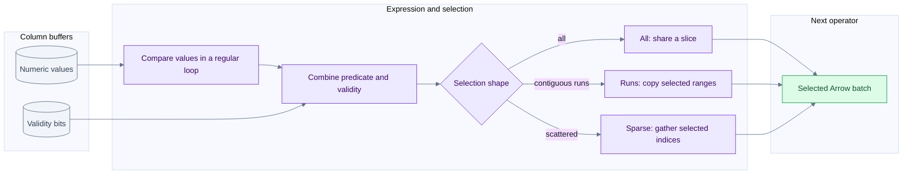
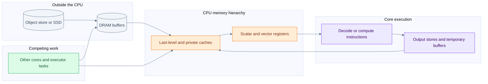

# Vectorization SIMD and hardware costs in batch execution

[Index](README.md) | [Arrow memory](13-arrow-memory-and-kernels.md) | [Iceberg scan and rewrite](15-arrow-in-iceberg-scan-and-rewrite.md)

A columnar layout gives the CPU regular data to work on. It does not remove storage latency, memory traffic, branches, dependencies or correctness requirements. This chapter separates the mechanisms that are often compressed into the word vectorization, identifies examples in Arrow Rust, and gives a model for deciding which optimization could matter in an Iceberg pipeline.

## Five different forms of parallel work

| Mechanism | Unit of work | Concrete meaning | Not equivalent to |
| --- | --- | --- | --- |
| Batch execution | Hundreds or thousands of logical rows | One operator call processes an Arrow array or batch | A particular CPU instruction |
| Packed bitmap processing | Bits in a machine word | One AND can combine many validity or predicate bits | SIMD over the original numeric values |
| Instruction-level parallelism | Independent instructions in one thread | Several accumulators or independent loads overlap | Multiple OS threads |
| CPU SIMD | Lanes inside vector registers | One instruction applies an operation to several packed elements | Guaranteed end-to-end speedup equal to lane count |
| Thread and distributed parallelism | Files, tasks, partitions, executors | Independent work runs concurrently | More memory bandwidth without limit |

An Arrow-based operator can benefit from the first three without issuing a wide SIMD instruction. It can also use SIMD on one hot loop and scalar code on another. Spark whole-stage code generation is another optimization dimension: generated JVM code can avoid interpretation overhead, and the JIT may optimize its loops. Native execution is not a comparison with an inherently unoptimized baseline.

## What a SIMD lane actually means

A 256-bit register can hold eight 32-bit values or four 64-bit values. A 128-bit register can hold four 32-bit values or two 64-bit values. These are capacity calculations, not throughput promises. The relevant instruction must exist for that element type, and loads, masks, shuffles, dependencies and tails still cost work.

| Instruction family | Illustrative vector width | Scope caveat |
| --- | --- | --- |
| x86 SSE-family vectors | 128 bits | Instruction subsets differ by CPU |
| x86 AVX/AVX2 vectors | Up to 256 bits | AVX and AVX2 do not provide identical integer/floating-point operations |
| x86 AVX-512 family | Up to 512 bits | Multiple feature subsets; not present on every x86 server |
| Arm Advanced SIMD / Neon | 128 bits | Distinct ISA from x86, with different instructions and costs |
| Arm SVE/SVE2 | Scalable vector length | Requires suitable hardware and generated code; do not infer it from an aarch64 build |

Primary references: [Intel architecture optimization manuals](https://www.intel.com/content/www/us/en/developer/articles/technical/intel64-and-ia32-architectures-optimization.html), [Arm Neon and SVE comparison](https://developer.arm.com/community/arm-community-blogs/b/architectures-and-processors-blog/posts/matrix-matrix-multiplication-neon-sve-and-sme-compared).

For Q6-style Decimal128 expressions, 128 describes the integer storage width of **one value**, not an assertion that a 128-bit vector instruction implements its multiply, rescale and overflow behavior. Wider integers, strings, hash probes and nested structures can require several instructions, irregular accesses or branches. Preserve precision, null, overflow and Spark compatibility semantics before considering a faster implementation.

## From a predicate to selected rows

Illustrative input, with rows numbered from zero:

```text
values = [10, 20, null, 40, 5, 60, 7, 80]
validity in row order = [1, 1, 0, 1, 1, 1, 1, 1]
predicate: value > 25
keep in row order = [0, 0, 0, 1, 0, 1, 0, 1]
packed keep byte = 0b10101000
selected indices = [3, 5, 7] -> selected values = [40, 60, 80]
```

The numeric comparison can potentially use SIMD. Combining validity with predicate bits is bitmap work. Compacting selected values is a separate memory operation and may use scalar copying, contiguous slice copying or target-specific instructions. Calling the entire chain one SIMD operation hides these distinctions.



This is a teaching decomposition of comparison plus filtering, not a claim that every DataFusion expression uses precisely this sequence. An empty selection also returns an empty array. The actual filter dispatch is in [arrow-select](/Users/srajak/Documents/repos/oss/apache/arrow-rs/arrow-select/src/filter.rs:582).

## Actual vectorization mechanisms in Arrow Rust

| Source path | What the checked implementation does | Classification and limitation |
| --- | --- | --- |
| [Arithmetic binary kernel](/Users/srajak/Documents/repos/oss/apache/arrow-rs/arrow-arith/src/arity.rs:109) | Iterates paired typed buffers and collects output, handling validity separately | Compiler-friendly regular loop; not an explicit AVX intrinsic |
| [Comparison bitmap builder](/Users/srajak/Documents/repos/oss/apache/arrow-rs/arrow-ord/src/cmp.rs:589) | Packs Boolean comparison results into 64-bit words and handles a remainder | Packed output plus compiler optimization opportunity; 64 bits do not mean 64 SIMD lanes |
| [Primitive aggregation](/Users/srajak/Documents/repos/oss/apache/arrow-rs/arrow-arith/src/aggregate.rs:234) | Uses independent accumulators for selected paths, then reduces them | Exposes parallel arithmetic and reduces one long dependency chain |
| [Parquet bit unpacking](/Users/srajak/Documents/repos/oss/apache/arrow-rs/parquet/src/util/bit_pack.rs:18) | Generates constant-bit-width unpack routines with shifts and masks | Specialized unrolled code suited to optimization; source does not select an AVX2 intrinsic here |
| [Bitmap compress and expand](/Users/srajak/Documents/repos/oss/apache/arrow-rs/arrow-buffer/src/util/bit_util.rs:57) | Uses x86 BMI2 PEXT/PDEP when enabled at compile time, scalar fallback otherwise | Explicit hardware instructions, but scalar bit-manipulation instructions rather than lane SIMD |
| [Parquet UTF-8 feature](/Users/srajak/Documents/repos/oss/apache/arrow-rs/parquet/Cargo.toml:100) | Declares optional `simdutf8`, included in this crate's default features | Dependency/feature evidence only; another consumer can disable defaults |

The BMI2 `compress`/`expand` helpers are present in the local **60.0.0** checkout but absent from the inspected **59.3.0** cached `bit_util.rs`. Do not attribute their benefit to the checked Comet dependency or old TPC-H run. In contrast, 59.3.0 also contains the aggregation lane structure, 0.8 filter heuristic and string-view filter path. [Resolved-version aggregation](/Users/srajak/.cargo/registry/src/index.crates.io-1949cf8c6b5b557f/arrow-arith-59.3.0/src/aggregate.rs:303), [resolved-version filter](/Users/srajak/.cargo/registry/src/index.crates.io-1949cf8c6b5b557f/arrow-select-59.3.0/src/filter.rs:915).

### Aggregation and dependency chains

One accumulator creates a recurrence: each addition depends on the previous sum. Several accumulators let independent chunks progress before a final reduction. Arrow's nullable path processes validity in 64-bit chunks and handles the tail separately. Its preferred accumulator sizing consults compile-time target features; non-null integer aggregation deliberately leaves loop vectorization to LLVM rather than forcing the same chunk structure.

Floating-point reassociation can change rounding. Source paths, chosen aggregate implementation and required semantics all matter. Seeing `aggregate_nonnull_lanes` in Arrow does not prove that Comet's Decimal128 Q6 aggregate invoked that function; DataFusion and Spark-compatible aggregates can have their own state and arithmetic. The source comment about AVX-512 stability is not used here as a statement about today's Rust compiler support.

### Bit unpacking and encoding

Suppose dictionary identifiers fit in five bits. Their encoded stream is smaller than an array of 32-bit identifiers, but reading it requires extracting fields that may cross machine-word boundaries. Constant bit width makes masks and shifts known to the compiler; generated routines avoid a general variable-width branch for each output value. `unpack32` emits blocks of 32 integers, not a claim about one 32-lane instruction. RLE can represent a repeated identifier even more compactly. Decompression, unpacking and dictionary lookup are distinct stages.

The inspected `test_pack_round_trip` exercises multiple bit widths. It establishes a correctness test for the encoding path, not a throughput measurement. [Bit-pack tests](/Users/srajak/Documents/repos/oss/apache/arrow-rs/parquet/src/util/bit_pack.rs:283).

## Compiler target and binary portability

LLVM has loop and straight-line SLP vectorizers. Legal and profitable vectorization depends on dependencies, control flow, memory access, available instructions and the cost model. Source that looks vectorizable can still compile to scalar instructions, or use different widths for different targets. [LLVM vectorizer documentation](https://llvm.org/docs/Vectorizers.html).

Rust's `target-cpu` and `target-feature` select code-generation capabilities. `native` specializes for the build host; it does not make the output portable to every executor. Compile-time `cfg(target_feature)` is different from runtime CPU detection and dispatch. A binary built for unavailable instructions may fail instead of gracefully selecting a slower path. [Rust code-generation options](https://doc.rust-lang.org/rustc/codegen-options/index.html#target-cpu).

Comet's [Makefile](/Users/srajak/Documents/repos/oss/apache/datafusion-comet/Makefile:57) contains target-specific build recipes, including `x86-64-v3`, `neoverse-n1`, `apple-m1` and local `native` builds. The release profile also enables thin LTO and one codegen unit. These affect the generated program; they do not record the flags used for the historical benchmark. Inspect the packaged binary and build log before asserting a SIMD ISA was active.

To prove a SIMD claim, locate the hot kernel, identify its concrete types and build flags, inspect its generated assembly, and profile whether that code is actually hot. Finding vector instructions somewhere in a library is not enough.

## The memory hierarchy



This is a cost model, not a literal universal cache topology. Networks, kernel/user buffers, DMA and multiple cache levels are compressed. A cache hit can satisfy a load without reaching DRAM; a store can create traffic beyond the bytes explicitly written by the program.

| Hardware concept | Why it matters for Arrow and Iceberg | What to inspect |
| --- | --- | --- |
| Spatial locality | Sequential column values use nearby bytes; following dictionary keys or hash buckets is less regular | Cache misses, access patterns, selected columns |
| Temporal locality | Reusing a decoded column or small dictionary can avoid rereads | Repeated passes, predicate cache, retained batches |
| Cache lines and prefetching | Hardware moves blocks, not individual SQL values; predictable streams are easier to prefetch | Useful bytes per fetched line and wasted projection width |
| Memory bandwidth | Several full-column passes can saturate memory channels | Bytes moved, scaling as more cores are added |
| Memory latency | Dependent random lookups cannot always hide the wait with more lanes | Hash probe chains, gather-heavy kernels, stalls |
| Branch prediction | Predictable runs and unpredictable per-row outcomes behave differently | Branch misses and selectivity distribution, not only percentage |
| Register pressure | Too many live values can force spills to the stack | Assembly and profiles, expression width, unrolling |
| Instruction cache | Larger specialized/generated code can hurt locality | Hot code size and instruction-side stalls |

These are diagnostic hypotheses, not observations from our TPC-H run. A low CPU utilization percentage does not by itself distinguish network wait, memory stalls, insufficient parallelism or driver work.

### TLBs and page size

The translation lookaside buffer caches virtual-to-physical address translations. Large arrays touch many pages; random access can stress both data caches and translation caches. Huge pages can reduce translation pressure, but allocation behavior, fragmentation and compaction introduce tradeoffs. A Parquet **data page** is not an OS **memory page**. No host huge-page setting was changed or recommended as a default here. [Linux huge-page concepts](https://cdn.kernel.org/doc/html/latest/admin-guide/mm/hugetlbpage.html), [transparent huge-page behavior](https://docs.kernel.org/admin-guide/mm/transhuge.html).

### NUMA and shared counters

On a NUMA system, CPU placement and memory placement can make the same array local or remote to a worker. More threads across sockets can increase available bandwidth, but cross-node accesses and movement can also hurt. Linux memory policy controls allocation placement; CPU affinity and memory policy are related but separate. Do not transfer a multi-socket server tuning claim to the historical local Apple Silicon run. [Linux NUMA memory policy](https://www.kernel.org/doc/html/latest/admin-guide/mm/numa_memory_policy.html).

False sharing occurs when independent writers contend on the same cache line. Shared counters, reference counts or adjacent per-thread state can introduce coherence traffic even when the logical data is not shared. Immutable Arrow payloads help avoid concurrent mutation, but do not eliminate synchronization or allocator overhead. [Linux false-sharing guide](https://www.kernel.org/doc/html/latest/kernel-hacking/false-sharing.html).

### Core count frequency and thermal limits

Logical CPU count is not a count of independent memory channels or full physical cores. SMT can help hide stalls for some workloads and compete for execution resources for others. Sustained load, power policy and temperature can change frequency; a wider-vector build or more active cores need not preserve the same clock behavior. Record machine and power conditions when comparing runs. [CPU performance scaling](https://www.kernel.org/doc/html/latest/admin-guide/pm/cpufreq.html).

## A simple bandwidth and compute model

The Roofline idea compares computational capacity with data movement. For a suitable kernel, attainable throughput is bounded by compute throughput and memory bandwidth times work per byte. Database operations mix integer, decimal, comparison and branch work, so FLOP/s is often the wrong universal unit. Use the model to ask where the limit lies, not to assign a synthetic FLOP count to every query. [Berkeley Lab Roofline explanation](https://amcr.lbl.gov/departments/computer-science-department/ppan/roofline-performance-model/).

Illustrative `c = a + b` over two Int64 input arrays and one Int64 output:

```text
minimum logical payload traffic = 8 + 8 + 8 = 24 bytes per row
10 million rows -> 240 million bytes
assumed sustained bandwidth = 40 billion bytes per second
idealized payload-only floor = 240000000 / 40000000000 = 0.006 seconds
```

Six milliseconds is not a prediction for a query or this machine. Validity, allocation, write-allocate traffic, cache state, decoding and other operators are omitted. If this loop is bandwidth-bound, doubling arithmetic lane width cannot halve total time. Removing an unnecessary materialization or whole pass can matter more.

Likewise, if a faster kernel improves only 30% of runtime by 2x, the idealized overall gain is `1 / (0.70 + 0.30 / 2) = 1.176x`, not 2x. This is a hypothetical serial-fraction calculation, not an attribution of the saved benchmark. Real task phases can overlap.

## Batch size and concurrency are coupled

Small batches repeat iterator, dispatch, JNI, allocation and scheduling overhead. Larger batches amortize overhead but increase the working set, delay first output and can retain more memory. There is no universal batch size that equals the CPU cache size: multiple columns, input/output arrays and operator state coexist, and caches are shared.

```text
approximate live scan memory = active tasks * in-flight files per task * per-file working set
                            + operator state + queued batches + writer state
```

This is an accounting model, not an exact allocator formula. Spark task parallelism, Iceberg file concurrency and range-fetch concurrency are distinct knobs. Increasing all three can multiply in-flight memory and object-store requests until the bottleneck shifts to bandwidth, throttling or memory pressure.

## What to measure before claiming an improvement

| Hypothesis | Needed evidence | Common mistake |
| --- | --- | --- |
| SIMD reduced compute cost | Concrete hot-loop assembly plus CPU profile and repeated controlled timings | Naming AVX/Neon because the CPU supports it |
| Columnar execution reduced conversion | Actual plan boundaries, allocation profile, converted row counts | Equating Arrow with zero allocations |
| Pruning saved I/O | Selected files/row groups/pages and physical bytes/requests | Using returned row count as bytes read |
| More concurrency helped | Throughput, wait time, request counts, RSS and saturation curve | Measuring only one concurrency setting |
| Compaction helps future scans | Before/after file layout plus representative read workload | Assuming fewer files always means better pruning |
| Native write is cheaper | Encode/compress CPU, output bytes, writer memory and commit time | Treating the entire rewrite as one encoding kernel |

Start with Spark SQL metrics/event logs and native profiles from the actual executor process. Hardware counters can help distinguish instruction, branch, cache and memory effects, but counter names, availability and sampling permissions vary by OS and CPU. No hardware counters were collected for the historical SF1 comparison, so none of these mechanisms is assigned a measured percentage of its gain.
