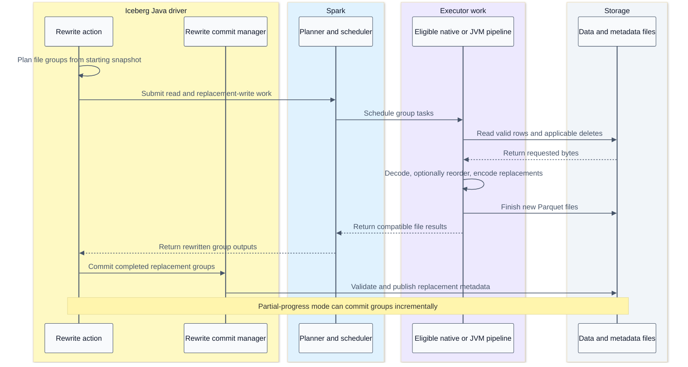

# Arrow in Iceberg scans writes and data file rewrites

[Index](README.md) | [Arrow memory](13-arrow-memory-and-kernels.md) | [Vectorization and hardware](14-vectorization-and-hardware.md)

The useful optimization order is to avoid unnecessary table work, avoid unnecessary file bytes, decode only what is needed, and then execute the remaining work efficiently. Arrow connects the decode and compute stages; it does not choose the Iceberg snapshot or commit replacement files. This chapter follows that boundary through the actual Comet integration and distinguishes a faster rewrite job from a better layout for future reads.

## Ownership and evidence

| Layer | Owns | Does not own |
| --- | --- | --- |
| Iceberg Java planning | Snapshot/file-task semantics, applicable deletes and table metadata | CPU instruction selection inside Rust kernels |
| Spark | Query plan, distribution, scheduling, attempts and stage recovery | Arrow buffer layout specifications |
| Comet | Eligible native plan regions, bridges, native scan/write integration and metrics | An independent Iceberg commit authority |
| Iceberg Rust reader/writer | Task-level read semantics and eligible file production | Replacing the Spark driver and Iceberg Java transaction |
| Parquet Rust | File/page decoding, Arrow reader APIs and Parquet encoding | General SQL optimization or snapshot selection |
| Arrow Rust | Arrays, buffers, kernels and interoperability | Distributed task scheduling |
| Hardware and OS | Instruction execution, caches, memory and I/O resources | Whether a delete file applies to a particular data file |

For Comet's dependency path, the inspected Iceberg Rust revision is `bb1e4a4861f02377489eff818b75138f414c4cb0`, as pinned in [Comet's manifest](/Users/srajak/Documents/repos/oss/apache/datafusion-comet/native/Cargo.toml:67). Its source is available in the local Cargo checkout. Comet resolves Arrow/Parquet 59.3.0, while the separately inspected Arrow tree is 60.0.0. Generic Arrow APIs below are labelled as source concepts rather than proof of every feature in the linked binary. The [earlier source ledger](09-source-ledger.md) and [Arrow chapter](13-arrow-memory-and-kernels.md#versions-and-scope) record the other boundaries.

## Scan work reduction ladder

```mermaid
%%{init: {"theme":"base","flowchart":{"curve":"basis","nodeSpacing":35,"rankSpacing":46},"themeVariables":{"fontFamily":"Ubuntu, Arial, sans-serif","fontSize":"15px","primaryTextColor":"#0f172a","lineColor":"#64748b"}}}%%
flowchart LR
  subgraph PLAN["Iceberg and Spark control"]
    S["Snapshot and file-task planning"]
    T["Spark executor task"]
    S --> T
  end
  subgraph READER["Native Iceberg and Parquet reader"]
    M["File metadata and field-ID mapping"]
    G["Candidate row groups and selected rows"]
    D["Load applicable delete artifacts"]
    P["Fetch and decode projected pages"]
    A["Arrow batches with table semantics"]
    T --> M --> G --> P --> A
    T --> D
    D --> G
    D --> P
  end
  subgraph COMPUTE["Eligible native operators"]
    F["Residuals and expressions"]
    O["Aggregate join sort or exchange"]
    A --> F --> O
  end
  classDef control fill:#e0f2fe,stroke:#0284c7,color:#0c4a6e
  classDef metadata fill:#fef9c3,stroke:#ca8a04,color:#713f12
  classDef io fill:#ffedd5,stroke:#f97316,color:#7c2d12
  classDef native fill:#ede9fe,stroke:#7c3aed,color:#3b0764
  class S,T control
  class M,G,D metadata
  class P io
  class A,F,O native
```



The drawing compresses metadata loading, selection and decoding. It does not imply all deletes are a post-scan filter: the checked reader incorporates position deletes into row selection and equality-delete conditions into the reader predicate.

| Stage | Work avoided | Evidence and caveat |
| --- | --- | --- |
| Iceberg partition/file pruning | Opening irrelevant data files | Metadata bounds must safely rule out a match; see [scan planning](02-iceberg-scan.md) |
| Parquet row-group pruning | Reading/decoding irrelevant row groups | Uses available statistics; absent or inconclusive statistics retain candidates |
| Column projection | Reading unneeded column chunks | Predicate and delete evaluation can require columns absent from final output |
| Page-index row selection | Unneeded row ranges/pages | Requires usable column and offset indexes for metadata-driven page pruning |
| Reader predicates | Decoding some later columns for rejected rows | Savings depend on selectivity, locality, projection overlap and reader behavior |
| Residual evaluation | Incorrectly passing candidate rows downstream | Metadata pruning is not universally exact row filtering |
| Native kernels | CPU cost of remaining work | Can reduce time without reducing physical bytes read |

This ordering explains why an improved file layout can beat an instruction-level optimization: work that is pruned does not need decoding or SIMD at all.

## Concrete Comet scan entry point

`IcebergScanExec::execute_with_tasks` loads FileIO, uses the DataFusion session batch size, fills missing Parquet delete-file sizes, and constructs the Iceberg Rust `ArrowReaderBuilder`. It sets file concurrency, enables row selection and supplies a 512 KiB metadata-size hint. It submits the task stream and wraps returned batches with Spark-compatible schema adaptation and metrics. [Comet scan](/Users/srajak/Documents/repos/oss/apache/datafusion-comet/native/core/src/execution/operators/iceberg_scan.rs:175).

The 512 KiB value is a metadata read hint, not a Parquet page size, an Arrow batch size or a CPU cache size. The file-concurrency setting controls overlapping file work within this path; it does not change Spark's number of task slots. Filling delete-file sizes can itself generate storage metadata requests. An error there is not permission to ignore deletes.

The pinned Iceberg Rust reader opens the Parquet file, resolves field IDs/name mappings, configures projection, combines predicates and deletes, and constructs a `ParquetRecordBatchStreamBuilder`. Its output transformer handles promotions, reordering, defaults, partition constants and metadata fields as applicable. This work is necessary for Iceberg semantics; an array with the right physical bytes but the wrong field identity is still wrong. [Pinned reader pipeline](/Users/srajak/.cargo/git/checkouts/iceberg-rust-1cfaaa0dd97c960f/bb1e4a4/crates/iceberg/src/arrow/reader/pipeline.rs:135).

## How Parquet becomes Arrow

```text
compressed page bytes -> decompress when required -> decode levels and encoded values -> construct Arrow buffers -> assemble arrays and batches
```

These are logical stages. Implementations can combine steps, reuse buffers or process fragments; not every page uses every encoding.

| File concept | Reader work | Hardware cost to reason about |
| --- | --- | --- |
| Compression codec | Expand compressed payload | CPU throughput versus reduced storage/network bytes |
| Dictionary encoding | Decode identifiers and resolve dictionary values or retain a supported dictionary form | Small-dictionary locality versus gathers and output materialization |
| RLE / bit packing | Expand runs and unpack narrow integers | Specialized shifts/masks, regular blocks and tail handling |
| Definition levels | Reconstruct null and nested-presence information | Bitmap construction and value placement |
| Repetition levels | Reconstruct repeated/nested structure | Offset generation, record boundaries and extra state |
| Strings | Build offsets/payload or view representation, preserve UTF-8 requirements | Copying, validation, payload locality and retained memory |
| Projection | Build only required columns and needed dependencies | Avoided decode can exceed the benefit of a faster kernel |

Sources: [page decompression](/Users/srajak/Documents/repos/oss/apache/arrow-rs/parquet/src/file/serialized_reader.rs:404), [record reader](/Users/srajak/Documents/repos/oss/apache/arrow-rs/parquet/src/arrow/record_reader/mod.rs:99), [primitive array reader](/Users/srajak/Documents/repos/oss/apache/arrow-rs/parquet/src/arrow/array_reader/primitive_array.rs:158), [bit unpacking](/Users/srajak/Documents/repos/oss/apache/arrow-rs/parquet/src/util/bit_pack.rs:18).

A nested record can have multiple encoded leaf values, so encoded-value count, logical-row count and Arrow child-array length need not be equal. `read_records` and `skip_records` operate with record/level semantics; treating each encoded value as a complete table row breaks nested data.

## Row selection and late materialization

The Arrow Parquet builder exposes projection, row-group selection, `RowSelection` and `RowFilter`. It does not itself understand arbitrary SQL or Iceberg catalog predicates. Its caller supplies selections or predicate implementations. [Reader contract](/Users/srajak/Documents/repos/oss/apache/arrow-rs/parquet/src/arrow/arrow_reader/mod.rs:191).

`RowSelection` describes selected/skipped logical row ranges. Row-group filtering happens first, so the selection is expressed over the remaining row groups. `RowFilter` evaluates predicates on their requested columns and refines the selection before final output projection. This can delay materializing expensive output columns until cheaper predicates eliminate rows. [Row-selection API](/Users/srajak/Documents/repos/oss/apache/arrow-rs/parquet/src/arrow/arrow_reader/mod.rs:366), [RowFilter](/Users/srajak/Documents/repos/oss/apache/arrow-rs/parquet/src/arrow/arrow_reader/filter.rs:137).

The tradeoff matters:

- A cheap narrow predicate that removes most rows can save later decode and output work.
- An expensive wide predicate that keeps almost every row can add passes without much benefit.
- Scattered survivors can still require many pages, even at low row selectivity.
- Predicate and output projections can overlap, causing repeated decoding unless the reader can reuse/cache it.
- Page indexes can locate useful regions; missing indexes reduce pruning opportunities without authorizing incorrect results.

The 60.0.0 reader contains optimizations for some adjacent predicates on the same column. That is not a claim that every optimization is present in Comet's resolved 59.3.0 reader, or that the pinned Iceberg adapter splits its expression into that predicate shape.

## Delete semantics before instruction tuning

The pinned pipeline builds an equality-delete predicate and ANDs it with the task predicate. Position-delete indexes or deletion vectors become a keep-row selection, intersected with any predicate-derived row selection. It then builds the reader stream and transforms batches to the table schema. [Delete/predicate combination](/Users/srajak/.cargo/git/checkouts/iceberg-rust-1cfaaa0dd97c960f/bb1e4a4/crates/iceberg/src/arrow/reader/pipeline.rs:557), [position selection intersection](/Users/srajak/.cargo/git/checkouts/iceberg-rust-1cfaaa0dd97c960f/bb1e4a4/crates/iceberg/src/arrow/reader/pipeline.rs:676).

Position deletes refer to positions in the original data file, not row numbers in an already-filtered output batch. Skipped row groups and pages must not shift their meaning. Equality deletes depend on the specified field identities and applicable delete semantics; they are not equivalent to dropping any row whose visible output happens to resemble a delete row.

The test `test_position_delete_across_multiple_row_groups` targets exactly this boundary; related tests cover selected/skipped row groups and an end-to-end deletion vector. These were inspected, not rerun. [Delete tests](/Users/srajak/.cargo/git/checkouts/iceberg-rust-1cfaaa0dd97c960f/bb1e4a4/crates/iceberg/src/arrow/reader/positional_deletes.rs:339).

Bitmap intersection may be efficient, but loading delete files, resolving field IDs, building predicates and fetching pages can dominate. “Delete filtering is a SIMD AND” is therefore an incomplete explanation of an Iceberg scan.

## I/O concurrency is not SIMD

The pinned reader has a single-concurrency fast path and bounded unordered file processing for higher concurrency. Its file reader coalesces nearby byte ranges, fetches merged ranges with bounded concurrency and slices the returned bytes back into requested ranges. [File pipeline](/Users/srajak/.cargo/git/checkouts/iceberg-rust-1cfaaa0dd97c960f/bb1e4a4/crates/iceberg/src/arrow/reader/pipeline.rs:65), [range fetching](/Users/srajak/.cargo/git/checkouts/iceberg-rust-1cfaaa0dd97c960f/bb1e4a4/crates/iceberg/src/arrow/reader/file_reader.rs:65).

Coalescing trades extra bytes in the gaps for fewer requests. Concurrency trades more in-flight memory and requests for less exposed latency. Neither changes the CPU lane width. An async API also does not prove that compression or decoding runs on a dedicated background CPU pool; inspect where the actual synchronous work is polled/executed.

The range-coalescing test checks that merged reads reconstruct the requested slices. It does not establish an optimum coalescing distance or request count for a production object store. [Test](/Users/srajak/.cargo/git/checkouts/iceberg-rust-1cfaaa0dd97c960f/bb1e4a4/crates/iceberg/src/arrow/reader/file_reader.rs:269).

## Batches through native operators

After the reader, a native region can keep `RecordBatch`-based execution across filter, projection, aggregate, join and exchange. This avoids a mandatory row conversion between every operator; it does not mean all kernels fuse into one loop or share one output allocation.

The checked DataFusion `FilterExec` evaluates a predicate and applies Arrow filtering; expression evaluation dispatches to typed kernels. Hash joins and aggregates add hash tables, key representations, random probes and potentially spill. Sorting can build index or row-comparison representations. These algorithms are not all sequential SIMD scans. [DataFusion filter](/Users/srajak/Documents/repos/oss/apache/datafusion/datafusion/physical-plan/src/filter.rs:989), [binary expressions](/Users/srajak/Documents/repos/oss/apache/datafusion/datafusion/physical-expr/src/expressions/binary.rs:271). This separate DataFusion checkout is `cd05b417544262f8a6c114e304055da53e5b4162`, not proof of the code in a historical Comet binary.

For the [saved Q6 plans](12-tpch-spark-versus-comet.md#q6-question-and-plan-proof), the established observation remains: the Spark baseline converts scan batches to rows before residual work; Comet retains the native scan/filter/project/aggregate/exchange region and converts the final result. The new Arrow/SIMD analysis explains possible mechanisms inside that region. It does not turn the roughly 2x historical suite result into a measured SIMD speedup.

## Data file rewrite versus metadata maintenance

| Operation | Reads or writes table-row data? | Where Arrow/CPU work could matter |
| --- | --- | --- |
| Bin-pack data-file rewrite | Reads selected input files and writes replacement files | Decode, delete application, batch handling, encode/compress |
| Sort or Z-order data-file rewrite | Reads/writes rows and reorganizes them | Above costs plus sort, repartition, shuffle, key computation and possible spill |
| Copy-on-write update/delete | Rewrites affected row data | Predicate evaluation and native read/write eligibility |
| Position-delete-file rewrite | Rewrites delete records, not necessarily the table's data files | Its own scan/write path; no automatic claim of native support |
| Manifest rewrite | Reorganizes metadata records | Not a Parquet table-row SIMD scan merely because it is called a rewrite |
| Snapshot expiration / orphan cleanup | Metadata and storage-object management | Listing, metadata validation and object deletion, not the normal Arrow compute path |

Data-file compaction is not byte concatenation of arbitrary Parquet files. Input schema, deletes, partitioning, output metadata and file encoding must remain valid. The Java bin-pack runner builds an Iceberg read over a staged file-task group, then writes replacements. It uses no redistribution when the output spec matches, but requests range distribution when the spec changes. “Bin pack never shuffles” is too strong. [Bin-pack runner](/Users/srajak/Documents/repos/oss/apache/iceberg/spark/v3.5/spark/src/main/java/org/apache/iceberg/spark/actions/SparkBinPackFileRewriteRunner.java:40), [shuffling runner](/Users/srajak/Documents/repos/oss/apache/iceberg/spark/v3.5/spark/src/main/java/org/apache/iceberg/spark/actions/SparkShufflingFileRewriteRunner.java:107).

## Rewrite coordination sequence



This is an ownership sequence, not an exhaustive API trace. The executor lane deliberately includes JVM fallback. The rewrite action chooses its runner, plans groups and uses a rewrite commit manager; partial-progress mode changes the grouping of commits. New files existing in storage do not mean a snapshot has published them. [Rewrite action](/Users/srajak/Documents/repos/oss/apache/iceberg/spark/v3.5/spark/src/main/java/org/apache/iceberg/spark/actions/RewriteDataFilesSparkAction.java:178).

## Native write data path

```mermaid
%%{init: {"theme":"base","flowchart":{"curve":"basis","nodeSpacing":35,"rankSpacing":46},"themeVariables":{"fontFamily":"Ubuntu, Arial, sans-serif","fontSize":"15px","primaryTextColor":"#0f172a","lineColor":"#64748b"}}}%%
flowchart LR
  subgraph NATIVE["Eligible Comet native writer"]
    B["Input RecordBatch"]
    S["Align target schema and field IDs"]
    P["Partition routing and row pacing"]
    W["DataFile and rolling writer"]
    B --> S --> P --> W
  end
  subgraph PARQUET["Parquet Rust"]
    A["Arrow writer: levels and encoded columns"]
    G["Pages and buffered row groups"]
    F["Flush data and finish footer"]
    W --> A --> G --> F
  end
  subgraph STORAGE["Output and publication boundary"]
    O[("New data files")]
    J["JVM metadata reconciliation and commit contract"]
    F --> O
    F --> J
  end
  classDef native fill:#ede9fe,stroke:#7c3aed,color:#3b0764
  classDef parquet fill:#ffedd5,stroke:#f97316,color:#7c2d12
  classDef store fill:#f1f5f9,stroke:#64748b,color:#334155
  classDef java fill:#fef9c3,stroke:#ca8a04,color:#713f12
  class B,S,P,W native
  class A,G,F parquet
  class O store
  class J java
```



Comet creates an Iceberg Rust `ParquetWriterBuilder`, wraps it in a rolling writer and DataFile writer, and selects unpartitioned, fanout or clustered routing. It conforms each batch to the field-ID-decorated target schema and writes paced units. A metadata-only schema adjustment can reuse buffers; a real cast or partition gather need not. [Writer construction](/Users/srajak/Documents/repos/oss/apache/datafusion-comet/native/core/src/execution/operators/iceberg_write.rs:507), [schema conformance](/Users/srajak/Documents/repos/oss/apache/datafusion-comet/native/core/src/execution/operators/iceberg_write.rs:849).

The pinned Iceberg writer uses `AsyncArrowWriter`, tracks NaN counts, finishes the file and builds DataFile information from Parquet metadata. Arrow's async writer wraps a synchronous Arrow encoder plus an async output sink. Async output does not make compression CPU-free. [Iceberg Parquet writer](/Users/srajak/.cargo/git/checkouts/iceberg-rust-1cfaaa0dd97c960f/bb1e4a4/crates/iceberg/src/writer/file_writer/parquet_writer.rs:620), [Arrow async writer structure](/Users/srajak/Documents/repos/oss/apache/arrow-rs/parquet/src/arrow/async_writer/mod.rs:158).

## Writer memory and output layout

An Arrow batch, a Parquet page, a row group and a data file are different units. Multiple batches can contribute to one row group; a batch can be split across row groups. File rolling wraps that process. The writer keeps encoded column/page state, dictionaries and other metadata before flushing a row group. Its `memory_size` and `in_progress_size` answer different questions: memory currently used versus estimated encoded row-group size. [Arrow writer buffering](/Users/srajak/Documents/repos/oss/apache/arrow-rs/parquet/src/arrow/arrow_writer/mod.rs:97).

| Choice | Potential benefit | Cost or risk to measure |
| --- | --- | --- |
| Larger output files | Fewer opens, footer reads, tasks and file metadata entries | Less file-level parallelism; target size is not a perfect on-disk equality |
| Larger row groups | Amortized metadata and possible encoding/compression benefits | Larger buffered state and coarser row-group pruning |
| Smaller pages / useful page indexes | Finer skipping opportunities | More metadata and page-processing overhead |
| Clustering/sort order | Narrower useful bounds, better compression or long matching runs | Sort/shuffle cost, spills, possible skew |
| Stronger compression | Fewer bytes stored, fetched or transmitted | More encoding CPU; decode tradeoff depends on codec and data |
| Fanout writers | Accept input spanning many partitions | More simultaneously open writers and buffered state |
| Clustered input | Fewer active partition writers | Upstream distribution/order requirements must hold |

These are tradeoffs, not universal tuning recommendations. A wider schema or high-cardinality strings can make writer memory large even when input batch rows are unchanged. Multiply per-writer state by active partitions and tasks before sizing the executor.

## Native eligibility remains a separate question

The presence of a generic Arrow or Iceberg Rust capability does not automatically enable it in Comet. The checked native-write serializer rejects format version 3 or later and has gates for schema, properties, storage, encryption, Bloom-filter requests and other compatibility conditions. Existing write flags remain opt-in in this notebook's recorded branch. [Native write gate](/Users/srajak/Documents/repos/oss/apache/datafusion-comet/spark/src/main/scala/org/apache/comet/serde/operator/CometIcebergNativeWrite.scala:118), [format-version gate](/Users/srajak/Documents/repos/oss/apache/datafusion-comet/spark/src/main/scala/org/apache/comet/serde/operator/CometIcebergNativeWrite.scala:246).

Therefore, confirm scan and writer engagement independently for each rewrite plan. An accelerated read with a JVM writer is possible; so is an eligible native writer with non-native work elsewhere. Read support for a delete-vector format is not proof of native write support for that table version. See [write and commit details](06-iceberg-write.md) and [capabilities](08-capabilities-and-debugging.md).

## Two different improvement questions

**Did the rewrite job become faster?** Measure its read/decode/delete, shuffle/sort, encode/compress, upload and commit phases, with the same input snapshot and intended output layout. Native execution may accelerate eligible data-plane work, but catalog commit latency and driver planning can remain unchanged.

**Did the rewritten layout improve subsequent queries?** Compare representative reads before and after, preserving the same logical live rows. Measure file counts, row groups, bounds, page indexes, selected bytes, requests and task counts. Removing small files may reduce overhead; sorting may improve pruning. Combining poorly clustered files can also broaden bounds. Fewer files alone is not proof of fewer bytes read.

Illustrative accounting: replacing 1,000 small files with 20 larger files means 50x fewer file objects, not 50x faster scans. A full scan may read almost the same live-row payload; a selective scan may change substantially depending on layout. Metadata, network latency, parallelism and decode determine the result.

## Investigation worksheet

| Area | Preserve | Question it answers |
| --- | --- | --- |
| Identity | Snapshot IDs, schema/field IDs, delete files, code revisions and binary checksum | Was the comparison logically and semantically equivalent? |
| Plan | Initial and final AQE plans, native nodes and fallback reasons | Which work actually ran native? |
| Read layout | Files, bytes, compression, row groups, pages, indexes and sort order | Was less work required, or was the same work faster? |
| Scan runtime | Physical bytes and requests, output rows, decode/delete CPU, file concurrency | Is storage, decode or semantics dominating? |
| Compute | Hot-loop profiles, conversions, allocations, hash/sort state, spills | Would SIMD, fewer passes or a different algorithm help? |
| Write | Rows, output sizes, active writers, buffered memory, codec CPU and close time | Is encoding, partitioning or I/O the write bottleneck? |
| Commit | Metadata reconciliation, catalog latency, validation/retries and publication outcome | Is the serial/control-plane part limiting total improvement? |
| Correctness | Nulls, decimals, nested rows, deletes, schema evolution and retry outcomes | Was speed gained without changing results? |

No scan/rewrite benchmark, hardware-counter collection or new native capability test was run for this documentation update. The proposed measurements are the next evidence needed, not results already obtained.
