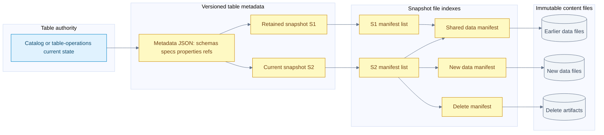
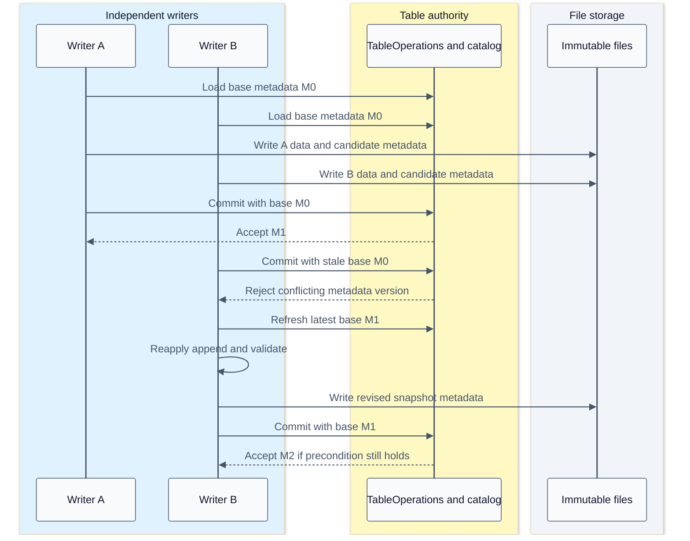

# Iceberg metadata manifests snapshots and commit concurrency

[Index](README.md) | [Distributed planning and compaction](17-distributed-iceberg-and-compaction.md) | [Tests and benchmarks](18-iceberg-tests-and-benchmark-evidence.md)

Iceberg makes a table a versioned graph of metadata and immutable file references, not a directory listing. Parallel workers can produce files independently, but those files become part of a table only when the table commit publishes a new metadata state. Understanding that distinction explains snapshot reads, manifest reuse, optimistic concurrency and safe compaction.

## Main findings

| Question | Finding from the checked code |
| --- | --- |
| Does a reader list every Parquet file? | Normal table scans follow a selected snapshot's manifest references, then prune metadata |
| Is a snapshot a full copy of table data? | No; snapshots can share manifests and data files |
| Must a current scan replay every old snapshot? | No; the selected snapshot identifies its manifest set; history is needed for other operations such as conflict validation |
| Does every metadata commit create a snapshot? | No; properties, schemas, partition specs and references also change table metadata |
| Does writing a Parquet file commit a row? | No; completed files are unpublished until the table update succeeds |
| Is a commit retry a rerun of Spark tasks? | Not normally; metadata is refreshed and the pending update is reapplied and revalidated |
| Does Comet replace the commit protocol with Rust? | No; eligible Rust file output is reconciled with the Iceberg Java commit contract |

Inspection: Iceberg `5e7169168db3d34e29354c6f59ec4d6e420b8d2d`, Comet `184accac5b9cee6b761a6673c73c263adedef45e`, 2026-09-30. Existing local changes are recorded in the [source ledger](09-source-ledger.md). These are source inspections, not new passing integration-test results.

## Version boundaries

The detailed examples use the familiar v2/v3 snapshot and manifest model. In this local Iceberg tree, v4 code also exists, including Avro and Parquet manifest support. Therefore, **all Iceberg manifests are always Avro** is not an accurate description of this entire checkout. The checked `ManifestLists` still reads manifest lists as Avro; a manifest list and a manifest are different objects. [Manifest lists](/Users/srajak/Documents/repos/oss/apache/iceberg/core/src/main/java/org/apache/iceberg/ManifestLists.java:44), [versioned manifest writers](/Users/srajak/Documents/repos/oss/apache/iceberg/core/src/main/java/org/apache/iceberg/ManifestFiles.java:264), [v4 manifest benchmark](/Users/srajak/Documents/repos/oss/apache/iceberg/core/src/jmh/java/org/apache/iceberg/ManifestBenchmark.java:45).

This source-tree capability is not a Comet compatibility claim. The checked Comet native writer rejects table format version 3 and later; native read and write gates must be evaluated independently. See [native eligibility](15-arrow-in-iceberg-scan-and-rewrite.md#native-eligibility-remains-a-separate-question). The [public specification](https://iceberg.apache.org/spec/) is the format reference; the code revisions above are the authority for this notebook's implementation trace.

## Metadata object graph



This illustrative graph shows reference sharing, not a promise that every append creates exactly one manifest. Snapshot parent links are omitted so the storage references remain readable. A delete artifact may be a v2 delete file or an applicable newer-format representation; its applicability is checked, not inferred from sharing a directory.

| Object | Important contents | Reader or writer responsibility |
| --- | --- | --- |
| Catalog/table operations | Current metadata location or equivalent authoritative version | Resolve the table and enforce the implementation's commit precondition |
| Table metadata | UUID, format, schemas and IDs, partition specs, sort orders, properties, snapshots, refs, logs | Interpret files using the correct identities and select a snapshot |
| Snapshot | ID, parent, sequence, timestamp, operation, summary, schema ID, manifest-list location | Identify a table state, not an executor's temporary output |
| Manifest list entry | Manifest path/length/content/spec ID, sequence information, live/deleted counts, partition summaries | Skip irrelevant manifests without opening all of them |
| Manifest entry | ADDED/EXISTING/DELETED status, snapshot/data/file sequence information, content-file descriptor | Decide whether a file is live and how it participates in delete semantics |
| DataFile descriptor | Path, format, partition tuple, rows/bytes, field-ID metrics, split offsets and other metadata | Prune files and construct read work; it is not the row payload |
| Physical data file | Encoded table rows and file-format metadata | Decode projected columns and honor applicable row semantics |

Sources: [TableMetadata fields](/Users/srajak/Documents/repos/oss/apache/iceberg/core/src/main/java/org/apache/iceberg/TableMetadata.java:246), [BaseSnapshot](/Users/srajak/Documents/repos/oss/apache/iceberg/core/src/main/java/org/apache/iceberg/BaseSnapshot.java:41), [ManifestEntry](/Users/srajak/Documents/repos/oss/apache/iceberg/core/src/main/java/org/apache/iceberg/ManifestEntry.java:30), [DataFile schema](/Users/srajak/Documents/repos/oss/apache/iceberg/api/src/main/java/org/apache/iceberg/DataFile.java:1).

## Snapshot identity and sequence numbers

Snapshot IDs identify snapshots; do not interpret a larger ID as a later commit. Sequence numbers carry ordering semantics in v2 and later. A file's **data sequence** describes its data's logical age; its **file sequence** describes when that physical file was added. Compaction is the important case where these can differ.

For example, replacement file C can be added in snapshot sequence 12 while preserving data sequence 10. The reader can then apply an equality delete from sequence 11 to C. Giving C a new data sequence of 12 would change that applicability. The precise conflict checks and example are in [concurrent compaction](17-distributed-iceberg-and-compaction.md#sequence-numbers-preserve-concurrent-delete-semantics). [Sequence contracts](/Users/srajak/Documents/repos/oss/apache/iceberg/core/src/main/java/org/apache/iceberg/ManifestEntry.java:99).

ADDED and EXISTING entries are live; DELETED entries record removal from the relevant snapshot state. A DELETED entry does not prove the object has already been erased from storage. It may remain necessary for retained snapshots. Likewise, an old manifest can still contain ADDED entries when reused by a later snapshot: ADDED is not a claim that the file was first created in every snapshot referencing that manifest.

## Why appends need not rewrite the whole table

`BaseTable.newFastAppend()` chooses `FastAppend`; `newAppend()` chooses `MergeAppend`. `FastAppend.apply` combines newly written/appended manifests with the parent snapshot's manifest set. `SnapshotProducer.apply` writes a new manifest list and constructs the new snapshot. Existing data files do not need to be read or rewritten for an ordinary append. [Append selection](/Users/srajak/Documents/repos/oss/apache/iceberg/core/src/main/java/org/apache/iceberg/BaseTable.java:208), [manifest reuse](/Users/srajak/Documents/repos/oss/apache/iceberg/core/src/main/java/org/apache/iceberg/FastAppend.java:147), [snapshot assembly](/Users/srajak/Documents/repos/oss/apache/iceberg/core/src/main/java/org/apache/iceberg/SnapshotProducer.java:295).

That is not free forever. Fast appends can accumulate many small manifests. Merge-oriented paths and explicit manifest rewrites can reorganize entries, trading commit work for future planning efficiency. The checked defaults include an 8 MiB manifest target, merging enabled, and a minimum merge count of 100. These configure the applicable merge logic; they do not mean every 100th commit rewrites the entire metadata graph. [Properties](/Users/srajak/Documents/repos/oss/apache/iceberg/core/src/main/java/org/apache/iceberg/TableProperties.java:115).

Three growth dimensions must be measured separately:

- Retained metadata/snapshots increase history and reachability work.
- Many live manifests increase manifest-list and planning work.
- Many live data/delete files increase descriptors, task planning, opens and read semantics.

Compacting data files does not automatically solve every metadata problem. Expiring snapshots does not automatically reduce the number of files in the current snapshot.

## Read planning from metadata

`BaseSnapshot.cacheManifests` lazily reads and caches the manifest list for that snapshot object, then separates data and delete manifests. It is not an unbounded, globally shared cache that makes every subsequent query free. `DataTableScan.doPlanFiles` passes those manifests, the projected metadata columns, schema/spec maps and row filter into `ManifestGroup`. [Snapshot cache](/Users/srajak/Documents/repos/oss/apache/iceberg/core/src/main/java/org/apache/iceberg/BaseSnapshot.java:169), [DataTableScan](/Users/srajak/Documents/repos/oss/apache/iceberg/core/src/main/java/org/apache/iceberg/DataTableScan.java:63).

`ManifestGroup` creates evaluators per partition spec. It uses an inclusive projection of the data predicate onto that spec, checks manifest partition summaries, reads surviving manifests and applies file-level filters. Inclusive means a safe candidate test, not exact SQL evaluation. Partition evolution therefore does not require pretending all files use the latest partition transform. Each manifest's spec identifies how its partition values must be interpreted. [Manifest filtering](/Users/srajak/Documents/repos/oss/apache/iceberg/core/src/main/java/org/apache/iceberg/ManifestGroup.java:287).

It builds a delete-file index and residual evaluator, retaining column statistics when equality-delete matching needs them. The scan task must carry the relevant data file, split, residual and deletes; projection alone is not permission to discard fields needed for correctness. The next chapter explains how this metadata work can itself run on Spark executors. [Task construction](/Users/srajak/Documents/repos/oss/apache/iceberg/core/src/main/java/org/apache/iceberg/ManifestGroup.java:164).

## Concurrent append commit sequence



This is a successful retry example for compatible appends, not a guarantee that any concurrent operations commute. The data files written by B can be reused; rebuilding metadata is different from rerunning its Spark job. Another conflict can occur on the next attempt, and retry budgets are finite.

`SnapshotProducer.commit` retries `CommitFailedException` using the configured backoff. Each attempt calls `apply`, which refreshes the base and runs validations. It does not blindly republish an obsolete snapshot. `CommitStateUnknownException` is explicitly propagated without ordinary failure cleanup because publication might already have succeeded. [Commit loop](/Users/srajak/Documents/repos/oss/apache/iceberg/core/src/main/java/org/apache/iceberg/SnapshotProducer.java:484).

## Atomicity depends on the catalog implementation

| Checked implementation | Publication mechanism | Important distinction |
| --- | --- | --- |
| JDBC | Update the catalog row conditional on the expected old metadata location; require one updated row | Independent writers coordinate through the database, not a shared JVM monitor |
| Hadoop path-based table | Write temporary metadata, rename to the next metadata version, then update a best-effort version hint | The rename is the commit operation; the hint is not the transaction authority |
| Generic `TableOperations` | `commit(base, updated)` contract | Do not assume every catalog uses the same SQL, lock, rename or HTTP protocol |

Sources: [JDBC conditional update SQL](/Users/srajak/Documents/repos/oss/apache/iceberg/core/src/main/java/org/apache/iceberg/jdbc/JdbcUtil.java:109), [affected-row check](/Users/srajak/Documents/repos/oss/apache/iceberg/core/src/main/java/org/apache/iceberg/jdbc/JdbcTableOperations.java:145), [Hadoop commit](/Users/srajak/Documents/repos/oss/apache/iceberg/core/src/main/java/org/apache/iceberg/hadoop/HadoopTableOperations.java:131).

The required filesystem/catalog guarantees must hold on the actual deployment. A successful local HadoopCatalog demo is not evidence that an arbitrary object-store rename implements the same atomicity. Rust versus JVM does not remove the need for a common commit authority when multiple engines write the same table.

## Readers and garbage collection

A reader plans against a selected snapshot and its files; a concurrent append does not silently add rows to that already-planned scan. However, retaining a snapshot reference in a running process does not create an automatic storage lease against maintenance. Expiration and orphan cleanup policies must account for long-running readers and writers.

`RemoveSnapshots` considers retained refs and their policies, prevents explicitly expiring snapshots still referenced by retained refs, commits the metadata change, and performs the selected cleanup. Shared files cannot be treated as garbage merely because one snapshot stopped referencing them. Unknown commit outcomes and in-progress writes make aggressive orphan deletion especially dangerous. [Retention selection](/Users/srajak/Documents/repos/oss/apache/iceberg/core/src/main/java/org/apache/iceberg/RemoveSnapshots.java:198), [cleanup](/Users/srajak/Documents/repos/oss/apache/iceberg/core/src/main/java/org/apache/iceberg/RemoveSnapshots.java:379).

Branches and tags are named snapshot references with different update/retention roles. A rollback changes which retained snapshot is current; it does not reverse a Parquet file byte by byte. The snapshot history and the set of retained snapshots answer different questions, especially after rollback or branch activity.

## Metadata inspection queries

These are read-only examples for an existing Spark Iceberg catalog. Replace `catalog.db.table_name`; no queries were executed for this chapter.

```sql
SELECT committed_at, snapshot_id, parent_id, operation, manifest_list, summary
FROM catalog.db.table_name.snapshots
ORDER BY committed_at;

SELECT made_current_at, snapshot_id, parent_id, is_current_ancestor
FROM catalog.db.table_name.history
ORDER BY made_current_at;

SELECT content, partition_spec_id, count(*) AS manifests, sum(length) AS manifest_bytes,
       sum(added_data_files_count + existing_data_files_count) AS live_data_entries
FROM catalog.db.table_name.manifests
GROUP BY content, partition_spec_id;
```

The last query measures metadata entries in the selected manifest set, not decoded rows or storage request counts. Snapshot summaries are not a substitute for a correctness query. Metadata-table schemas are verified in [SnapshotsTable](/Users/srajak/Documents/repos/oss/apache/iceberg/core/src/main/java/org/apache/iceberg/SnapshotsTable.java:30), [HistoryTable](/Users/srajak/Documents/repos/oss/apache/iceberg/core/src/main/java/org/apache/iceberg/HistoryTable.java:37), and [ManifestsTable](/Users/srajak/Documents/repos/oss/apache/iceberg/core/src/main/java/org/apache/iceberg/ManifestsTable.java:31).

## What this means for Comet

The native writer's DataFile transport manifest is an executor-to-JVM handoff, not proof that Rust published the table's snapshot or manifest list. JVM code reconstructs compatible file metadata and commit messages; Iceberg Java applies the table update. Native scan work likewise consumes planned file tasks rather than independently selecting another snapshot. The metadata graph and concurrency contract stay shared with other Iceberg writers. See [write handoff](06-iceberg-write.md#executor-handoff-sequence) and [test evidence](18-iceberg-tests-and-benchmark-evidence.md).
