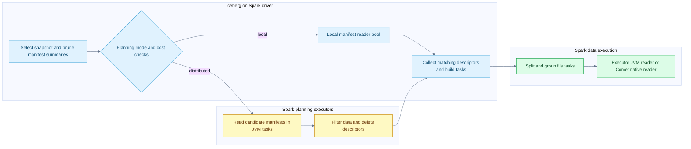
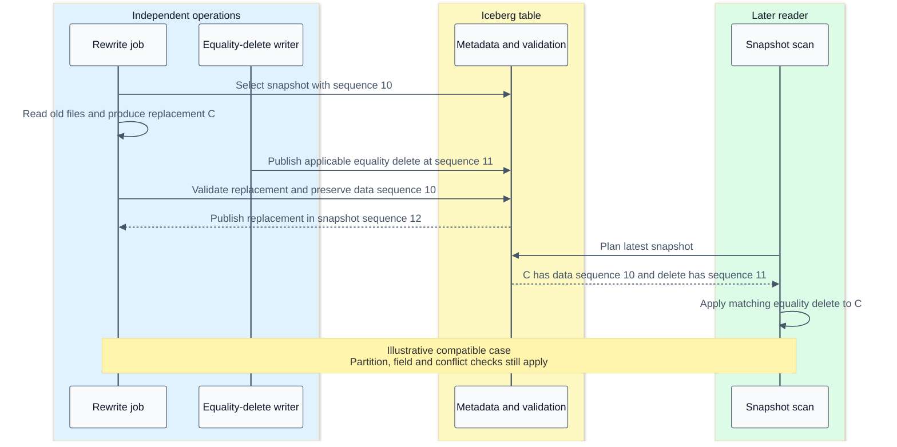

# Distributed Iceberg planning execution and compaction

[Index](README.md) | [Metadata and snapshots](16-iceberg-metadata-and-snapshots.md) | [Tests and benchmarks](18-iceberg-tests-and-benchmark-evidence.md)

Scaling an Iceberg job means scaling several different kinds of work: metadata planning, file reads, compute/shuffle, file production and publication. Spark can distribute both manifest processing and table-row processing. Comet accelerates eligible executor data work inside that system; it does not provide a second cluster scheduler or a replacement catalog transaction protocol.

This chapter follows the checked Iceberg Spark 3.5 implementation and the Comet revision in the [source ledger](09-source-ledger.md). Other Spark modules, packaged Iceberg versions and catalog implementations must be checked separately.

## The units of parallelism

| Unit | Meaning | Do not confuse it with |
| --- | --- | --- |
| Manifest | Metadata entries sharing a partition-spec interpretation and content kind | A Spark data-read partition |
| Manifest-planning Spark partition | Work to read/filter candidate metadata remotely | Native Parquet scan work |
| FileScanTask | File/split/residual/delete-related read work | Necessarily a whole file or one final Spark task |
| ScanTaskGroup / Spark InputPartition | Group of tasks assigned as input work | One Iceberg partition value |
| Spark task attempt | Scheduled execution of a partition, including retry identity | A committed snapshot |
| Native file concurrency | Overlapping file-reader work within a native scan | More Spark executor slots |
| Rewrite file group | Independently rewritable set chosen by the action planner | One Spark task; a group can require many tasks and stages |
| Snapshot commit | Validated publication of selected results | One commit per output file or task |

## Distributed manifest planning



The diagram is an ownership decomposition; data and delete planning can overlap. Distributed metadata work does not make the reader itself native. It is still Iceberg Java code running in Spark tasks.

`BaseDistributedDataScan.doPlanFiles` first filters data/delete manifests and decides independently where each side should be planned. If both stay local, it uses the normal manifest-group path. Otherwise it starts data and delete planning futures, then combines data descriptors with the delete index into scan tasks. [Planning branches](/Users/srajak/Documents/repos/oss/apache/iceberg/core/src/main/java/org/apache/iceberg/BaseDistributedDataScan.java:150).

`SparkDistributedDataScan` parallelizes the candidate manifest beans with one RDD partition per manifest in this implementation. Executors read/filter manifests using the broadcast serializable table and schema/spec context. Data descriptors return through `collectPartitions`; delete descriptors return through `collect`, and the delete index is built on the driver. [Spark implementation](/Users/srajak/Documents/repos/oss/apache/iceberg/spark/v3.5/spark/src/main/java/org/apache/iceberg/SparkDistributedDataScan.java:124).

The consequence is important: distributed planning moves metadata I/O and filtering out to executors, but matching descriptors still return to the driver. It is not proof of constant driver memory as live-file count grows. Manifest count, surviving entries, column-statistics width, serialization and delete-index size all matter.

### When AUTO chooses local work

The checked implementation is more specific than “large table means distributed planning”:

- An explicitly supplied planning executor forces the local planning path in the core decision.
- AUTO favors local data planning when column statistics must be loaded, including for possible equality deletes.
- AUTO favors local delete planning when equality deletes may be present.
- The generic AUTO decision stays local if remote parallelism is no greater than local parallelism, manifest count is at most twice local parallelism, or manifest bytes are below the local planning threshold.
- The threshold is local planning parallelism times 128 MiB in this checkout.
- `SparkReadConf` forces LOCAL when its parsed `spark.driver.maxResultSize` is below 256 MiB, even before resolving the requested planning-mode config. Do not assume a setting that Spark otherwise treats specially, such as zero, bypasses this literal comparison.

These are source-version heuristics, not recommended tuning constants. Supported distributed planning also depends on the table capability. [Core decision](/Users/srajak/Documents/repos/oss/apache/iceberg/core/src/main/java/org/apache/iceberg/BaseDistributedDataScan.java:228), [threshold](/Users/srajak/Documents/repos/oss/apache/iceberg/core/src/main/java/org/apache/iceberg/BaseDistributedDataScan.java:61), [Spark gates](/Users/srajak/Documents/repos/oss/apache/iceberg/spark/v3.5/spark/src/main/java/org/apache/iceberg/spark/SparkReadConf.java:346).

The table properties are `read.data-planning-mode` and `read.delete-planning-mode`, with AUTO as the checked default. Force a mode only after measuring its costs; distributing a tiny manifest scan can add more Spark scheduling/serialization work than it removes. [Properties](/Users/srajak/Documents/repos/oss/apache/iceberg/core/src/main/java/org/apache/iceberg/TableProperties.java:276).

## From file descriptors to Spark execution

After file planning, split/task-group planning combines work using split size, lookback and file-open cost. The checked base defaults are 128 MiB target splits, lookback 10 and 4 MiB open-file cost. The cost is a planning weight, not an assertion that opening each file reads 4 MiB. Adaptive splitting and Spark overrides can change the effective task shape. [Planning properties](/Users/srajak/Documents/repos/oss/apache/iceberg/core/src/main/java/org/apache/iceberg/TableProperties.java:249).

`SparkBatch.planInputPartitions` broadcasts serializable table and FileIO objects, serializes the expected schema, computes locality preferences and constructs an input partition for each task group. This is why “one input file equals one Spark task” is unsafe as a universal model. [Input partitions](/Users/srajak/Documents/repos/oss/apache/iceberg/spark/v3.5/spark/src/main/java/org/apache/iceberg/spark/source/SparkBatch.java:87).

Spark still chooses executor placements, runs attempts and handles stage failures. Comet's native scan receives resolved file-task payloads. Rust does task-level file I/O, delete application, schema adaptation and Arrow production; it does not ask a separate scheduler to launch workers. See [task scheduling and networking](05-distributed-execution.md), [scan internals](15-arrow-in-iceberg-scan-and-rewrite.md#concrete-comet-scan-entry-point), and [fault tolerance](07-fault-tolerance.md).

## JVM versus Comet is an execution boundary comparison

| Phase | Spark with Iceberg JVM path | Eligible Comet path | Shared responsibility |
| --- | --- | --- | --- |
| Snapshot and metadata planning | Iceberg Java, possibly distributed using Spark | Same control-plane family | Field IDs, specs, snapshots and valid file tasks |
| Parquet data read | Iceberg Java reader; batch/vectorization eligibility varies | Iceberg Rust and Parquet Rust produce Arrow batches | Decode correct projected rows and apply applicable deletes |
| Expressions, joins, aggregation, sort | Spark physical operators and generated JVM code | Eligible Comet/DataFusion native region | SQL semantics and plan distribution requirements |
| Shuffle | Spark-managed exchange and block lifecycle | Eligible native serialization/write/read paths | Spark stage dependencies, locations and retries remain relevant |
| Data-file production | Iceberg Java writers | Eligible Iceberg Rust Parquet writers | Correct partitioning, schema IDs, metrics and closed files |
| Commit-message construction | Normal Java writer results | JVM reconstruction/reconciliation of native results | Iceberg-compatible commit messages |
| Table publication | Iceberg Java/catalog | Iceberg Java/catalog | Optimistic conflict checks and snapshot visibility |

Do not compare these as “a row-at-a-time JVM versus automatically SIMD Rust.” JVM Parquet readers can already be vectorized; native code can still allocate, copy, wait for I/O and fall back at unsupported boundaries. Chapters [13](13-arrow-memory-and-kernels.md) and [14](14-vectorization-and-hardware.md) explain those costs.

Concurrent Spark tasks already perform JVM reads/writes in parallel. Rust's bounded async file/range concurrency can overlap additional I/O inside a task. That is a different mechanism, not proof that the JVM is single-threaded. More native file concurrency can also multiply requests, decoded buffers and delete-reader memory. The checked `spark.comet.scan.icebergNative.dataFileConcurrencyLimit` defaults to 1 and must be positive; it does not set Spark task parallelism. [Native concurrency](/Users/srajak/Documents/repos/oss/apache/datafusion-comet/native/core/src/execution/operators/iceberg_scan.rs:175), [configuration](/Users/srajak/Documents/repos/oss/apache/datafusion-comet/spark/src/main/scala/org/apache/comet/CometConf.scala:144).

## Compaction group lifecycle

```mermaid
%%{init: {"theme":"base","flowchart":{"curve":"basis","nodeSpacing":34,"rankSpacing":45},"themeVariables":{"fontFamily":"Ubuntu, Arial, sans-serif","fontSize":"15px","primaryTextColor":"#0f172a","lineColor":"#64748b"}}}%%
flowchart LR
  subgraph ACTION["Iceberg rewrite action on driver"]
    S["Pin starting snapshot and select candidate files"]
    G["Form bounded file groups"]
    P["Submit groups through bounded thread pool"]
    S --> G --> P
  end
  subgraph EXEC["Spark group jobs"]
    R["Read group and apply deletes"]
    O["Optional repartition sort or Z-order"]
    W["Write and close replacement files"]
    P --> R --> O --> W
  end
  subgraph COMMIT["Iceberg Java publication"]
    Q{"Partial progress enabled?"}
    A["Collect all completed groups"]
    B["Queue completed groups in commit batches"]
    V["Validate and publish replacement snapshot"]
    W --> Q
    Q -- "no" --> A --> V
    Q -- "yes" --> B --> V
  end
  classDef action fill:#e0f2fe,stroke:#0284c7,color:#0c4a6e
  classDef execution fill:#dcfce7,stroke:#16a34a,color:#14532d
  classDef metadata fill:#fef9c3,stroke:#ca8a04,color:#713f12
  class S,G,P action
  class R,O,W execution
  class Q,A,B,V metadata
```



Failure handling is omitted from this topology and described below. Executor boxes can contain native regions, JVM operators or both; the graph is not an assertion that a whole maintenance procedure converts to Comet.

`RewriteDataFilesSparkAction.execute` pins a starting snapshot, selects a planner/runner, builds the rewrite plan and chooses single-commit or partial-progress execution. A fixed driver thread pool bounded by `max-concurrent-file-group-rewrites` submits independent group work. Each group is its own Spark action and can have many partitions. Five concurrent groups does not mean five executor tasks. [Action and pool](/Users/srajak/Documents/repos/oss/apache/iceberg/spark/v3.5/spark/src/main/java/org/apache/iceberg/spark/actions/RewriteDataFilesSparkAction.java:178).

The size-based planner filters candidate files, packs bounded groups and checks whether a group warrants rewriting. Limits on group bytes and input-file count prevent every large partition from becoming one unbounded rewrite unit. Selection is broader than just “files below target size”: oversized files and delete-related criteria can also matter. [Size-based grouping](/Users/srajak/Documents/repos/oss/apache/iceberg/core/src/main/java/org/apache/iceberg/actions/SizeBasedFileRewritePlanner.java:175), [bin-pack selection](/Users/srajak/Documents/repos/oss/apache/iceberg/core/src/main/java/org/apache/iceberg/actions/BinPackRewriteFilePlanner.java:1).

The runner stages file tasks and reads them back as a group, then collects replacement file results. Bin-pack avoids redistribution when its output spec matches the original spec; changing specs can require range distribution. Sort and Z-order introduce additional key computation, ordering/shuffle and possible spill. [Runner details](15-arrow-in-iceberg-scan-and-rewrite.md#data-file-rewrite-versus-metadata-maintenance).

## Partial progress changes publication granularity

| Option | Checked default | Meaning |
| --- | --- | --- |
| `max-concurrent-file-group-rewrites` | 5 | Maximum simultaneous group rewrites submitted by the action |
| `max-file-group-size-bytes` | 107374182400, or 100 GiB | Planner's target upper bound for grouping input work; not an executor memory reservation |
| `max-file-group-input-files` | `Long.MAX_VALUE` | Independent cap on input file count in a group |
| `partial-progress.enabled` | false | Publish all groups together, or allow incremental group commits |
| `partial-progress.max-commits` | 10 | Budget used to batch completed groups for publication |
| `use-starting-sequence-number` | true | Preserve starting data age in replacement files |

Sources: [rewrite options](/Users/srajak/Documents/repos/oss/apache/iceberg/api/src/main/java/org/apache/iceberg/actions/RewriteDataFiles.java:35), [group-size options](/Users/srajak/Documents/repos/oss/apache/iceberg/core/src/main/java/org/apache/iceberg/actions/SizeBasedFileRewritePlanner.java:98). The [public procedure reference](https://iceberg.apache.org/docs/latest/spark-procedures/#rewrite_data_files) provides invocation syntax; local defaults above are read from source.

With partial progress off, the action waits for all successful group rewrites before one commit. A rewrite failure triggers cleanup of completed unpublished outputs. The action-level task builder uses `noRetry`; that does not disable Spark's own task-attempt retries inside a group job.

With partial progress on, completed groups are offered to a commit service. The checked batching formula is `groupsPerCommit = ceil(totalGroups / maxCommits)`. For 10 groups and a budget of 3 commits, the batches can contain 4, 4 and 2 groups if all complete. Completion order matters; these are not fixed input partition numbers. The test that injects failure into the second commit verifies six committed groups, unchanged rows, two new snapshots and no orphans in its fixture. [Partial execution](/Users/srajak/Documents/repos/oss/apache/iceberg/spark/v3.5/spark/src/main/java/org/apache/iceberg/spark/actions/RewriteDataFilesSparkAction.java:323), [failure test](/Users/srajak/Documents/repos/oss/apache/iceberg/spark/v3.5/spark/src/test/java/org/apache/iceberg/spark/actions/TestRewriteDataFilesAction.java:1336).

Partial progress is not one atomic transaction over the whole maintenance action. Earlier successful snapshots remain published if later groups fail. Inspect committed-group results and failure policy rather than treating a returned action or exception as a universal all-or-nothing signal.

## Sequence numbers preserve concurrent delete semantics



The rewrite commit manager calls `validateFromSnapshot(startingSnapshotId)` and, by default, sets the new data files' data sequence to the starting snapshot's sequence. In `MergingSnapshotProducer`, this causes the replaced-file validation to tolerate newer equality deletes while continuing to reject applicable newer position deletes. Equality deletes can apply to the new file's values; position deletes refer to the old file path/positions and cannot be blindly transferred to a replacement. [Commit manager](/Users/srajak/Documents/repos/oss/apache/iceberg/core/src/main/java/org/apache/iceberg/actions/RewriteDataFilesCommitManager.java:88), [delete validation](/Users/srajak/Documents/repos/oss/apache/iceberg/core/src/main/java/org/apache/iceberg/MergingSnapshotProducer.java:475), [validation branch](/Users/srajak/Documents/repos/oss/apache/iceberg/core/src/main/java/org/apache/iceberg/MergingSnapshotProducer.java:519).

The core test `testRewriteDataAndAssignOldSequenceNumber` checks that new file data sequence stays old while the new manifest's sequence advances. Separate tests reject successive deletion-vector replacements against the file being rewritten. Preserving a data sequence is therefore not a blanket exemption from delete conflict checks. [Old-sequence test](/Users/srajak/Documents/repos/oss/apache/iceberg/core/src/test/java/org/apache/iceberg/TestRewriteFiles.java:316), [DV conflict test](/Users/srajak/Documents/repos/oss/apache/iceberg/core/src/test/java/org/apache/iceberg/TestRewriteFiles.java:987).

## Three different failures and recoveries

| Failure | Correct response boundary | What not to assume |
| --- | --- | --- |
| Executor task fails while writing | Spark may retry the task; native/JVM cleanup handles known attempt files where possible | Every failed attempt always cleans all files, including after abrupt process death |
| Commit has a known stale-base conflict | Iceberg refreshes/revalidates within its retry policy, or rejects incompatible replacement work | More retries can fix a real serializable-isolation conflict |
| Commit outcome is unknown | Preserve potentially committed files and reconcile authoritative table state | An exception means all output is unreferenced and safe to delete |

The rewrite manager's `commitOrClean` explicitly avoids cleanup for `CommitStateUnknownException` and cleans known outputs only for an appropriate cleanable failure. The upstream action test commits successfully and then injects an unknown-state exception; it checks that the data and published snapshot survive. [Cleanup boundary](/Users/srajak/Documents/repos/oss/apache/iceberg/core/src/main/java/org/apache/iceberg/actions/RewriteDataFilesCommitManager.java:138), [unknown-state test](/Users/srajak/Documents/repos/oss/apache/iceberg/spark/v3.5/spark/src/test/java/org/apache/iceberg/spark/actions/TestRewriteDataFilesAction.java:1728).

Comet's write tests separately exercise a conflicting concurrent append, failed-task cleanup, and a native mid-write storage failure followed by a Spark retry. These establish distinct intended behaviors; a passing scan query would not cover them. [Conflict test](/Users/srajak/Documents/repos/oss/apache/datafusion-comet/spark/src/test/scala/org/apache/comet/CometIcebergWriteActionSuite.scala:526), [native retry test](/Users/srajak/Documents/repos/oss/apache/datafusion-comet/spark/src/test/scala/org/apache/comet/CometIcebergWriteActionSuite.scala:1861).

## Capacity model for a large rewrite

These are accounting models, not measurements or sizing recommendations:

```text
driver metadata pressure ~= surviving file descriptors + delete index + task groups + commit results
executor live memory ~= active task state + native in-flight reads + sort/hash state + writer buffers
open output streams ~= active write tasks * active partition writers per task
rewrite duration ~= planning + scheduled read/reorder/write critical path + publication
```

Do not multiply group count, Spark tasks and native concurrency as if each had an independent guaranteed pool of cores. Concurrent group jobs compete for the same executor slots and storage limits. Sorting can spill; fanout can increase active writers; a commit service introduces another queue. More concurrency can improve overlap or increase contention depending on the current bottleneck.

Illustrative planning memory: one million surviving descriptors at an assumed 1 KiB serialized size represent about 0.954 GiB before Java object overhead, delete indexes, collections and copies. This is not a measured descriptor size. Pruning 99% of those descriptors before collection changes that traffic dramatically; accelerating row arithmetic does not directly address it.

For metadata-heavy jobs, measure planning duration, manifest counts/bytes, surviving descriptors and driver memory. For data-heavy jobs, measure input bytes, decode/delete CPU, shuffle/spill, output encoding, requests and per-stage skew. For write-heavy concurrency, measure commit attempts/conflicts and publication latency as well. A local `local[*]` run cannot establish multi-host network, external shuffle, executor-loss or object-store throttling behavior.
