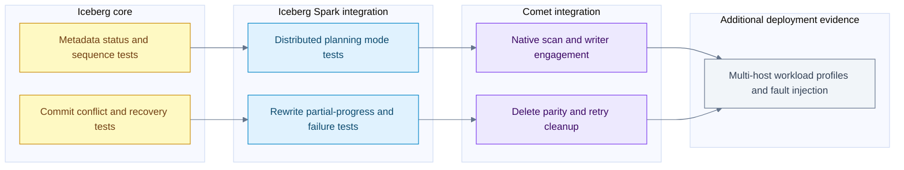

# Iceberg integration tests benchmark coverage and evidence gaps

[Index](README.md) | [Metadata and snapshots](16-iceberg-metadata-and-snapshots.md) | [Distributed compaction](17-distributed-iceberg-and-compaction.md)

There is substantial source coverage for metadata commits, distributed planning, rewrite failures, native write engagement and delete-correct compaction. That does not establish a measured cluster-scale Comet advantage. This chapter separates what tests assert, what benchmark code times, what old local reports show, and what still needs a controlled run.

## Evidence verdict

| Evidence class | What was checked | Verdict |
| --- | --- | --- |
| Iceberg core tests | Manifest/file sequences, metadata conflicts and rewrite validation | Relevant source coverage exists; not executed in this update |
| Iceberg Spark tests | Distributed planning modes, partial progress, failed commits and unknown outcomes | Integration behavior is exercised by local Spark fixtures; not proof of multi-host scale |
| Comet tests | Native scan/write nodes, compaction with deletes, fallback and task retry | Several tests explicitly verify engagement, not merely successful SQL |
| Historical local XML | Four Comet-related reports and three Iceberg core reports | Mixed ages; one scan report records a cancellation failure; no fresh revision-matched verdict |
| Benchmark implementations | Manifest I/O, planning, metadata rewrite, Spark compaction, Comet read/write | Different timing boundaries; they must not be presented as interchangeable results |
| Saved maintenance comparison | Existing local `rewrite_data_files` JSON, six measured timing samples and recorded correctness summaries | 4.97x ratio of medians for that tiny-file local fixture; not a fresh run or a cluster-scale result |
| New performance results | None collected | No new speedup, concurrency optimum or capacity limit is claimed |

Inspection date: 2026-09-30. Iceberg HEAD is `5e7169168db3d34e29354c6f59ec4d6e420b8d2d`; Comet HEAD is `184accac5b9cee6b761a6673c73c263adedef45e`. The Comet tree has pre-existing scan/test and benchmark-config modifications. Existing JARs include several version/profile generations, so their presence is not proof that a current-source test or benchmark is ready to run with matching binaries.

## Tests at each boundary



Edges show how evidence builds across boundaries, not automatic test invocations or a guarantee that the final deployment test has been performed.

| Test source | Concrete behavior worth reading | Limit |
| --- | --- | --- |
| [TestRewriteFiles](/Users/srajak/Documents/repos/oss/apache/iceberg/core/src/test/java/org/apache/iceberg/TestRewriteFiles.java:316) | `testRewriteDataAndAssignOldSequenceNumber` checks old data sequence with a new manifest sequence; later cases reject conflicting DV replacements | Core metadata semantics, not Parquet throughput |
| [TestHadoopCommits](/Users/srajak/Documents/repos/oss/apache/iceberg/core/src/test/java/org/apache/iceberg/hadoop/TestHadoopCommits.java:195) | Failed/stale commits, stale version hint and concurrent fast appends | Hadoop implementation; not every catalog backend |
| [TestSparkDistributedDataScanReporting](/Users/srajak/Documents/repos/oss/apache/iceberg/spark/v3.5/spark/src/test/java/org/apache/iceberg/TestSparkDistributedDataScanReporting.java:35) | v2/v3 crossed with LOCAL/DISTRIBUTED data and delete planning; inherited scan/reporting assertions | Its Spark session is `local[2]`, not a multi-node network test |
| [TestRewriteDataFilesAction](/Users/srajak/Documents/repos/oss/apache/iceberg/spark/v3.5/spark/src/test/java/org/apache/iceberg/spark/actions/TestRewriteDataFilesAction.java:1044) | Single/partial commits, parallel rewrite failures, failed commit batches, unchanged data, cleanup and unknown commit outcome | Fault injection and fixture assertions, not observed production failure rates |
| [TestRoundTrip](/Users/srajak/Documents/repos/oss/apache/iceberg/spark/v3.5/spark-runtime/src/integration/java/org/apache/iceberg/spark/TestRoundTrip.java:41) | Runtime integration source exercises create/insert/MERGE/query, snapshot counts and DDL | Packaging/runtime smoke coverage, not exhaustive concurrency coverage |
| [CometIcebergRewriteActionSuite](/Users/srajak/Documents/repos/oss/apache/datafusion-comet/spark/src/test/scala/org/apache/comet/CometIcebergRewriteActionSuite.scala:48) | Bin-pack, sort and single-column Z-order assert native read/write engagement; sort cases check exchange/sort; MOR compaction materializes only surviving rows | Single-column Z-order test is not a general multidimensional performance result |
| [CometIcebergWriteActionSuite](/Users/srajak/Documents/repos/oss/apache/datafusion-comet/spark/src/test/scala/org/apache/comet/CometIcebergWriteActionSuite.scala:493) | Abort leaves table unchanged; gated concurrent append makes serializable DELETE conflict; native failed tasks/retries clean known output | Exact tests have separate gates and conditions; don't infer every case runs natively |
| [CometIcebergWriteDetectionSuite](/Users/srajak/Documents/repos/oss/apache/datafusion-comet/spark/src/test/scala/org/apache/comet/CometIcebergWriteDetectionSuite.scala:1) | Native writer eligibility and fallback surface | Planning support, not file correctness or speed by itself |

The runtime test class in the local Iceberg Spark 3.5 tree is `TestRoundTrip`, not the `SmokeTest.java` name in Comet's cross-version testing guide. This is a concrete example of why a guide or another pinned Iceberg release must not replace inspection of the intended checkout.

### Strong evidence in the Comet compaction test

The MOR compaction case creates a v2 file with three rows, adds a positional delete and an equality delete, then rewrites the data. It checks:

1. Only the expected row is visible before the rewrite.
2. Both delete kinds are actually present, preventing a metadata-only DELETE from accidentally substituting for the intended workload.
3. The rewrite plans contain native scan and native writer nodes.
4. Current data files were written through the native path.
5. Visible rows are unchanged and physical data-file record count drops from three to one.

That last check distinguishes physically applying deletes during compaction from merely leaving old deleted rows in replacement files and hiding them again later. The same suite deliberately expects **no Comet operators** for its position-delete-file rewrite path. Data-file compaction support is not blanket support for every maintenance action. [MOR test](/Users/srajak/Documents/repos/oss/apache/datafusion-comet/spark/src/test/scala/org/apache/comet/CometIcebergRewriteActionSuite.scala:161), [delete-file rewrite fallback](/Users/srajak/Documents/repos/oss/apache/datafusion-comet/spark/src/test/scala/org/apache/comet/CometIcebergRewriteActionSuite.scala:93).

### Why a green upstream suite can still hide fallback

Comet's Iceberg CI adaptation enables the plugin, native scan, split writer, native writer and local-table scan where configured. Inline `VALUES` inputs otherwise risk keeping a non-native child and preventing native-write conversion. The reusable workflow also captures write-report records. [Applied test configuration](/Users/srajak/Documents/repos/oss/apache/datafusion-comet/dev/diffs/iceberg/1.11.0.diff:55), [CI report setup](/Users/srajak/Documents/repos/oss/apache/datafusion-comet/.github/workflows/iceberg_spark_test_reusable.yml:157).

`IcebergWriteReportListener` distinguishes `native`, `jvm` and `spark`: respectively the native writer, split plan with a JVM writer, and Spark's own write path. These execution records and fallback reasons are better engagement evidence than a count of successful SQL statements. This chapter checked the reporting implementation/configuration, not a current GitHub Actions run. [Listener](/Users/srajak/Documents/repos/oss/apache/datafusion-comet/spark/src/main/scala/org/apache/comet/iceberg/IcebergWriteReportListener.scala:94).

## Historical local test reports

Only report headers and the single failure's identifying fields were read for this summary. JVM properties, environment values and full logs were not copied into the notes. Modification times below are filesystem timestamps in UTC, not proof of the source revision used to produce a report.

| Existing report | Tests | Failures / errors | File modified UTC | Interpretation |
| --- | --- | --- | --- | --- |
| CometIcebergNativeSuite | 1 | 1 / 0 | 2026-09-28 06:19:27 | One selected test failed with SparkContext shutdown cancellation |
| CometIcebergNativeScanSuite | 8 | 0 / 0 | 2026-09-20 07:03:33 | Old serializer/planning-suite result, not a fresh scan integration run |
| CometIcebergSqlFileTestSuite | 5 | 0 / 0 | 2026-05-13 12:05:03 | Older SQL-file test result |
| IcebergRESTVendedS3ProviderTest | 3 | 0 / 0 | 2026-09-02 17:49:15 | Credential-provider tests, not cloud scan throughput |
| Iceberg TestSnapshotChanges | 17 | 0 / 0 | 2026-07-05 07:02:45 | Older core result |
| Iceberg TestSnapshotManager | 168 | 0 / 0 | 2026-07-05 07:02:45 | Older core result |
| Iceberg TestWapWorkflow | 56 | 0 / 0 | 2026-07-05 07:02:45 | Older core result |

The failed selected test is `partially supported AND in positive position does not drop rows`; its report says `Job 0 cancelled because SparkContext was shut down`. That is evidence of an unsuccessful historical run, not evidence that the named row-preservation assertion failed. The cause of the shutdown and the exact binary/source provenance were not established here. Do not report this as either a new regression diagnosis or a green current suite.

Report locations: [Comet selected scan report](/Users/srajak/Documents/repos/oss/apache/datafusion-comet/spark/target/surefire-reports/TEST-org.apache.comet.CometIcebergNativeSuite.xml:1), [Comet serializer report](/Users/srajak/Documents/repos/oss/apache/datafusion-comet/spark/target/surefire-reports/TEST-org.apache.comet.serde.operator.CometIcebergNativeScanSuite.xml:1), [Iceberg core report](/Users/srajak/Documents/repos/oss/apache/iceberg/core/build/test-results/test/TEST-org.apache.iceberg.TestSnapshotManager.xml:1). Build outputs are ephemeral and may be replaced by later runs.

## Benchmark inventory and timing boundaries

| Benchmark source | What its timed method measures | Important workload boundary |
| --- | --- | --- |
| [ManifestBenchmark](/Users/srajak/Documents/repos/oss/apache/iceberg/core/src/jmh/java/org/apache/iceberg/ManifestBenchmark.java:45) | Manifest entry read/write in supported version/format combinations | Synthetic DataFile descriptors, varying column count and partitioning; includes v4 Avro/Parquet source paths |
| [PlanningBenchmark](/Users/srajak/Documents/repos/oss/apache/iceberg/spark/v3.5/spark-extensions/src/jmh/java/org/apache/iceberg/spark/PlanningBenchmark.java:106) | Local/distributed file-task planning with filters/statistics and different delete layouts | 30 partitions times 50,000 data-file descriptors; not a 1.5-million-Parquet-file full row scan |
| [RewriteDataFilesBenchmark](/Users/srajak/Documents/repos/oss/apache/iceberg/core/src/jmh/java/org/apache/iceberg/RewriteDataFilesBenchmark.java:81) | `newRewrite` metadata commit followed by rollback commit | 50,000 to 2,000,000 file descriptors and selected rewrite percentages; no Spark row decode/sort/encode in the timed method |
| [IcebergSortCompactionBenchmark](/Users/srajak/Documents/repos/oss/apache/iceberg/spark/v3.5/spark/src/jmh/java/org/apache/iceberg/spark/action/IcebergSortCompactionBenchmark.java:65) | Real Spark `rewriteDataFiles().sort(...).execute()` | Generates 8 times 7,500,000 rows; table setup/cleanup is per iteration; session uses `local[*]` |
| [CometIcebergReadBenchmark](/Users/srajak/Documents/repos/oss/apache/datafusion-comet/spark/src/test/scala/org/apache/spark/sql/benchmark/CometIcebergReadBenchmark.scala:35) | Single-column Iceberg SQL aggregate with Spark versus Comet settings | 128 times 1024 times 1024 rows across seven numeric/Boolean types; includes aggregation, not just reader decode |
| [CometIcebergWriteBenchmark](/Users/srajak/Documents/repos/oss/apache/datafusion-comet/spark/src/test/scala/org/apache/spark/sql/benchmark/CometIcebergWriteBenchmark.scala:85) | Unpartitioned insert, clustered insert, fanout insert, copy-on-write DELETE | 4 times 1024 times 1024 rows, eight source files, local temporary warehouse, `local[5]`, three execution arms |
| [TPC harness](/Users/srajak/Documents/repos/oss/apache/datafusion-comet/benchmarks/tpc/tpcbench.py:1) | Analytical queries with saved timing/hash/plan options | Existing SF1 evidence is qualified in chapter 12; not a maintenance or concurrent-writer benchmark |

Two naming traps matter. A benchmark containing `RewriteDataFiles` can measure metadata replacement rather than physical compaction. A benchmark containing `Read` can include aggregation and other operators. Source comments are useful entry points, but the timed block defines the measurement.

The checked JMH configuration uses JDK 17 or 21 and sets `-Xmx32g`. Some benchmark classes have large parameter matrices and substantial setup. They were not launched implicitly for a documentation request. [JMH configuration](/Users/srajak/Documents/repos/oss/apache/iceberg/jmh.gradle:20).

## Saved local physical compaction comparison

The presentation already contains a local `rewrite_data_files` result, preserved here as [maintenance JSON](assets/maintenance/iceberg-maintenance-jvm-vs-comet.json). This saved artifact is a different evidence class from the benchmark implementations above. It records Spark 3.5.8, Iceberg 1.8.1, Comet 1.1.0-SNAPSHOT, `local[4]`, AQE disabled, four shuffle partitions, 2 GiB off-heap memory and native data-file concurrency four. The JSON does not embed an execution timestamp; its existence does not establish a revision-matched result for the current source check.

| Recorded measurement | JVM seconds | Comet seconds |
| --- | --- | --- |
| Measured trial 1 | 1.626433 | 0.327444 |
| Measured trial 2 | 1.625134 | 0.361036 |
| Measured trial 3 | 1.635873 | 0.325614 |
| Median | 1.626433 | 0.327444 |

`1.626433 / 0.327444 = 4.967...`, rounded to **4.97x**. The JSON separately records a 4.825x paired geometric mean. Its method describes one warmup and three measured trials per arm, alternated engine order, and a fresh JVM-created equivalent table for each trial. Both arms ran in one Spark application; the JVM arm disabled Comet planning rules. These are recorded method details rather than a reconstruction from independently retained trial logs.

The input summary is 500,000 physical rows, 490,000 visible rows, 144 data files, 72 position-delete files and 2,492,804 data bytes: about 16.9 KiB per data file. The correctness summary records 144 rewritten data files, one added file, zero failed data files and 490,000 physical output rows. It reports matched row count, price sum and row-hash sum for every trial, and **72 remaining delete files after this data-file rewrite**. Applying deletes to the replacement rows does not itself demonstrate delete-file cleanup.

The artifact lists JVM plan nodes `BatchScan`, `ColumnarToRow`, `AppendData` and Comet nodes `CometIcebergNativeScan`, `CometIcebergWrite`, `IcebergCommit`. These node lists support its stated execution-path summary, but they are not full initial/final plans. Its representative data-plane and scan/write timings are illustrative recorded phase observations, not independent totals to sum or ratios to label as isolated SIMD gains.

This is a local tiny-file fixture, not a multi-host networking or production-size result. The JSON lacks full plans, a complete executable fixture/run log and exact source/binary hashes for reproduction. It also states that the Comet output file was larger, so the speedup is not a storage-size improvement. Preserve those limitations when quoting 4.97x, and repeat with isolated applications, representative remote storage, controlled caches and saved plans/results before extrapolating. No fresh benchmark was executed during this documentation audit.

## Comet write benchmark sequence

```mermaid
%%{init: {"theme":"base","flowchart":{"curve":"basis","nodeSpacing":34,"rankSpacing":44},"themeVariables":{"fontFamily":"Ubuntu, Arial, sans-serif","fontSize":"15px","primaryTextColor":"#0f172a","lineColor":"#64748b"}}}%%
flowchart LR
  subgraph SETUP["Outside measured statement"]
    P["Build fixed source corpus"]
    V["Preflight each arm: execute verify plan and count"]
    R["Reset target before each iteration"]
    P --> V --> R
  end
  subgraph TIMED["Measured workload"]
    T["Start timer"]
    W["Execute SQL including file output and commit"]
    E["Stop timer"]
    R --> T --> W --> E
  end
  subgraph REPORT["Interpret results"]
    B["Compare arms and preserve fallback label"]
    E --> B
  end
  classDef setup fill:#e0f2fe,stroke:#0284c7,color:#0c4a6e
  classDef timed fill:#ede9fe,stroke:#7c3aed,color:#3b0764
  classDef report fill:#fef9c3,stroke:#ca8a04,color:#713f12
  class P,V,R setup
  class T,W,E timed
  class B report
```



The benchmark verifies a preflight execution before timing each arm. This is not a full result-hash validation of every timed iteration. Target-table reset occurs before the timer so repeated inserts/deletes do not change the workload accidentally. Timed SQL includes publication; catalog work is not subtracted from native execution time. [Timer block](/Users/srajak/Documents/repos/oss/apache/datafusion-comet/spark/src/test/scala/org/apache/spark/sql/benchmark/CometIcebergWriteBenchmark.scala:322).

The checked write benchmark requests at least five measured iterations, with 500 ms warmup and minimum-time thresholds. Treat these as harness controls, not an assertion that every environment executes exactly one warmup and five measurements. Preserve the actual iteration samples and spread. The JVM and native paths can have different warmup, allocation and file-layout behavior.

| Arm | Configuration | Proper interpretation |
| --- | --- | --- |
| Spark | Comet disabled | Stock baseline; verification rejects unexpected Comet nodes |
| Comet scan | Comet execution enabled, split/native write flags off | Eligible native input/compute with JVM writing; not a pure scanner-only isolation |
| Comet scan + native write | Comet execution plus split/native writer flags | Adds eligible native writer path; output layout can differ |

Preflight checks row count, presence/absence of Comet, expected exchange and sort, and writer engagement. Unexpected native writing in the JVM-write arm is an error. Missing native writing in the native arm produces a warning and a **fell back to JVM writer** label, rather than silently presenting it as a native writer measurement. Read that label before quoting results. [Verification](/Users/srajak/Documents/repos/oss/apache/datafusion-comet/spark/src/test/scala/org/apache/spark/sql/benchmark/CometIcebergWriteBenchmark.scala:369).

If baseline, JVM-writer Comet and native-writer Comet times are `Ts`, `Tj`, and `Tn`, then the end-to-end ratios are `Ts/Tj`, `Ts/Tn`, and `Tj/Tn`. The last ratio isolates the configuration change more closely, but is still statement time, not the pure encoder's CPU factor. Physical output boundaries, compression, file counts, shuffle and metadata reconciliation can differ. Row counts alone cannot establish value-level equivalence.

The read benchmark enables Comet execution alongside its native Iceberg scan and executes `sum` queries. Its timed cases do not perform the write benchmark's explicit engagement preflight or a Spark-versus-Comet result hash comparison. Capture the executed plan and compare results independently before making a reader speedup claim. [Read cases](/Users/srajak/Documents/repos/oss/apache/datafusion-comet/spark/src/test/scala/org/apache/spark/sql/benchmark/CometIcebergReadBenchmark.scala:51).

## Focused validation commands

These are proposed commands, not commands executed for this update. Use an isolated, writable checkout and matching JDK/dependencies. Test resources can create/delete their own temporary tables; do not repoint them at production data.

Iceberg core metadata and conflict coverage:

```bash
./gradlew :iceberg-core:test \
  --tests org.apache.iceberg.TestRewriteFiles \
  --tests org.apache.iceberg.hadoop.TestHadoopCommits
```

Iceberg Spark planning and rewrite integration, with the version/profile selected explicitly:

```bash
./gradlew -DsparkVersions=3.5 -DscalaVersion=2.12 \
  -DflinkVersions= -DkafkaVersions= \
  :iceberg-spark:iceberg-spark-3.5_2.12:test \
  --tests org.apache.iceberg.TestSparkDistributedDataScanReporting \
  --tests org.apache.iceberg.spark.actions.TestRewriteDataFilesAction
```

Comet-focused integration from the Comet repository, after building matching native/JVM code:

```bash
make core
./mvnw test -Pspark-3.5 -Dtest=none \
  -Dsuites="org.apache.comet.CometIcebergRewriteActionSuite,org.apache.comet.CometIcebergWriteActionSuite"
```

The Comet development guide requires the native build before JVM tests and warns not to use `-pl` for this workflow or an empty `-DwildcardSuites`, which can select far more tests than intended. Confirm nonzero executed counts, cancellations and actual writer engagement. [Test invocation guidance](/Users/srajak/Documents/repos/oss/apache/datafusion-comet/docs/source/contributor-guide/development.md:208).

For upstream Iceberg tests **with Comet injected**, the repository-supported `dev/local-ci.sh iceberg <target>` workflow prepares a matching pinned Iceberg tree and applies Comet's adaptation. It is different from running the sibling Iceberg checkout unchanged. It can be expensive and its preparation sweeps POM-only entries in the shared Maven cache. Choose an appropriate shard/target before running; `SKIP_PREPARE=1` also skips installing Comet and is not valid after uninstalled code changes. It was not run here. [Local CI entry point](/Users/srajak/Documents/repos/oss/apache/datafusion-comet/dev/local-ci.sh:63), [shared-cache preparation](/Users/srajak/Documents/repos/oss/apache/datafusion-comet/dev/local-ci.sh:196).

For benchmark discovery, use exact class/method includes rather than an entire JMH matrix. The Comet benchmark entry points are `make benchmark-org.apache.spark.sql.benchmark.CometIcebergReadBenchmark` and `make benchmark-org.apache.spark.sql.benchmark.CometIcebergWriteBenchmark`. Build a matching release binary for performance work, record the actual flags, and keep raw outputs/plans outside the worktree. A debug `make core` build is suitable for correctness work, not a representative release performance comparison.

## Experiment matrix for distributed scale

This is a proposed investigation, not a completed benchmark:

| Experiment | Hold constant | Vary | Record |
| --- | --- | --- | --- |
| Metadata planning | Logical file descriptors, filter and delete semantics | Manifest count/size, LOCAL/DISTRIBUTED, stats width | Planning time, metadata bytes/requests, driver RSS, descriptors returned |
| Data scan | Same snapshot, schema, file layout and result | JVM/native path, file concurrency, executor slots | Bytes/requests, decode/delete CPU, output rows/hash, memory, plan |
| File writing | Same source rows and logical output specification | JVM/native writer, clustered/fanout, codec | Statement and phase times, rows/hash, output layout, RSS, close/commit time |
| Physical compaction | Cloned equivalent starting state | Bin-pack/sort, group size/concurrency, partial progress | Rewritten groups, shuffle/spill, committed snapshots, retries and read-after result |
| Concurrent writers | Same conflict scenario and isolation level | Append/DELETE/rewrite overlap at controlled barriers | Accepted/rejected updates, sequence numbers, visibility and known orphan files |
| Failure recovery | Same intended logical result | Task loss, storage failure, commit rejection, unknown outcome | Retry attempts, surviving snapshots, cleanup safety and recovery procedure |
| Future read benefit | Same logical live rows and query set | Before/after physical layout | Pruned files/groups/pages, physical bytes, task count and query distribution |

Use independent table copies or reproducible reset for each mutating arm. Reusing an already-compacted table for the second engine measures a different workload. Warm/cold metadata, OS/object-store caches, AQE, codec settings, file-size targets, sort order and storage location must be recorded. Randomize or alternate arm order and retain per-iteration samples rather than only the best run.

For multi-host claims, use multiple executors on separate hosts and record task placement, network/shuffle metrics, storage limits and failure injection. Local Spark integration tests are valuable, but `local[2]`, `local[5]` and `local[*]` cannot independently demonstrate distributed networking or executor-machine loss recovery.

## Remaining gaps

No fresh integration suite, physical compaction benchmark, hardware profile or multi-node fault-injection run was executed during this documentation audit. The saved maintenance JSON above is historical local evidence; the TPC-H timings remain a different workload with the limitations documented in [chapter 12](12-tpch-spark-versus-comet.md). No current CI status or universal JVM-versus-Rust speedup was inferred. The next useful result would pair the focused native rewrite tests with a three-arm write/compaction run whose exact plans, logical results, file layout and phase metrics are saved.
