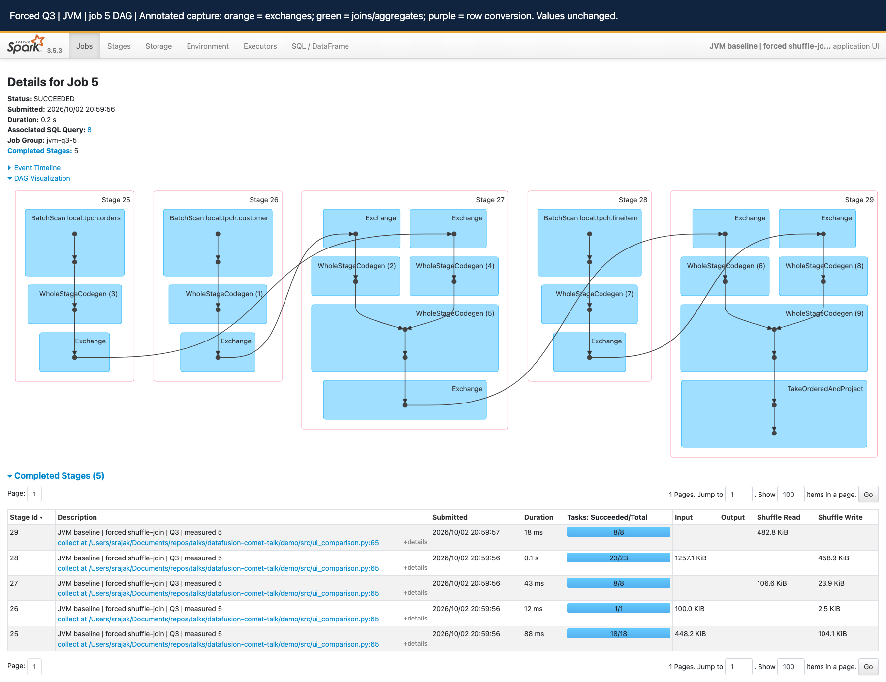
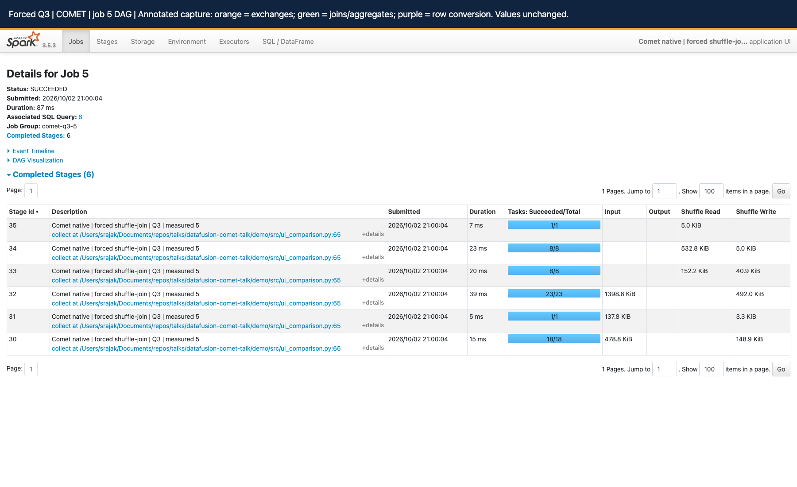

# Reading Spark UI: normal plans versus forced shuffle

Evidence captured from the October 2, 2026 local Iceberg demo. Start with Q3 for joins, Q1 for aggregation, Q9 for a longer join chain, and Q18 for semi-join/exchange-reuse semantics. These are CometBench-H queries derived from TPC-H, not audited TPC-H results.

## The mental model

| | Normal | Forced shuffle |
| --- | --- | --- |
| Broadcast joins | Allowed when Spark considers them suitable | Disabled in this runner |
| Join strategy | Spark chooses from the query, sizes and settings | Selected queries must show sort-merge or shuffled-hash joins |
| AQE in this demo | Off by default; configurable | Always off |
| Purpose | Compare ordinarily selected plans | Compare JVM versus Comet shuffle-join execution |

### Normal: move the small side

If filtered customers are small enough:

```text
Small customer input -> broadcast a copy to executors
Orders partitions -> tasks join locally with that copy
```

This avoids repartitioning both inputs for that join. Normal does not mean no shuffle: Spark can select shuffle joins, and aggregation or ordering can require exchanges. The demo's AQE default is not a statement about stock Spark defaults.

### Forced shuffle: bring matching keys together

The runner sets both options for both engines:

```properties
spark.sql.autoBroadcastJoinThreshold=-1
spark.sql.adaptive.enabled=false
```

```text
Customers -> hash partition by customer key -> local sort -+
                                                          +-> merge equal keys
Orders -> hash partition by customer key -> local sort ----+
```

The captured Q3 plans use `SortMergeJoin` versus `CometSortMergeJoin`. Disabling broadcast alone does not guarantee sort-merge for arbitrary SQL; this runner also checks for a shuffle join and rejects a broadcast plan. Q1 has no join and is deliberately not part of forced-join mode.

Present normal as "What happens with the usual join selection?" Present forced as "What changes when both engines execute shuffle joins?" Forced mode is an experiment, not a tuning recommendation. Compare JVM and Comet within the same mode, not normal JVM against forced Comet.

## What was actually measured

Spark 3.5.3, Iceberg runtime 1.8.1, locally built Comet 1.1.0-SNAPSHOT; `local[8]`, eight shuffle partitions, AQE off, 4g driver memory and configured 8g Comet off-heap. One warm-up plus five measured executions per query/engine. The small `tpch_sf10m` fixture is roughly 2.9 MB of source data; its directory name is not a verified TPC-H scale factor. The Iceberg warehouse has multiple files and delete artifacts from the demo.

The runner pins Iceberg snapshots, saves SQL and physical plans, and checks schema, row count and an order-independent exact result digest. Each paired run passed those checks. Matching digests are useful evidence for this fixture, not an exhaustive correctness proof or an ordering check.

Harness latency covers `spark.sql(...).collect()`, excluding application startup, saved-plan export and result hashing. The UI's SQL duration measures a different interval. Screenshots below show measured iteration 5; the table uses the median of all five. Do not substitute a screenshot duration for the median.

| Query / mode | JVM median (ms) | Comet median (ms) | JVM / Comet | Lower latency | Rows |
| --- | --- | --- | --- | --- | --- |
| Q1 / normal | 294.9 | 185.0 | 1.59x | 37.3% | 4 |
| Q3 / normal | 265.3 | 162.3 | 1.63x | 38.8% | 10 |
| Q3 / forced | 325.5 | 189.5 | 1.72x | 41.8% | 10 |
| Q9 / normal | 465.1 | 263.8 | 1.76x | 43.3% | 174 |
| Q9 / forced | 585.8 | 464.7 | 1.26x | 20.7% | 174 |
| Q18 / normal | 520.6 | 204.2 | Not promoted | Empty result | 0 |
| Q18 / forced | 591.2 | 384.6 | Not promoted | Empty result | 0 |

These sub-second observations are sensitive to JVM/JIT warm-up, OS caches, run order and other laptop activity. Normal Q3 ran Comet first; the other pairs ran JVM first. They are not component microbenchmarks or evidence of multi-machine network speedups. Q18 returned no rows in both modes: keep it for plan explanation, not the headline performance claim.

## Q1: a shuffle without a join

```text
Lineitem -> ship-date filter -> compute amounts -> partial aggregates
         -> hash exchange(returnflag, linestatus) -> final aggregates
         -> range exchange -> local sort -> collect four result rows
```

The captured cutoff is September 24, 1998. Follow the actual saved SQL rather than substituting another TPC-H parameter set. Partial aggregation reduces what is shuffled; final aggregation combines groups from all input partitions. Range partitioning plus local sorting implements the ordered output.

JVM: `BatchScan -> ColumnarToRow ->` generated row-oriented filter/project/aggregate work. Comet: `CometIcebergNativeScan -> CometFilter -> CometProject -> CometHashAggregate`, native exchanges, then `CometColumnarToRow` at the output. A columnar reader does not make every downstream JVM operator columnar. Spark's row path uses code generation and compact representations; it is not necessarily one heap object allocation per field.

Where Comet can help: decoding, batch expressions, aggregation and shuffle serialization. The observed whole-query median is lower; these screenshots do not isolate each contribution. The first Comet exchange reports 91 shuffle records written, demonstrating partial aggregation, while individual node counters need not equal final result rows.

## Q3: the clearest join-and-shuffle story

```text
Customer BUILDING + orders before 1995-03-15 -> join on customer key
Intermediate + lineitem shipped after 1995-03-15 -> join on order key
-> revenue by order/date/priority -> top ten orders
```

Normal plans use two broadcast hash joins. Forced plans use two sort-merge joins with four join-input exchanges:

1. Customer and orders repartition by customer key; each receiver locally sorts its input and merges matching keys.
2. The intermediate result and lineitem repartition by order key; receiving tasks sort and merge again.
3. Partial/final revenue aggregation follows. In these forced plans the existing order-key partitioning satisfies grouping requirements, so there is no separate aggregation exchange between those aggregate operators.
4. `TakeOrderedAndProject` / `CometTakeOrderedAndProject` produces the top ten. Do not mistake this for sorting every input row globally. The Comet job includes an extra result stage; the physical operator tree and stage counts need not match one-to-one.

The JVM job for measured execution 8 has stages 25-29: orders scan/shuffle (25), customer scan/shuffle (26), first join and order-key shuffle (27), lineitem scan/shuffle (28), second join/aggregation/top-N (29). Stage IDs are local to that application. The paired Comet job has six stages, 30-35; use its own labels, not the JVM numbering.

Audience wording: "Same snapshot, same query, same shuffle-join strategy. Spark still schedules the work; Comet changes the eligible data-processing and shuffle representation inside the tasks."

## Q9: six tables, five joins, then aggregation

```text
Part name contains moccasin -> join lineitem by part key
-> supplier / partsupp / orders / nation joins
-> sale amount minus supply cost -> aggregate by nation/year -> ordered output
```

Read the exact join order and composite keys in the saved plan: SQL table order is not the physical execution order. The six tables are part, supplier, lineitem, partsupp, orders and nation. The partsupp relationship requires both part and supplier keys; joining on only one would change the answer.

Normal captures have five broadcast hash joins. Forced captures have five sort-merge joins, ten join-input exchanges, followed by aggregate and ordering exchanges. This is a useful second example of repeated partition/sort/join boundaries, not a claim that more shuffles make Comet's advantage larger. Here the forced Q9 advantage is smaller than normal Q9.

The selected stage example is the stage with the largest summed executor runtime among jobs belonging to measured iteration 5. It illustrates task metrics, not the entire SQL duration:

| Measured Q9 forced stage | Tasks | Summed executor runtime (ms) | JVM GC (ms) | Input bytes | Shuffle write bytes | Spill bytes |
| --- | --- | --- | --- | --- | --- | --- |
| JVM stage 125 | 41 | 1204 | 16 | 2351238 | 1617941 | 0 disk / 0 memory |
| COMET stage 125 | 41 | 323 | 0 | 2836562 | 1645408 | 0 disk / 0 memory |

Both examples have 41 tasks and no reported spill. Input and shuffle bytes differ, so do not describe this as "same bytes, faster network." Byte accounting and encoding can differ by reader/shuffle path. Summed executor runtime can exceed wall time because tasks overlap; subtracting these totals does not identify query time saved. Zero JVM GC is not proof of zero native allocation. The executor screenshots aggregate Q9, Q18 and warm-ups across the application, not just this stage.

## Q18: aggregation, semi joins and reused work

```text
Lineitem -> sum(quantity) by order -> retain sums > 313
-> eligible order keys -> semi-filter orders and lineitem
-> customer/orders/lineitem joins -> grouped quantity -> top 100
```

The saved query threshold is 313, not the commonly shown alternative 300. Spark transforms the `IN` subquery into left-semi joins: keep matching left rows without adding right-side columns. The captured plan contains semi joins in addition to inner joins, with `ReusedExchange` sharing an earlier exchange rather than recomputing an independent input. A repeated box is not automatically repeated network traffic.

Normal uses broadcast joins; forced uses sort-merge joins and reused aggregate exchange work. Both return zero rows on this fixture. Empty downstream work makes the latency comparison unrepresentative of a populated large-order workload. Before presenting Q18 performance, use a larger representative dataset with qualifying orders and rerun both engines unchanged. Do not silently relax the predicate and continue calling it the same query.

## How to read the DAG and UI

| UI view | Read this | Avoid this conclusion |
| --- | --- | --- |
| SQL / DataFrame | Description, operator tree, scan filters, join keys/type, exchange partitioning, output rows and node metrics | Execution ID 8 in two apps alone proves the same query |
| Job DAG | Follow input dependencies through exchanges to result work; expand DAG Visualization | Every blue box is one task or one executor |
| Stage boundary | A group of tasks with dependencies on upstream shuffle output | Stage number or visual width is elapsed time |
| WholeStageCodegen | Fused JVM operator region; expand SQL details to see operators | Codegen ID is a Spark stage ID |
| Stage details | Task count, duration distribution, input/shuffle bytes, fetch wait, spill and GC | Sum of task times equals query wall time |
| Executors | Where tasks ran; per-executor totals and imbalance | Application totals belong only to the selected query |
| Environment | Effective AQE, broadcast threshold, shuffle partitions and master | A config value proves an operator was actually used |
| Storage | Persisted Spark RDD/DataFrame blocks when present | This tab inventories Iceberg files or object-store caching |

Read the physical plan from scan leaves toward its root. In UI drawings, follow arrowheads; layout orientation varies. Stage-group borders surround dependencies; arrows are not literal network sockets. An Exchange may appear on both producer and consumer sides of the DAG: do not count duplicate visual labels as distinct physical exchanges. Check retries/failed stages separately before telling a performance story.

Matching a pair: same saved SQL and mode -> same pinned snapshots -> same query label and iteration -> matched schema/count/hash -> inspect both physical plans -> compare timings. IDs are scoped to each app. The linked manifest records application IDs, execution IDs, labels and job/stage membership.

## What moves between distributed workers?

```text
Driver -> plan stages -> schedule partition tasks on executors
Map task -> filter/project/join input -> partition by key -> shuffle blocks
Reduce task -> fetch its blocks -> decode -> sort/join/aggregate
Final tasks -> small query result -> driver collect()
```

On a cluster, reducers fetch remote blocks through Spark's shuffle transport, or read local blocks when colocated. Ordinary shuffle data does not all pass through the driver. Broadcast distribution and final result collection have different paths. Spark still owns stage dependencies, task scheduling, retries and shuffle availability with Comet enabled. See [distributed execution](05-distributed-execution.md) for failure and network paths.

This capture uses `local[8]`: eight task threads in a single local executor/driver process, not eight remote executors. It demonstrates partitioning, task scheduling and local shuffle, not remote networking, multi-host scaling or skew recovery.

### JVM exchange versus Comet exchange

JVM Spark serializes its row representation for shuffle. The captured `CometExchange` plans identify `CometNativeShuffle`: eligible native work partitions and encodes/compresses columnar batches; Spark coordinates blocks and fetches, and the native reader decodes them. Comet has multiple shuffle paths, so do not generalize this label to every configuration. Read the captured plan and [native runtime/serialization](04-native-runtime-and-serde.md).

Columnar batches can reduce representation conversions, amortize dispatch and expose contiguous typed data to efficient kernels. SIMD can process several values per instruction in eligible kernels; not every hash lookup, sort, string operation or join is SIMD. These runs have no hardware-counter or instruction-profile evidence. Native means compiled Rust/native machine code invoked from the JVM; it does not mean zero-copy network transport or no serialization. Arrow FFI can share buffers within a process; network/disk exchange still needs an encoded representation.

**Observed:** native operators and lower paired medians on this local fixture. **Source-backed mechanism:** different batch/operator/shuffle implementations. **Not isolated:** how much of the gain came from scan, conversion, join, SIMD, allocation or compression. Measure those with controlled variants and profiles before making a causal percentage claim.

## Annotated evidence gallery

Orange outlines identify exchanges, green joins/aggregates and purple row conversions where those nodes are exposed. An annotation banner was added before capture; metric values were not edited. Use the full-resolution screenshot links for readable counters. The two Q3 DAGs are embedded below; the very tall SQL graphs open separately to avoid loading all high-resolution images at once. DAG codegen groups hide individual operators; use the saved physical plan to expand the explanation.

### Q1 normal

[Saved SQL](assets/spark-ui/q1.sql)

<details>
<summary>JVM - SQL 12, measured iteration 5</summary>

Application: `local-1790956089334`. Jobs: 11, 10.

[Live SQL UI](http://localhost:18081/history/local-1790956089334/SQL/execution/?id=12) - [physical plan](assets/spark-ui/normal-q1-jvm.plan.txt) - [node metrics](assets/spark-ui/normal-q1-jvm-metrics.json) - [full-resolution SQL screenshot](assets/spark-ui/normal-q1-jvm-sql.png)


</details>

<details>
<summary>COMET - SQL 12, measured iteration 5</summary>

Application: `local-1790956102813`. Jobs: 11, 10.

[Live SQL UI](http://localhost:18081/history/local-1790956102813/SQL/execution/?id=12) - [physical plan](assets/spark-ui/normal-q1-comet.plan.txt) - [node metrics](assets/spark-ui/normal-q1-comet-metrics.json) - [full-resolution SQL screenshot](assets/spark-ui/normal-q1-comet-sql.png)


</details>

### Q3 normal

[Saved SQL](assets/spark-ui/q3.sql)

<details>
<summary>JVM - SQL 14, measured iteration 5</summary>

Application: `local-1790950834553`. Jobs: 23, 22, 21.

[Live SQL UI](http://localhost:18081/history/local-1790950834553/SQL/execution/?id=14) - [physical plan](assets/spark-ui/normal-q3-jvm.plan.txt) - [node metrics](assets/spark-ui/normal-q3-jvm-metrics.json) - [full-resolution SQL screenshot](assets/spark-ui/normal-q3-jvm-sql.png)


</details>

<details>
<summary>COMET - SQL 14, measured iteration 5</summary>

Application: `local-1790950825868`. Jobs: 23, 22, 21.

[Live SQL UI](http://localhost:18081/history/local-1790950825868/SQL/execution/?id=14) - [physical plan](assets/spark-ui/normal-q3-comet.plan.txt) - [node metrics](assets/spark-ui/normal-q3-comet-metrics.json) - [full-resolution SQL screenshot](assets/spark-ui/normal-q3-comet-sql.png)


</details>

### Q3 forced

[Saved SQL](assets/spark-ui/q3.sql)

<details>
<summary>JVM - SQL 8, measured iteration 5</summary>

Application: `local-1790954991540`. Jobs: 5.

[Live SQL UI](http://localhost:18081/history/local-1790954991540/SQL/execution/?id=8) - [physical plan](assets/spark-ui/forced-q3-jvm.plan.txt) - [node metrics](assets/spark-ui/forced-q3-jvm-metrics.json) - [full-resolution SQL screenshot](assets/spark-ui/forced-q3-jvm-sql.png)


[Full-resolution dag](assets/spark-ui/forced-q3-jvm-dag.png)



</details>

<details>
<summary>COMET - SQL 8, measured iteration 5</summary>

Application: `local-1790954998990`. Jobs: 5.

[Live SQL UI](http://localhost:18081/history/local-1790954998990/SQL/execution/?id=8) - [physical plan](assets/spark-ui/forced-q3-comet.plan.txt) - [node metrics](assets/spark-ui/forced-q3-comet-metrics.json) - [full-resolution SQL screenshot](assets/spark-ui/forced-q3-comet-sql.png)


[Full-resolution dag](assets/spark-ui/forced-q3-comet-dag.png)



</details>

### Q9 normal

[Saved SQL](assets/spark-ui/q9.sql)

<details>
<summary>JVM - SQL 18, measured iteration 5</summary>

Application: `local-1790956089334`. Jobs: 53, 52, 51, 50, 49, 48, 47.

[Live SQL UI](http://localhost:18081/history/local-1790956089334/SQL/execution/?id=18) - [physical plan](assets/spark-ui/normal-q9-jvm.plan.txt) - [node metrics](assets/spark-ui/normal-q9-jvm-metrics.json) - [full-resolution SQL screenshot](assets/spark-ui/normal-q9-jvm-sql.png)


</details>

<details>
<summary>COMET - SQL 18, measured iteration 5</summary>

Application: `local-1790956102813`. Jobs: 53, 52, 51, 50, 49, 48, 47.

[Live SQL UI](http://localhost:18081/history/local-1790956102813/SQL/execution/?id=18) - [physical plan](assets/spark-ui/normal-q9-comet.plan.txt) - [node metrics](assets/spark-ui/normal-q9-comet-metrics.json) - [full-resolution SQL screenshot](assets/spark-ui/normal-q9-comet-sql.png)


</details>

### Q9 forced

[Saved SQL](assets/spark-ui/q9.sql)

<details>
<summary>JVM - SQL 12, measured iteration 5</summary>

Application: `local-1790956142005`. Jobs: 11, 10.

[Live SQL UI](http://localhost:18081/history/local-1790956142005/SQL/execution/?id=12) - [physical plan](assets/spark-ui/forced-q9-jvm.plan.txt) - [node metrics](assets/spark-ui/forced-q9-jvm-metrics.json) - [full-resolution SQL screenshot](assets/spark-ui/forced-q9-jvm-sql.png)


[Full-resolution stage](assets/spark-ui/forced-q9-jvm-stage.png)


[Full-resolution executors](assets/spark-ui/forced-q9-jvm-executors.png)


</details>

<details>
<summary>COMET - SQL 12, measured iteration 5</summary>

Application: `local-1790956154952`. Jobs: 11, 10.

[Live SQL UI](http://localhost:18081/history/local-1790956154952/SQL/execution/?id=12) - [physical plan](assets/spark-ui/forced-q9-comet.plan.txt) - [node metrics](assets/spark-ui/forced-q9-comet-metrics.json) - [full-resolution SQL screenshot](assets/spark-ui/forced-q9-comet-sql.png)


[Full-resolution stage](assets/spark-ui/forced-q9-comet-stage.png)


[Full-resolution executors](assets/spark-ui/forced-q9-comet-executors.png)


</details>

### Q18 normal

[Saved SQL](assets/spark-ui/q18.sql)

<details>
<summary>JVM - SQL 24, measured iteration 5</summary>

Application: `local-1790956089334`. Jobs: 77, 76, 75, 74.

[Live SQL UI](http://localhost:18081/history/local-1790956089334/SQL/execution/?id=24) - [physical plan](assets/spark-ui/normal-q18-jvm.plan.txt) - [node metrics](assets/spark-ui/normal-q18-jvm-metrics.json) - [full-resolution SQL screenshot](assets/spark-ui/normal-q18-jvm-sql.png)


</details>

<details>
<summary>COMET - SQL 24, measured iteration 5</summary>

Application: `local-1790956102813`. Jobs: 77, 76, 75, 74.

[Live SQL UI](http://localhost:18081/history/local-1790956102813/SQL/execution/?id=24) - [physical plan](assets/spark-ui/normal-q18-comet.plan.txt) - [node metrics](assets/spark-ui/normal-q18-comet-metrics.json) - [full-resolution SQL screenshot](assets/spark-ui/normal-q18-comet-sql.png)


</details>

### Q18 forced

[Saved SQL](assets/spark-ui/q18.sql)

<details>
<summary>JVM - SQL 18, measured iteration 5</summary>

Application: `local-1790956142005`. Jobs: 17.

[Live SQL UI](http://localhost:18081/history/local-1790956142005/SQL/execution/?id=18) - [physical plan](assets/spark-ui/forced-q18-jvm.plan.txt) - [node metrics](assets/spark-ui/forced-q18-jvm-metrics.json) - [full-resolution SQL screenshot](assets/spark-ui/forced-q18-jvm-sql.png)


</details>

<details>
<summary>COMET - SQL 18, measured iteration 5</summary>

Application: `local-1790956154952`. Jobs: 17.

[Live SQL UI](http://localhost:18081/history/local-1790956154952/SQL/execution/?id=18) - [physical plan](assets/spark-ui/forced-q18-comet.plan.txt) - [node metrics](assets/spark-ui/forced-q18-comet-metrics.json) - [full-resolution SQL screenshot](assets/spark-ui/forced-q18-comet-sql.png)


</details>


## Reproduce and navigate

From the talk repository's `demo` directory, after preflight and warehouse setup:

```bash
UI_QUERIES="1,3,9,18" ./scripts/06-run-ui-comparison.sh
UI_FORCE_SHUFFLE_JOIN=true UI_QUERIES="3,9,18" ./scripts/06-run-ui-comparison.sh
SPARK_HISTORY_PORT=18081 ./scripts/07-start-history-server.sh
```

Use the generated comparison HTML to choose a labeled query/iteration, then open its History Server SQL link. The URL component is `/SQL/`, case-sensitive. The helper includes the Iceberg and Comet jars when replaying custom metrics. Localhost links work only while the local server and event logs are available; the screenshots, SQL, plans and curated JSON here remain readable offline.

## Source and validation evidence

- Demo source at [talk revision 54f000c](https://github.com/Shekharrajak/CoC-Glasgow-2026/tree/54f000c/demo): `scripts/06-run-ui-comparison.sh`, `src/ui_comparison.py`, `src/test_ui_comparison.py` and `scripts/07-start-history-server.sh`. These define modes, snapshot pinning, timing, result checks and execution-link mapping. The five runner unit tests passed in the preceding demo work; no engine tests were rerun for this documentation capture.
- Comet source baseline [184accac5](https://github.com/apache/datafusion-comet/tree/184accac5): `spark/src/main/scala/org/apache/spark/sql/comet/execution/shuffle/CometShuffleExchangeExec.scala`, `CometShuffleManager.scala` in that directory, and `docs/source/contributor-guide/native_shuffle.md`. The local build includes pre-existing Iceberg scan/test and benchmark configuration edits; this is not a pristine release-binary claim.
- Inspected coverage entry points: `spark/src/test/scala/org/apache/comet/exec/CometJoinSuite.scala`, `spark/src/test/scala/org/apache/spark/sql/comet/execution/shuffle/CometNativeShuffleWriterSuite.scala` and `CometNativeShuffleInputRDDSuite.scala`. Named tests describe intended coverage, not a new passing engine-suite result.
- JVM source entry points: Spark `sql/core/src/main/scala/org/apache/spark/sql/execution/Columnar.scala` (`ColumnarToRowExec`) and `exchange/ShuffleExchangeExec.scala` (`UnsafeRowSerializer`, shuffle dependency preparation). The reference checkout is not necessarily the runtime revision; saved Spark 3.5.3 plans are the authority for these observations.
- [Capture manifest and all five timing samples](assets/spark-ui/summary.json) records the selected executions, snapshots, results, curated settings and local links. SQL metric JSON accompanies every screenshot. No full environment dump, event log or credential-bearing configuration is published.

Next evidence needed: representative scale, nonempty Q18, interleaved/repeated engine order, true multi-executor remote fetch metrics, task skew distributions and CPU/hardware profiles. These captures explain execution; they do not replace those experiments.
