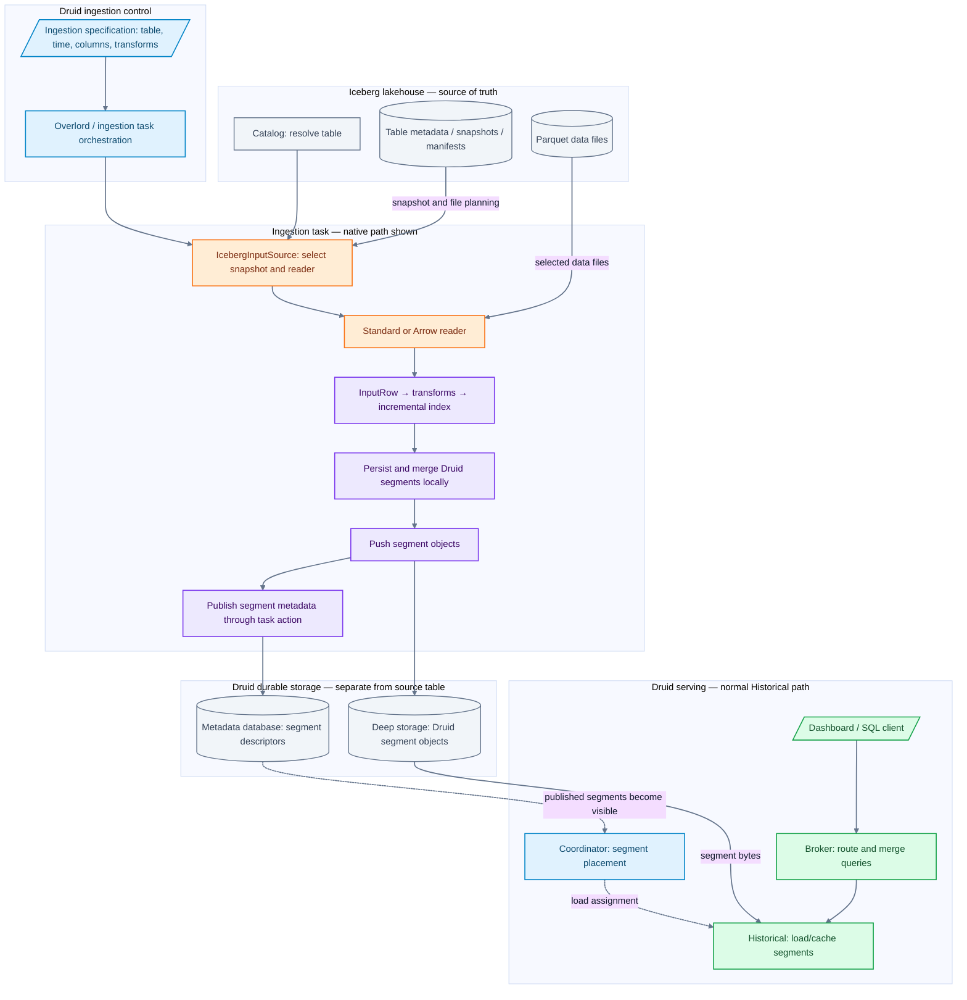
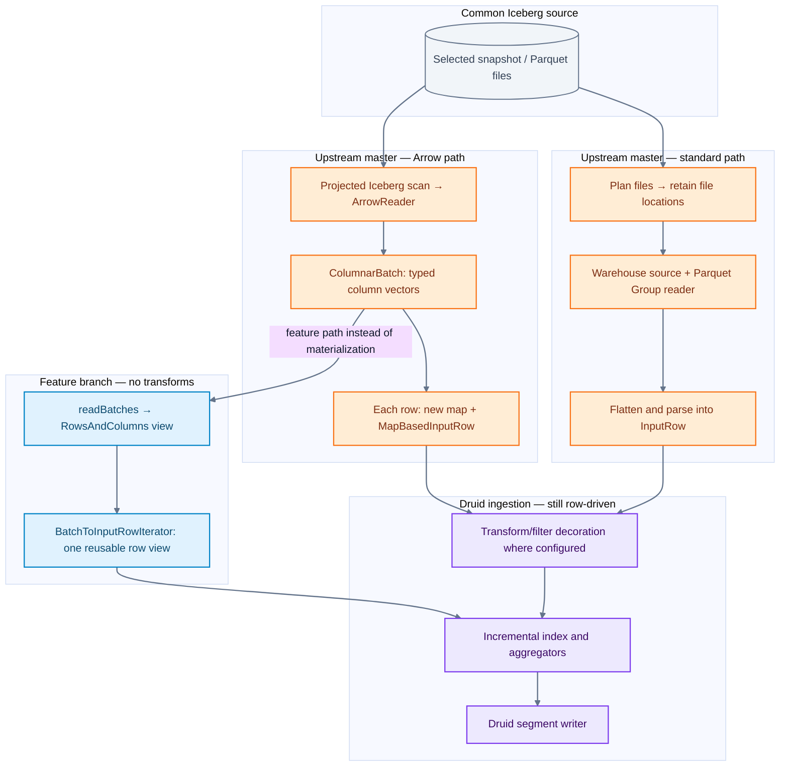
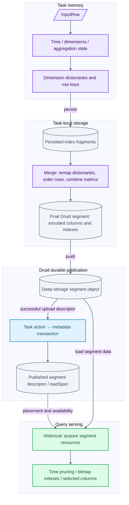
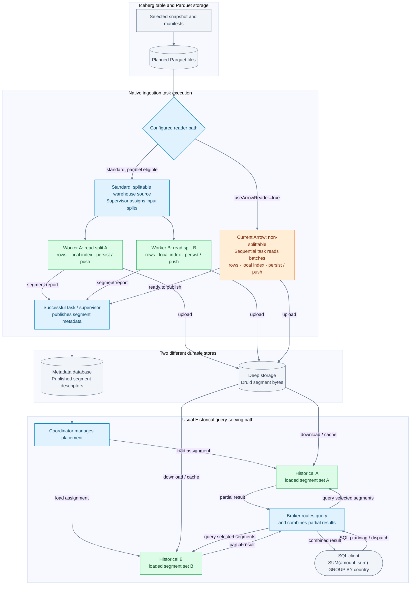
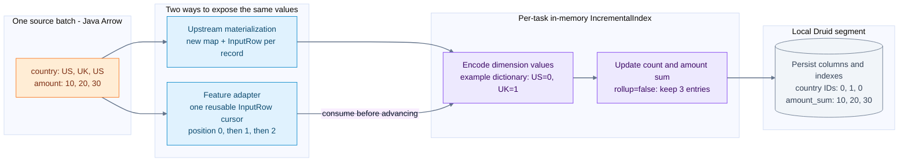

# Iceberg → Druid: what Arrow improves and where storage work remains

Source review: **2026-10-03**. Druid upstream `master` at `15a592e899cafa01240d7cd6a15eab07a4cf9e91`. Separate batch-adapter implementation inspected at feature branch commit `bf29a035846a4653f015e695d34a1f2fc80ece1b`. Benchmark observations are from `22d830c186` on 2026-09-30, not this upstream checkout.

## 1. The high-level value for Iceberg users

Iceberg maintains the lakehouse table: schema, snapshots, manifests, partition metadata and data/delete-file references. Druid ingests selected table data into its own indexed, columnar segments for repeated analytical queries.

The Iceberg input source lets users identify a catalog, namespace and table rather than manually maintaining the current list of files. Snapshot selection and metadata filtering determine candidate files. Arrow makes the Parquet-reading part more efficient; the feature-branch adapter further reduces row materialization.

The user-facing opportunity is faster refresh of the Druid serving copy and less temporary Java allocation during ingestion. Druid can then serve dashboard/filter/aggregation queries using its own segment layout. Those query-serving capabilities predate this Arrow change; no query-latency improvement was measured by the ingestion benchmarks.

| User need | Component that helps | Boundary |
|---|---|---|
| Read a lakehouse table by name | Iceberg catalog + `IcebergInputSource` | Catalog access and storage credentials still need configuration |
| Choose a historical table state | `snapshotTime` / Iceberg `asOfTime` | This is a selected snapshot scan, not continuous CDC |
| Avoid unnecessary input work | Iceberg metadata pruning and Arrow projection | Residual predicates may still need row-level handling |
| Reduce decoding/materialization overhead | Iceberg Arrow reader; feature batch adapter | Current persistence still consumes rows |
| Serve repeated interactive analytics | Druid segments, indexes, serving processes | Data is copied into Druid; freshness depends on ingestion |
| Safely ingest mutable Iceberg tables | Delete-aware reader would be needed | Current standard path does not apply deletes; Arrow rejects delete-bearing tasks |

**Arrow is an in-memory column layout. Parquet is the source file format. Iceberg is the table/snapshot layer. Druid segments are the target storage format. These are four different contracts.**

## 2. End-to-end components



[Open diagram SVG](diagrams/01-system-flow.svg) · [Mermaid source](diagrams/01-system-flow.mmd)

This is a logical data/control flow, not a claim that every arrow is a direct RPC. Native ingestion is shown; the MSQ alternative is described below. The serving portion depicts the usual Historical path; it is not an exhaustive diagram of every Druid query engine or segment-acquisition mode.

### Source control plane: catalog and metadata

1. Catalog resolves the table. Druid has Local, Hive, Glue and REST catalog implementations in this checkout.
2. Iceberg table metadata identifies snapshots and schema/partition information. Snapshot manifest lists reference manifests, which describe data and delete files with metadata useful for pruning.
3. `IcebergInputSource` selects the standard or Arrow delegate. With `snapshotTime`, the scan uses Iceberg's as-of-time snapshot selection; otherwise it scans the current table state selected by that scan.
4. The configured Iceberg filter participates in scan planning. Partition/file pruning may eliminate files before any Parquet values are decoded.
5. An Iceberg `FileScanTask` carries more semantics than a file path, including applicable deletes and scan information. Preserving those semantics matters for correctness; merely knowing a Parquet location is insufficient for a table with deletes.

Metadata pruning is not equivalent to exact row predicate evaluation. In this connector the residual policy is explicit: `IGNORE` can include residual nonmatching rows, while `FAIL` rejects a scan needing unresolved residual filtering. Users needing an exact result must choose an appropriate Druid transform/filter or a supported preprocessing path.

### Druid task control plane

The ingestion request specifies the datasource, timestamp/dimensions/metrics, input source, transforms, intervals/partitioning and tuning. Overlord/task orchestration schedules native tasks on the configured execution system. Execution may involve a Peon under MiddleManager, Indexer or another task runner; the Arrow reader does not replace this scheduling layer.

Standard mode delegates source splitting to the warehouse input source. Arrow mode currently reports `isSplittable=false` and one input split. Iceberg's internal `CombinedScanTask` planning groups file work inside the reader; it does not automatically create distributed Druid input tasks. Large-table throughput therefore depends on both per-task reader speed and available task parallelism.

## 3. Three reader paths: distinguish what is merged



[Open diagram SVG](diagrams/02-reader-boundaries.svg) · [Mermaid source](diagrams/02-reader-boundaries.mmd)

The batch-vector branch in the diagram is an alternative implemented only on the feature branch. It is not an additional simultaneous consumer of a master batch. On master all Arrow results pass through materialized row objects.

### A. Standard Iceberg path — upstream

`IcebergInputSource.StandardDelegate.warehouseInputSource()` calls `IcebergCatalog.extractSnapshotDataFiles()`. The catalog code plans Iceberg files, then collects `task.file().location()` into a path list. The warehouse input-source factory creates the actual file input source; it handles splits and source I/O.

For the Parquet input format:

```text
InputEntity.fetch → local/readable file → ParquetReader<Group>
→ GroupReadSupport → Group per record → flattener
→ MapInputRowParser → InputRow
```

`InputEntity.fetch` may localize remote data; its behavior depends on the source implementation. Do not assume every local file is copied or every storage backend behaves identically. The reader uses the configured Parquet format options, including flattening behavior.

This route integrates with existing warehouse/input-format machinery, but builds row-oriented intermediate representations before indexing. It is not a generic Iceberg `GenericRecord` table reader: Druid reads the selected paths through its existing input stack.

### B. Arrow reader — upstream

`ArrowDelegate.reader()` retrieves the Iceberg table, checks residual policy and planned file formats, then constructs `IcebergArrowInputSourceReader`.

`read()` performs these operations:

1. Build a scan with case sensitivity, selected snapshot, column projection and filter policy.
2. Reject planned delete files and projected decimal fields whose precision exceeds 18.
3. Plan `CombinedScanTask`s using Iceberg scan sizing settings.
4. Open `new ArrowReader(scan, batchSize, true)`: vectors may be reused across batches.
5. Iterate `ColumnarBatch` rows; use logical typed Iceberg `ColumnVector` getters for strings/numbers/other supported scalar types.
6. Allocate a map per row, extract values, resolve timestamp/dimensions and construct `MapBasedInputRow`.
7. Close the batch iterator, Arrow reader and planned tasks; restore the thread context classloader around extension operations.

Default batch size is 1,024; `useArrowReader` defaults to false. Projection is driven by `ColumnsFilter`, not only `DimensionsSpec`, so an aggregator's input column must survive even if it is not an output dimension. Timestamp extraction may require adding the timestamp column back to the scan.

Typed getters matter for dictionary-encoded Parquet: a physical vector can contain dictionary IDs rather than the desired logical values. The code reads through Iceberg's logical accessors; raw Arrow vectors are used for buffer-size estimation, not as a substitute for logical field decoding.

This path avoids the standard `Group`/flattening route and decodes columns in batches, but it is not zero-copy end-to-end. Strings, boxed values, maps and row objects still cost allocations. Source-format flattening options are not automatically equivalent to Arrow's scalar extraction.

### C. Reusable batch-backed row view — feature branch only

The feature introduces `BatchInputSourceReader.readBatches()`, `IcebergArrowRowsAndColumns` and `BatchToInputRowIterator`.

`IcebergArrowRowsAndColumns` wraps a batch with a column-name layout and per-column accessors. It does not eagerly copy every row into a map. The iterator builds a batch context containing accessors and resolved dimensions, then moves a single `BatchBackedInputRow` cursor to each row number.

`getRaw(column)` calls the relevant accessor only when requested. Timestamp parsing occurs when the cursor advances. A complete map is still available for diagnostic/error formatting, but is not constructed for every normal row. Primitive/typed extraction may still box values; repeated getter calls are not a guarantee of zero allocation or memoized decoding.

Native `AbstractBatchIndexTask.inputSourceReader()` selects this path only if the reader is batch-capable **and** the transform spec equals `TransformSpec.NONE`. Transformed workloads use the decorated materialized `read()` path. The returned row is borrowed: consumers must finish using it before advancing the iterator, because its cursor and backing vectors can change.

This reduces adapter overhead without replacing the downstream indexing API. **It does not implement vectorized ingestion aggregators, direct Arrow-to-segment writing, or a DataFusion execution engine.**

## 4. From InputRow to Druid storage



[Open diagram SVG](diagrams/03-storage-boundaries.svg) · [Mermaid source](diagrams/03-storage-boundaries.mmd)

### Index construction

`InputSourceProcessor` loops over rows, applies ingestion filtering/error handling, determines the interval/sequence and invokes `BatchAppenderatorDriver.add`. The appenderator routes rows to the target segment's incremental index.

For the tested on-heap path, `OnheapIncrementalIndex` manages row keys, dimensions/dictionaries and aggregator state. Timestamp granularity and ingestion schema affect keys. With rollup enabled, rows with the same rollup key combine according to aggregators; rollup is not arbitrary event-ID deduplication. With rollup disabled, rows remain distinct but encoding and index construction still cost work.

The exact index implementation, partitioning and native ingestion mode can vary. The benchmark used `OnheapIncrementalIndex`; it does not establish the performance of every ingestion engine/configuration.

### Persist and merge

Memory/row thresholds lead to local persists. `BatchAppenderator.persistAll` schedules persistence; `IndexMergerBase.persist` writes an incremental index through adapters into segment-format files. Several persisted fragments may later contribute to the final segment.

`BatchAppenderator.mergeAndPush` acquires persisted queryable indexes and calls `IndexMerger.mergeQueryableIndex`. Column mergers reconcile dimension dictionaries, remap encoded IDs, merge ordered row streams and combine metric state where appropriate. String/dictionary column writers construct configured inverted/bitmap indexes; numeric and other column types have their own encodings/index capabilities.

Compression, bitmap format and write-out behavior are driven by the index/tuning configuration. Druid has both V9 and V10 merger implementations in this source; the earlier local benchmark used V9. Do not describe every current segment as one fixed physical layout.

An Arrow batch is transient column memory. A Druid segment must have Druid's storage metadata, column encoding, indexes and ordering/partitioning contracts. Having columnar input does not remove those obligations.

### Push, publish and serving

`DataSegmentPusher.push` uploads the built segment to configured deep storage and returns segment metadata including how it can be loaded. This is a Druid segment object, not an Iceberg Parquet data file or new Iceberg snapshot.

The task publishes through its appropriate transactional action. `SegmentTransactionalInsertAction` is one native publication route; append/replace and other ingestion modes can use different actions/coordination. The metadata transaction makes the segment authoritative within Druid's publication rules. The metadata DB stores descriptors, not all event values.

Coordinator placement and serving processes then make published segments available. Historical nodes load/cache segment data; native query execution uses segment timelines, time bounds, indexes and selected columns. Broker routes queries and merges partial results. Upload completion, metadata publication and serving availability are distinct events.

| Boundary | Meaning | Not implied |
|---|---|---|
| Local persist | Segment/index files exist on task disk | Cross-machine durability or published visibility |
| Push | Segment object is in deep storage | Successful metadata transaction |
| Publish | Druid segment metadata is committed | Every serving node has loaded it |
| Load/availability | Serving tier can query the segment | A new Iceberg table commit |

Streaming handoff is a related but distinct serving transition. Do not describe batch ingest success, publication and streaming handoff as one interchangeable event.

## 5. MSQ is a separate ingestion route

SQL ingestion with an Iceberg `EXTERN` input can use the same input source but feeds a different engine:

```text
MSQ controller / stage DAG → workers → ExternalInputSliceReader / ExternalSegment
→ reader.read() → rows / frames / shuffle as planned
→ SegmentGeneratorFrameProcessor → segment generation → controller publication
```

`ExternalSegment` explicitly calls `reader.read()`. It therefore uses materialized Arrow rows in the reviewed code and does not exercise the feature's native reusable row-view selection. The REST catalog integration-test task timings are not proof of batch-adapter acceleration.

Druid frames include row-based and columnar forms; neither `RowsAndColumns` nor a frame name alone proves that every operator is a vector kernel. Queries over ingested Druid datasources read Druid segments; an explicit MSQ external query can scan Iceberg without first creating a persistent Druid datasource.

## 6. Measured improvements and why the full pipeline gain is smaller

Synthetic deterministic tables, four Snappy Parquet files/table, no partitioning or deletes, 100k/1M source rows and 5/20 scalar columns. Apple M4 Pro, 14 logical CPUs, 48 GiB RAM; Corretto 25.0.3; JMH 1.37; one benchmark thread; three forks, three 1-second warmups and five 1-second measurements/fork; warm filesystem cache. Arrow batch size 1,024.

| Comparison / scope | Observation |
|---|---|
| Standard → upstream-style materialized Arrow, reader only | 1.48× aggregate speedup |
| Materialized Arrow → feature batch view, reader only | Another 1.55× |
| Standard → feature batch view, reader only | 2.29×; 76–81% less allocated Java heap |
| Standard → feature batch view, local read/index/persist | 1.116× across tested 100k/1M × 5-column cases |
| Transformed workloads, standard → materialized Arrow reader | 1.356× across the four transformed cases |
| Transformed local read/index/persist | 1.099× across the two transformed cases |

Ratios use sums of per-case mean elapsed times within each benchmark execution; these are not production workload weights. The transform benchmark is a separate run. Expressions modified string/double/long fields; the filtered case retained 470,588 of one million rows. Compare readers within the same workload rather than treating reduced output rows as a reader optimization.

The pipeline benchmark uses rollup disabled, count/double-sum aggregation and one local V9 persist. It excludes object-store push, task startup, distributed shuffles, multiple-spill final merges and serving availability. Counts/checksums and persisted readbacks were checked.

A speedup is `old elapsed / new elapsed`. A 1.08× ratio means about 7.4% lower measured latency, not an 8% CPU or memory reduction. CPU time/utilization, peak heap, RSS and Arrow direct-memory consumption were not measured. Allocated heap volume is not peak live memory. No new benchmark was run for this note.

As an illustrative model, if reading is 20% of old total time and becomes 2.29× faster while everything else stays fixed, total speedup is `1 / (0.8 + 0.2 / 2.29) ≈ 1.13×`. The 20% is an example, not a measured decomposition. This explains why a large reader gain can yield a modest overall ingestion gain.

## 7. Operational and correctness boundaries

- Arrow is Parquet-only and non-splittable at the Druid input-source level. Faster local reads do not guarantee faster ingestion than a parallel standard-reader job.
- Arrow rejects planned equality/position delete files. Standard enumeration discards delete application semantics; disabling Arrow is not a safe delete-aware fallback. File-format version alone is insufficient to judge safety—inspect the actual planned snapshot.
- Decimal precision above 18 and unsupported nested structures are rejected by the Arrow path. Supported timestamp values are converted to milliseconds, including nanosecond timestamps; do not promise nanosecond preservation.
- Mixed file-schema evolution has explicit unsupported cases. Projection and historical-schema tests cover selected cases, not universal evolution support.
- `IGNORE` residual policy can return extra rows. A test with a `name = Foo` Iceberg filter returns both Foo and Bar in IGNORE mode.
- A selected snapshot read is not continuous synchronization, a checkpointed incremental Iceberg source, or automatic propagation of later Iceberg deletes into Druid. Append/replace/reingestion policy must be designed explicitly.
- Druid segment publication is not an Iceberg snapshot transaction, nor an atomic transaction spanning both systems.
- Arrow buffers use direct memory as well as Java objects. Batch size trades memory footprint against amortized overhead; there is no universal best value established here.
- Required extension classes/configuration must be available on the processes that plan, deserialize, sample or execute the input. Storage authentication remains a separate concern from using an Arrow memory layout.

## 8. What this means for the Comet talk

Comet accelerates eligible Spark executor work using a DataFusion-based runtime. This Druid reader uses Iceberg Java + Arrow Java to feed Druid ingestion. Both use columnar batches, but they have different execution and durability boundaries.

```text
Comet story: Iceberg tasks → native Arrow batches → eligible native query operators
Druid story: Iceberg scan → Arrow batches → InputRow/indexing → Druid serving segments
```

Arrow compatibility is not automatic operator compatibility or end-to-end zero-copy. The useful comparison is where a pipeline preserves batches, where it materializes rows, and which downstream costs remain.

## 9. Source ledger and test evidence

Paths below point to the inspected local Druid checkout. Feature classes are absent on master; use the pinned feature commit and `git show` instead of assuming those files are currently checked out.

- [IcebergInputSource](/Users/srajak/Documents/repos/oss/apache_olap/druid/extensions-contrib/druid-iceberg-extensions/src/main/java/org/apache/druid/iceberg/input/IcebergInputSource.java)
- [IcebergCatalog](/Users/srajak/Documents/repos/oss/apache_olap/druid/extensions-contrib/druid-iceberg-extensions/src/main/java/org/apache/druid/iceberg/input/IcebergCatalog.java)
- [IcebergArrowInputSourceReader](/Users/srajak/Documents/repos/oss/apache_olap/druid/extensions-contrib/druid-iceberg-extensions/src/main/java/org/apache/druid/iceberg/input/IcebergArrowInputSourceReader.java)
- [ParquetReader](/Users/srajak/Documents/repos/oss/apache_olap/druid/extensions-core/parquet-extensions/src/main/java/org/apache/druid/data/input/parquet/ParquetReader.java)
- [AbstractBatchIndexTask](/Users/srajak/Documents/repos/oss/apache_olap/druid/indexing-service/src/main/java/org/apache/druid/indexing/common/task/AbstractBatchIndexTask.java)
- [InputSourceProcessor](/Users/srajak/Documents/repos/oss/apache_olap/druid/indexing-service/src/main/java/org/apache/druid/indexing/common/task/InputSourceProcessor.java)
- [BatchAppenderatorDriver](/Users/srajak/Documents/repos/oss/apache_olap/druid/server/src/main/java/org/apache/druid/segment/realtime/appenderator/BatchAppenderatorDriver.java)
- [BatchAppenderator](/Users/srajak/Documents/repos/oss/apache_olap/druid/server/src/main/java/org/apache/druid/segment/realtime/appenderator/BatchAppenderator.java)
- [OnheapIncrementalIndex](/Users/srajak/Documents/repos/oss/apache_olap/druid/processing/src/main/java/org/apache/druid/segment/incremental/OnheapIncrementalIndex.java)
- [IndexMergerBase](/Users/srajak/Documents/repos/oss/apache_olap/druid/processing/src/main/java/org/apache/druid/segment/IndexMergerBase.java)
- [DictionaryEncodedColumnMerger](/Users/srajak/Documents/repos/oss/apache_olap/druid/processing/src/main/java/org/apache/druid/segment/DictionaryEncodedColumnMerger.java)
- [SegmentTransactionalInsertAction](/Users/srajak/Documents/repos/oss/apache_olap/druid/indexing-service/src/main/java/org/apache/druid/indexing/common/actions/SegmentTransactionalInsertAction.java)
- [IndexerSQLMetadataStorageCoordinator](/Users/srajak/Documents/repos/oss/apache_olap/druid/server/src/main/java/org/apache/druid/metadata/IndexerSQLMetadataStorageCoordinator.java)
- [ExternalSegment](/Users/srajak/Documents/repos/oss/apache_olap/druid/multi-stage-query/src/main/java/org/apache/druid/msq/input/external/ExternalSegment.java)
- [SegmentGeneratorFrameProcessor](/Users/srajak/Documents/repos/oss/apache_olap/druid/multi-stage-query/src/main/java/org/apache/druid/msq/indexing/processor/SegmentGeneratorFrameProcessor.java)
- [ControllerImpl](/Users/srajak/Documents/repos/oss/apache_olap/druid/multi-stage-query/src/main/java/org/apache/druid/msq/exec/ControllerImpl.java)
- [IcebergArrowInputSourceReaderTest](/Users/srajak/Documents/repos/oss/apache_olap/druid/extensions-contrib/druid-iceberg-extensions/src/test/java/org/apache/druid/iceberg/input/IcebergArrowInputSourceReaderTest.java)
- [IcebergInputSourceArrowModeTest](/Users/srajak/Documents/repos/oss/apache_olap/druid/extensions-contrib/druid-iceberg-extensions/src/test/java/org/apache/druid/iceberg/input/IcebergInputSourceArrowModeTest.java)

Feature-only files at `bf29a035846a4653f015e695d34a1f2fc80ece1b`:

- `processing/src/main/java/org/apache/druid/data/input/BatchInputSourceReader.java`
- `processing/src/main/java/org/apache/druid/data/input/BatchToInputRowIterator.java`
- `extensions-contrib/druid-iceberg-extensions/src/main/java/org/apache/druid/iceberg/input/IcebergArrowRowsAndColumns.java`
- Feature changes to `IcebergArrowInputSourceReader` and `AbstractBatchIndexTask`.

```bash
git show bf29a035846a4653f015e695d34a1f2fc80ece1b:processing/src/main/java/org/apache/druid/data/input/BatchToInputRowIterator.java
```

Tests inspected: basic/dictionary-value reads, projection and aggregator columns, snapshot-time/historical schema, mixed-schema rejection, high-precision decimal rejection, classloader/resource cleanup, residual IGNORE/FAIL, delete rejection, default mode and one-split behavior. These are source/test reviews, not tests executed during this documentation task.

Benchmark details: [September measurement note](/Users/srajak/Documents/repos/oss/apache_olap/druid_notes/07-benchmarks/results-2026-09-arrow.md). Raw artifacts remain under `druid/benchmarks/results/2026-09-30-arrow-comparison` and `2026-09-30-arrow-transforms`.

## 10. Next investigations, not implemented improvements

1. Preserve Iceberg scan semantics while designing safe distributed Arrow splits; measure total task throughput as well as reader latency.
2. Profile index/aggregation, dictionary merge and segment encoding separately to find the now-dominant cost.
3. Design a batch-aware downstream ingestion contract with explicit ownership and error handling; direct segment persistence requires more than swapping a reader.
4. Add representative delete/evolution/nested-type coverage before expanding compatibility claims.
5. Measure CPU time, peak heap/direct memory, GC, multiple persists, deep-storage I/O and full task-to-availability latency on representative data.


## 11. How to see vectorized versus row-based execution

Verified against Druid master `15a592e899` on 2026-10-03. This section describes available source-level instrumentation and a runbook; it is not a capture from a running Druid deployment. No Druid configuration was changed and no demonstration query was executed.

### What Druid actually exposes

| Question | Existing evidence | What it cannot prove |
|---|---|---|
| Did a Historical segment scan use a vector cursor? | `query/segment/time` event with `vectorized=true/false` | Whether every expression uses a native vector kernel or SIMD |
| Can this supported query execute with vectorization required? | `vectorize=force`, optionally `vectorizeVirtualColumns=force` | A complete per-operator execution trace; unsupported query types may ignore the flag |
| What query was planned? | `EXPLAIN PLAN FOR`; request logs for native-query details | Runtime vectorization or actual execution of an explained query |
| Was Arrow requested for Iceberg ingestion? | Task input-source configuration, `useArrowReader=true` | End-to-end columnar execution or the feature adapter being selected |
| Which MSQ stages moved rows/frames or generated segments? | Stage reports and channel/CPU/segment-generation counters where collected | A universal columnar/row-based badge per operator |
| Was the feature's reusable view selected? | Source selection conditions; debugger/profiler or added instrumentation | An existing standard task-summary field—none was found in the reviewed path |

Do not conflate **columnar storage**, **Arrow batch representation**, **vector cursor execution**, and **SIMD instructions**. Druid can read columnar segments through scalar cursors; an Arrow batch can be materialized back into rows; a vector processor can contain scalar fallback.

### Runtime metric: the strongest existing signal for segment scans

`QueryableIndexCursorHolder.asCursor()` calls `metrics.vectorized(false)`. `asVectorCursor()` calls `metrics.vectorized(true)` after checking eligibility. `DefaultQueryMetrics.vectorized` adds the boolean dimension to the metric event.

`ServerManager.buildQueryRunnerForSegment` wraps the segment runner in `MetricsEmittingQueryRunner` with `reportSegmentTime` and the segment ID. The metric wrapper emits on sequence completion/termination and records failed/short status where relevant. A single native query can scan different segments using different modes; the `QueryMetrics` interface explicitly documents this mixed case.

Illustrative event fields, not captured output:

```json
{
  "metric": "query/segment/time",
  "value": 12,
  "id": "native-query-id",
  "segment": "segment-identifier",
  "vectorized": true
}
```

The value is milliseconds for that segment query execution, including applicable load/page-in time; it is not CPU time, decoded rows, an operator percentage, or whole-query wall time. Segment timings can overlap because tasks execute concurrently. Correlate the native query ID from request/query logs; do not assume every SQL request maps to exactly one native query ID.

**Cache caveat:** the segment execution metric wrapper is inside `CachingQueryRunner`; `query/segmentAndCache/time` wraps the cache as well. A cache hit can bypass the real segment runner. Missing `vectorized` or missing segment-time events must be treated as unknown/not observed, not inferred as row-based execution. Empty/no-op paths, failures and metric-export filtering also require interpretation.

### Prometheus: the default mapping drops the distinction

In the reviewed `extensions-contrib/prometheus-emitter/src/main/resources/defaultMetrics.json`, `query/segment/time` has `"dimensions": []`. The Druid event can contain `vectorized`, but the default Prometheus mapping does not export it as a label.

To expose the split, prepare a custom metric mapping based on the existing complete mapping and change its `query/segment/time` entry to include the dimension. This is an example entry, not a complete replacement mapping:

```json
{
  "query/segment/time": {
    "dimensions": ["vectorized"],
    "type": "timer",
    "conversionFactor": 1000.0,
    "help": "Seconds spent querying an individual segment, split by cursor mode."
  }
}
```

Configure the deployed emitter to read the full custom mapping:

```properties
druid.emitter.prometheus.dimensionMapPath=/path/to/custom-metrics.json
```

The file is read in place of the default mapping, not merged automatically; keep other metrics that the deployment needs. The emitter converts the boolean to a string label and uses `unknown` if a configured dimension is missing. Its timer is exported as a histogram, converting milliseconds to seconds with the factor above.

With Prometheus namespace `druid`, example panels are:

```promql
sum by (vectorized) (rate(druid_query_segment_time_count[5m]))
```

This is the rate of observed segment-timing events by mode, not a percentage of query operators or rows.

```promql
sum by (vectorized) (rate(druid_query_segment_time_sum[5m]))
```

This is accumulated segment execution seconds per second. Parallel scans can make the total exceed one. Add service/host filtering as appropriate to the deployed labels; confirm the actual metric name in `/metrics` because namespace/configuration can differ.

For a per-query/per-segment investigation, retain raw events with `id`, `segment` and `vectorized` in a diagnostic sink. Exporting arbitrary query IDs and segment IDs as long-lived Prometheus labels can create very high cardinality; the two-valued mode label is the simpler aggregate view.

### A reproducible query experiment

Use a representative persisted datasource and the native SQL engine, with a query that translates to a supported vectorizable native query such as GroupBy or Timeseries. For example, replace the datasource/columns below with your own:

```sql
SELECT region, SUM(amount)
FROM iceberg_sales
GROUP BY region
```

First inspect `EXPLAIN PLAN FOR` to establish the query type. It does not run the query. Then execute the actual query twice with equivalent cache controls and separately identifiable requests.

Vector-required run:

```json
{
  "vectorize": "force",
  "vectorizeVirtualColumns": "force",
  "useCache": false,
  "populateCache": false,
  "useResultLevelCache": false,
  "populateResultLevelCache": false
}
```

Scalar run: use the same context with `"vectorize": false` and `"vectorizeVirtualColumns": false`.

Check equal results and inspect the actual segment events. An eligible scanned immutable segment should report the corresponding cursor mode. Do not use `SELECT *` translating to native Scan as a universal `force` test: current native Scan, TopN and Search ignore the vectorize parameter. Local master documentation lists GroupBy, Timeseries, TimeBoundary and MSQ Scan as supporting vectorization subject to their constraints; this section's Historical metric runbook targets native segment execution, not every MSQ stage.

`force` is a diagnostic setting, not a blanket production recommendation. Realtime or otherwise unsupported inputs can fail; cache hits, empty results or unexecuted branches can avoid the cursor path entirely. Separate repeated timing experiments from correctness/eligibility checks.

### A vector cursor can still evaluate scalar expressions

`FallbackVectorProcessor` adapts scalar expression evaluation to the vector processor interface. Current `ExpressionProcessingConfig` defaults `druid.expressions.allowVectorizeFallback` to true. Therefore even `vectorize=force` plus `vectorized=true` does not prove all expressions ran as native vector implementations.

For a controlled investigation, disabling `druid.expressions.allowVectorizeFallback` in the test process helps reveal reliance on this expression fallback; it is a runtime configuration property, not an equivalent query-context switch. Eligibility still depends on the actual filter, aggregators, virtual columns and segment capabilities.

`druid.expressions.useVectorApi` is a separate option, default false here, for eligible JDK Vector API specializations. A vectorized metric is not a hardware SIMD counter. Source inspection or profiling/disassembly is needed for a stronger instruction-level claim.

### What can be observed in Iceberg ingestion today?

On master:

```text
useArrowReader=true → ArrowReader → ColumnarBatch
→ batchRowToInputRow → map + MapBasedInputRow → row-driven indexing/persistence
```

`useArrowReader` is configuration evidence. The reviewed reader does not emit a dedicated metric or task-summary event identifying the batch-to-row boundary or a count of materialized rows. It updates `InputStats` using estimated Arrow vector buffer sizes; that number is not a measured count of compressed Parquet/network bytes and does not reveal the downstream execution mode.

On the feature branch, `AbstractBatchIndexTask.inputSourceReader` selects `BatchToInputRowIterator` only for a batch-capable reader with `TransformSpec.NONE`. With transforms it follows the decorated materialized path. `ExternalSegment` in MSQ calls `reader.read()` and therefore also materializes rows in this implementation.

MSQ's reviewed counters expose channel rows/bytes/frames, CPU/wall counters where collected, sorter progress, and segment-generation rows processed/persisted/merged/pushed. The reviewed reports and workbench code do not expose a complete per-operator columnar/scalar execution map. Stage names or frame counts alone are insufficient evidence.

### Proposed instrumentation — not implemented

The clearest future addition is a task-level summary emitted when the path is selected, plus separate counters at the reader/adapter boundaries. Use explicit names rather than one ambiguous `columnar=true` flag:

| Proposed field | Example values | Record where |
|---|---|---|
| `readerMode` | `STANDARD_PARQUET`, `ICEBERG_ARROW` | Reader construction/selection |
| `rowAdapter` | `MATERIALIZED_INPUT_ROW`, `REUSABLE_BATCH_VIEW` | Actual native/MSQ adapter selection |
| `selectionReason` | `NO_TRANSFORMS`, `TRANSFORMS_PRESENT`, `MSQ_READ_API` | Selection branch |
| `indexingMode` | `ROW_BASED` for the reviewed ingestion path | Indexing handoff |
| `batchesRead`, `rowsRead` | Counts | Batch iteration |
| `rowsMaterialized` | Count | Actual map/row construction |
| `readerElapsed`, `indexElapsed`, `persistElapsed` | Clearly scoped timings | Defined stage boundaries |

Those field names are a design suggestion, not existing configuration keys or report fields. Timers need explicit semantics: wall times from concurrent stages are not automatically additive, and adapter reads may happen lazily during indexing.

### Source evidence

- [Cursor eligibility and actual mode marking](/Users/srajak/Documents/repos/oss/apache_olap/druid/processing/src/main/java/org/apache/druid/segment/QueryableIndexCursorHolder.java)
- [Mixed-mode metric contract](/Users/srajak/Documents/repos/oss/apache_olap/druid/processing/src/main/java/org/apache/druid/query/QueryMetrics.java)
- [Default metric event fields](/Users/srajak/Documents/repos/oss/apache_olap/druid/processing/src/main/java/org/apache/druid/query/DefaultQueryMetrics.java)
- [Metric and cache wrapper ordering](/Users/srajak/Documents/repos/oss/apache_olap/druid/server/src/main/java/org/apache/druid/server/ServerManager.java)
- [Metric emission lifecycle](/Users/srajak/Documents/repos/oss/apache_olap/druid/processing/src/main/java/org/apache/druid/query/MetricsEmittingQueryRunner.java)
- [Metric dimension unit test: testVectorizedDimensionInMetrics](/Users/srajak/Documents/repos/oss/apache_olap/druid/processing/src/test/java/org/apache/druid/query/DefaultQueryMetricsTest.java)
- [Default Prometheus mapping](/Users/srajak/Documents/repos/oss/apache_olap/druid/extensions-contrib/prometheus-emitter/src/main/resources/defaultMetrics.json)
- [Prometheus mapping loader and histogram naming](/Users/srajak/Documents/repos/oss/apache_olap/druid/extensions-contrib/prometheus-emitter/src/main/java/org/apache/druid/emitter/prometheus/Metrics.java)
- [Prometheus dimension/value conversion](/Users/srajak/Documents/repos/oss/apache_olap/druid/extensions-contrib/prometheus-emitter/src/main/java/org/apache/druid/emitter/prometheus/PrometheusEmitter.java)
- [Prometheus configuration reference](/Users/srajak/Documents/repos/oss/apache_olap/druid/docs/development/extensions-contrib/prometheus.md)
- [Query vectorization controls](/Users/srajak/Documents/repos/oss/apache_olap/druid/docs/querying/query-context-reference.md)
- [Scalar expression fallback](/Users/srajak/Documents/repos/oss/apache_olap/druid/processing/src/main/java/org/apache/druid/math/expr/vector/FallbackVectorProcessor.java)
- [Expression fallback and Vector API defaults](/Users/srajak/Documents/repos/oss/apache_olap/druid/processing/src/main/java/org/apache/druid/math/expr/ExpressionProcessingConfig.java)
- [MSQ channel counters](/Users/srajak/Documents/repos/oss/apache_olap/druid/multi-stage-query/src/main/java/org/apache/druid/msq/counters/ChannelCounters.java)
- [MSQ CPU counters](/Users/srajak/Documents/repos/oss/apache_olap/druid/multi-stage-query/src/main/java/org/apache/druid/msq/counters/CpuCounter.java)
- [MSQ segment generation counters](/Users/srajak/Documents/repos/oss/apache_olap/druid/multi-stage-query/src/main/java/org/apache/druid/msq/counters/SegmentGenerationProgressCounter.java)

The previous source ledger links the Iceberg reader, native ingestion task, and MSQ `ExternalSegment`. Source paths are pinned by the review commit above; a future checkout can change their contents. Existing tests were inspected, not rerun as part of this notes update.


## 12. Audience mental model: a batch becomes a serving segment

Source checked **2026-10-04** against Druid master `15a592e899` and the separately identified feature implementation. This chapter explains source behavior and uses a **three-row illustrative example**, not a new benchmark or a deployed distributed test.

> Iceberg chooses the files. Parquet stores their columns. Arrow holds decoded batches in memory. Druid consumes row values to build indexes, writes its own segments, then distributes queries across those segments.

| Boundary | What changes | What does not follow automatically |
|---|---|---|
| Parquet -> Arrow | Compressed file pages become typed in-memory vectors | Arrow is not a Druid segment and does not create distributed tasks |
| Arrow -> InputRow | Druid's ingestion interface exposes one record at a time | A reusable row view is not a vectorized index builder |
| InputRow -> IncrementalIndex | Dimensions are encoded and metric aggregators consume values | This is not a SQL `CREATE INDEX` operation |
| Index -> local persist | In-memory data becomes local columnar Druid segment files | Local files are not yet uploaded or published |
| Push -> publish -> load | Bytes enter deep storage, metadata becomes visible, serving nodes load segments | These are separate boundaries; upload alone does not make a segment queryable |
| SQL -> Broker -> Historicals | Queries operate on Druid segment columns and indexes | A normal datasource query does not reread Iceberg Parquet or reuse ingestion Arrow buffers |

### 12.1 Distributed ingestion and distributed serving are different



[Open full diagram](diagrams/04-distributed-ingest-and-query.svg) - [PNG](diagrams/04-distributed-ingest-and-query.png) - [Mermaid source](diagrams/04-distributed-ingest-and-query.mmd)

**Read this diagram as alternative ingestion routes, not two readers running simultaneously.** It depicts standard single-phase native parallel ingestion and the current sequential Arrow alternative. Each worker has its own in-memory indexes and task-local files. There is no shared, cluster-wide `IncrementalIndex`.

- Standard Iceberg mode delegates splitting to its warehouse input source. With a splittable source and sufficient configured concurrency, the supervisor assigns splits to tasks. Split A and split B are illustrative assignments; the split hint, files, and partitioning policy determine actual work.
- Current Arrow mode reports `isSplittable=false`. `ParallelIndexSupervisorTask.isParallelMode` checks this flag; its sequential branch logs that the source is not splittable. Setting a large `maxNumConcurrentSubTasks` does not distribute this Arrow scan. Iceberg `CombinedScanTask` groups inside the reader are not Druid worker assignments.
- Splitting source work and partitioning output segments are separate decisions. One input file can contribute to several time buckets or output segments; several input files can contribute to one segment. An Arrow batch, Parquet row group, input split, task, and Druid segment are not interchangeable units.
- Guaranteed-rollup native jobs use a different multiphase route, with intermediate partition data and merge work. MSQ uses its own controller, worker stages, frames, and shuffles. The diagram does not promise that every native job has a shuffle, or that the feature adapter is used by MSQ.
- The Overlord/task runner schedules ingestion. The Coordinator manages serving placement. Those are distinct responsibilities, even though both belong to Druid's control plane.

**Audience line:** "Druid distributes work at two different times: tasks build segments, then serving nodes query segments. A faster Arrow reader does not itself create more input tasks."

### 12.2 Three records, two row interfaces, one logical result

Assume all three events have the same timestamp, one string dimension `country`, a `count` metric named `events`, and a `doubleSum(amount)` metric named `amount_sum`. Use `rollup=false`, as in the local pipeline benchmark. The timestamp is omitted from the picture for space.



[Open full diagram](diagrams/05-row-view-worked-example.svg) - [PNG](diagrams/05-row-view-worked-example.png) - [Mermaid source](diagrams/05-row-view-worked-example.mmd)

| Position | Arrow country | Arrow amount | Logical indexed metric values with rollup disabled |
|---|---|---:|---|
| 0 | US | 10 | events=1, amount_sum=10 |
| 1 | UK | 20 | events=1, amount_sum=20 |
| 2 | US | 30 | events=1, amount_sum=30 |

The dictionary IDs and displayed ordering are explanatory. Real encodings are task/segment-local; persist and merge can remap IDs or reorder rows. They are not stable global country IDs.

<details>
<summary>Arrow + materialized rows: what is allocated?</summary>

The upstream `IcebergArrowInputSourceReader.batchRowToInputRow` visits the columns of a row, extracts non-null values into a new map, extracts its timestamp, and creates a `MapBasedInputRow`. For the first record, think `{country: "US", amount: 10, timestamp: ...}`. It repeats that work for subsequent records.

Arrow already decoded a batch, but this bridge creates row-oriented Java representations before the consumer indexes them. This is not necessarily a deep copy of every underlying value; the avoidable cost includes the per-record container objects and eager extraction of column values.

</details>

<details>
<summary>Arrow + reusable row view: what does the consumer see?</summary>

The feature's `IcebergArrowRowsAndColumns` exposes column accessors. `BatchToInputRowIterator` owns one `BatchBackedInputRow`; `next()` calls `moveTo(batch, rowNumber)` and returns that same cursor object.

At position 0, `getRaw("country")` returns US and `getRaw("amount")` returns 10. After advancing to position 1, the same object exposes UK and 20. Consume values before advancing, and do not retain the cursor or access a closed/reused batch. This lifetime rule is why a row view is not interchangeable with an independently owned materialized record.

The adapter avoids a full row map on the normal access path, but individual value extraction can still allocate or box, and map conversion paths can still materialize. It is not an allocation-free, zero-copy pipeline. In the reviewed feature, native ingestion without transforms selects this adapter; transformed input and MSQ external reads use the materialized route.

</details>

### 12.3 What "index" actually means

```text
InputRow values -> timestamp / dimension processing -> dimension dictionaries + metric aggregators -> per-task IncrementalIndex
```

Druid selects a time bucket/output segment, encodes dimension values, and updates the incremental index through row selectors and aggregators. A dictionary can represent repeated `US` values by a small integer ID. The count aggregator adds one input event; the sum aggregator reads `amount`. This is the ingestion data structure that accumulates data before segment writing, not a separate SQL index requested by the user.

With rollup disabled, the three logical rows remain three entries even when timestamp and country match. With rollup enabled and matching time bucket/dimensions, the two US records may combine into `{country: US, events: 2, amount_sum: 40}` and UK into `{country: UK, events: 1, amount_sum: 20}`. Cross-task perfect rollup depends on the chosen ingestion/partitioning strategy; do not assume every worker independently creates one globally final row per key.

During persistence, dimension encodings and metric values are serialized into Druid columns; applicable segment indexes, such as string bitmap indexes when enabled, support later filtering. Segment writing also handles encoding/compression. Arrow vectors are not copied directly into deep storage as the final serving format.

### 12.4 Persist, merge, push, publish, load

```text
Worker memory -> local persisted indexes -> local final merge if needed -> deep-storage push -> metadata publication -> serving-node load
```

1. **Persist:** memory thresholds or task lifecycle cause accumulated indexes to be written to task-local disk. A task can persist multiple times. This frees ingestion memory and creates local intermediate indexes; it is not publication.
2. **Merge/finalize:** combine the relevant local persisted indexes into final segment files where needed. Segment partitioning and rollup affect the work. The one-persist benchmark is not a benchmark of every possible merge path.
3. **Push:** upload final segment bytes using the configured storage implementation. Deep storage holds the segment payload. A pushed `DataSegment` descriptor identifies what was written.
4. **Publish:** commit segment descriptors through Druid's metadata/task action path. In single-phase parallel ingestion, subtasks push and report their segments; the supervisor coordinates publication. The metadata database stores descriptors, not the full segment bytes.
5. **Load and announce:** in the usual Historical path, the Coordinator manages placement, serving nodes fetch/cache segments, open them, and announce availability. Query routing uses available segments. This is separate from object upload and metadata publication.

Task failure, retry, cleanup, locking, and replacement semantics add control-plane work not drawn here. There is no transaction that atomically commits both a new Iceberg snapshot and Druid segment publication. Ingestion reads a selected table state and produces a separate serving copy.

### 12.5 What the audience's SQL query reads

```sql
SELECT country, SUM(amount_sum) AS total, SUM(events) AS event_count
FROM iceberg_sales
GROUP BY country;
```

For the three illustrative records, the expected result is US: total=40, event_count=2; UK: total=20, event_count=1. These are hand-derived example results, not a query run during this note update.

The Broker plans/routes work to nodes serving the relevant datasource/time segments. A Historical opens Druid segment columns and uses available indexes to narrow matching rows, then executes the query operators. Eligible query paths may use vector cursors; this is independent of whether ingestion used the Arrow reader. Partial aggregation results return to the Broker for combination.

For example, if segment A has US=10 and UK=20, while segment B has US=30, the query combines US partial sums 10+30 into 40. Replica copies are alternative serving locations, not additional data to count. Time pruning chooses relevant segments; dimension indexes can reduce work within them. The exact operator/filter support determines whether execution is vectorized.

Normal queries against this Druid datasource read **Druid segments**, not the original Parquet files. An explicit external/MSQ query is a different route. New Iceberg snapshots do not automatically refresh the serving copy; an ingestion/refresh policy must do that.

### 12.6 Explain the benchmark without overstating it

- Reader only: traditional Java -> materialized Arrow was 1.48x; traditional Java -> feature reusable view was 2.29x. Both are Java reader paths.
- Local read/index/persist: traditional -> feature adapter was 1.116x (about 1.12x), or about 10.4% less elapsed time, for the tested 5-column cases.
- The benchmark compares scopes; it does not isolate the time spent in `InputRow`, dictionaries, aggregation, compression, or disk I/O. The reader set also includes 20-column cases, while the pipeline set uses 5 columns.
- The explanation is that accelerating decoding/materialization only speeds up part of the task. Per-row index building and segment writing remain. The 76-81% reduction measures **allocated Java heap during reading**, not peak memory, native Arrow memory, CPU utilization, or production cluster savings.

**60-second talk track:** "Start with the same three records in Parquet. Iceberg tells us which files belong to the selected snapshot. Arrow decodes their columns together. The first bridge constructs Java rows; the improved bridge moves one row cursor through the batch. That saves objects, but Druid still builds dictionaries and metrics from row values. It persists its own segment format, uploads segment bytes, publishes metadata, and loads segments onto serving nodes. Later, the Broker distributes queries across those segments. So a two-times reader gain need not become a two-times ingestion gain, and reading in batches is different from distributing the scan."

### 12.7 Source map and verification limits

All master links below are pinned to the reviewed source revision. Existing test code was inspected; this documentation update did not run new Java tests or a distributed ingestion job.

- [Reader selection and non-splittable Arrow delegate](https://github.com/apache/druid/blob/15a592e899cafa01240d7cd6a15eab07a4cf9e91/extensions-contrib/druid-iceberg-extensions/src/main/java/org/apache/druid/iceberg/input/IcebergInputSource.java)
- [Batch-to-map conversion](https://github.com/apache/druid/blob/15a592e899cafa01240d7cd6a15eab07a4cf9e91/extensions-contrib/druid-iceberg-extensions/src/main/java/org/apache/druid/iceberg/input/IcebergArrowInputSourceReader.java)
- [Reader correctness tests](https://github.com/apache/druid/blob/15a592e899cafa01240d7cd6a15eab07a4cf9e91/extensions-contrib/druid-iceberg-extensions/src/test/java/org/apache/druid/iceberg/input/IcebergArrowInputSourceReaderTest.java)
- [Parallel eligibility and sequential fallback](https://github.com/apache/druid/blob/15a592e899cafa01240d7cd6a15eab07a4cf9e91/indexing-service/src/main/java/org/apache/druid/indexing/common/task/batch/parallel/ParallelIndexSupervisorTask.java)
- [Worker push/report behavior](https://github.com/apache/druid/blob/15a592e899cafa01240d7cd6a15eab07a4cf9e91/indexing-service/src/main/java/org/apache/druid/indexing/common/task/batch/parallel/SinglePhaseSubTask.java)
- [Per-row index and aggregation](https://github.com/apache/druid/blob/15a592e899cafa01240d7cd6a15eab07a4cf9e91/processing/src/main/java/org/apache/druid/segment/incremental/OnheapIncrementalIndex.java)
- [Segment persistence and merge](https://github.com/apache/druid/blob/15a592e899cafa01240d7cd6a15eab07a4cf9e91/processing/src/main/java/org/apache/druid/segment/IndexMergerV9.java)
- [Segment loading](https://github.com/apache/druid/blob/15a592e899cafa01240d7cd6a15eab07a4cf9e91/server/src/main/java/org/apache/druid/server/coordination/SegmentLoadDropHandler.java)
- [Historical query execution](https://github.com/apache/druid/blob/15a592e899cafa01240d7cd6a15eab07a4cf9e91/server/src/main/java/org/apache/druid/server/ServerManager.java)
- [Broker distributed query dispatch](https://github.com/apache/druid/blob/15a592e899cafa01240d7cd6a15eab07a4cf9e91/server/src/main/java/org/apache/druid/client/CachingClusteredClient.java)

Feature-only sources at `bf29a035846a4653f015e695d34a1f2fc80ece1b`: `processing/src/main/java/org/apache/druid/data/input/BatchToInputRowIterator.java`, its `BatchToInputRowIteratorTest`, and `extensions-contrib/druid-iceberg-extensions/src/main/java/org/apache/druid/iceberg/input/IcebergArrowRowsAndColumns.java`. Local feature references are not a claim that the code is merged upstream.

Inspected test anchors: `IcebergArrowInputSourceReaderTest.testBasicRead`, `testColumnPruning`, and `testLargeBatch`; feature `BatchToInputRowIteratorTest.testReadsMultipleBatchesWithReusableCursor` explicitly asserts the same cursor object is returned across rows and batches.
